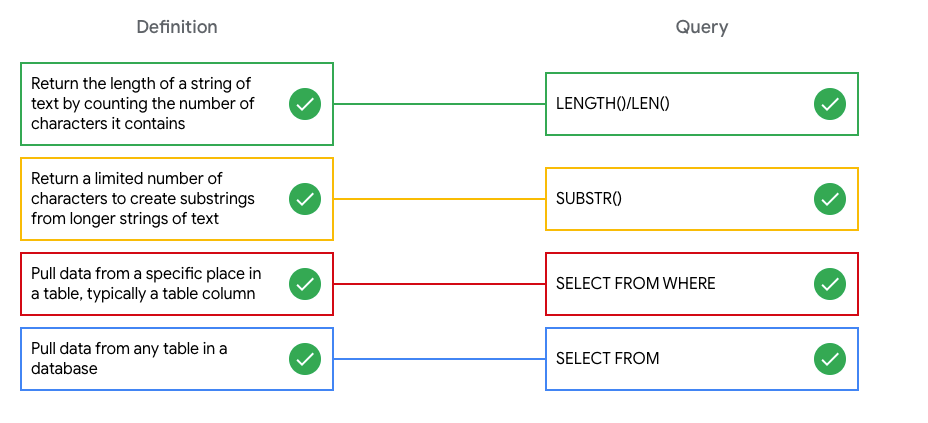
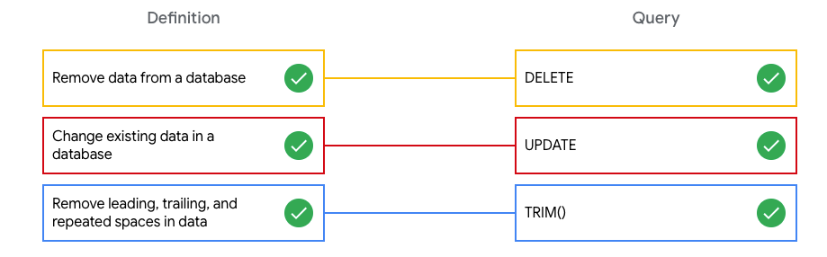
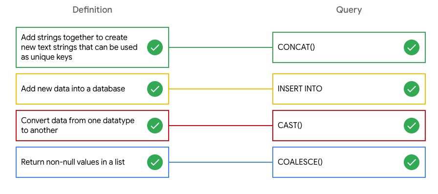

# Data-cleaning with SQL functions

## Data-cleaning SQL functions

Matching exercise

**Know your data types**
In this matching exercise, match each SQL function definition to the correct SQL query.

