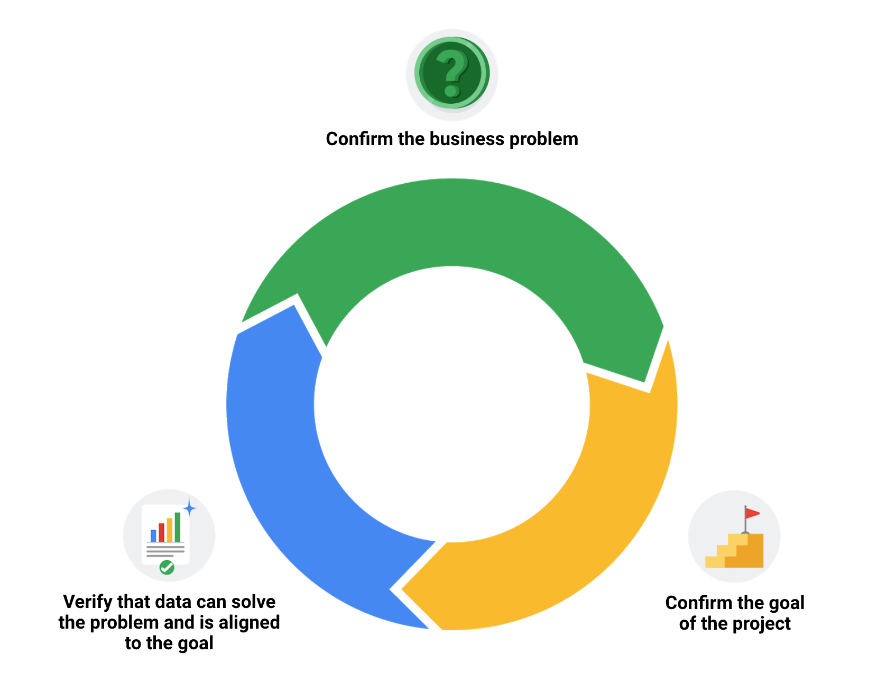

# Data-cleaning verification checklist

This reading will give you a checklist of common problems you can refer to when doing your data cleaning verification, no matter what tool you are using. When it comes to data cleaning verification, there is no one-size-fits-all approach or a single checklist that can be universally applied to all projects. Each project has its own organization and data requirements that lead to a unique list of things to run through for verification.

Keep in mind, as you receive more data or a better understanding of the project goal(s), you might want to revisit some or all of these steps.

## Correct the most common problems

Make sure you identified the most common problems and corrected them, including:

- **Sources of errors**:  Did you use the right tools and functions to find the source of the errors in your dataset?
- **Null data**:  Did you search for NULLs using conditional formatting and filters?
- **Misspelled words**:  Did you locate all misspellings?
- **Mistyped numbers**:  Did you double-check that your numeric data has been entered correctly?
- **Extra spaces and characters**:  Did you remove any extra spaces or characters using the `TRIM` function?
- **Duplicates**:  Did you remove duplicates in spreadsheets using the Remove Duplicates function or `DISTINCT` in SQL?
- **Mismatched data types**:  Did you check that numeric, date, and string data are typecast correctly?
- **Messy (inconsistent) strings**:  Did you make sure that all of your strings are consistent and meaningful?
- **Messy (inconsistent) date formats**:  Did you format the dates consistently throughout your dataset?
- **Truncated data**:  Did you check for truncated or missing data that needs correction?
- **Business Logic**:  Did you check that the data makes sense given your knowledge of the business?

## Review the goal of your project

Once you have finished these data cleaning tasks, it is a good idea to review the goal of your project and confirm that your data is still aligned with that goal. This is a continuous process that you will do throughout your project-- **but here are three steps you can keep in mind while thinking about this**:  

- Confirm the business problem
- Confirm the goal of the project
- Verify that data can solve the problem and is aligned to the goal

