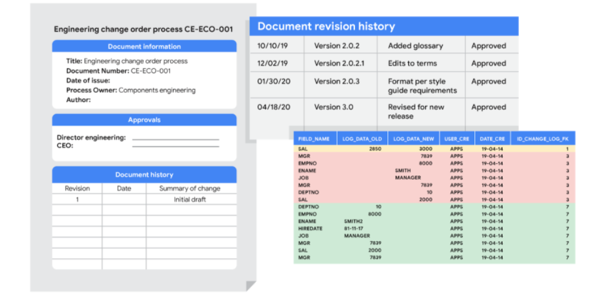

# Embrace changelogs

What do engineers, writers, and data analysts have in common? Change.

Engineers use **engineering change orders** (ECOs) to keep track of new product design details and proposed changes to existing products. Writers use **document revision histories** to keep track of changes to document flow and edits. And data analysts use **changelogs** to keep track of data transformation and cleaning. Here are some examples of these:

## Automated version control takes you most of the way

Most software applications have a kind of history tracking built in. For example, in Google sheets, you can check the version history of an entire sheet or an individual cell and go back to an earlier version. In Microsoft Excel, you can use a feature called Track Changes. And in BigQuery, you can view the history to check what has changed.

Here’s how it works:

| | |
|-------------|-------------|
|**Google Sheets**|1. Right-click the cell and select **Show edit history**.   2. Click the left-arrow < or right arrow > to move backward and forward in the history as needed.|
|**Microsoft Excel**|1. If Track Changes has been enabled for the spreadsheet: click **Review**.   2. Under **Track Changes**, click the **Accept/Reject** Changes option to accept or reject any change made.|
|**BigQuery**|Bring up a previous version (without reverting to it) and figure out what changed by comparing it to the current version.|

## Changelogs take you down the last mile

A **changelog** can build on your automated version history by giving you an even more detailed record of your work. This is where data analysts record all the changes they make to the data. Here is another way of looking at it. Version histories record what was done in a data change for a project, but don't tell us why. Changelogs are super useful for helping us understand the reasons changes have been made. Changelogs have no set format and you can even make your entries in a blank document. But if you are using a shared changelog, it is best to agree with other data analysts on the format of all your log entries.

Typically, a changelog records:  

- Data, file, formula, query, or any other component that changed
- Description of what changed
- Date of the change
- Person who made the change
- Person who approved the change
- Version number
- Reason for the change

Let’s say you made a change to a formula in a spreadsheet because you observed it in another report and you wanted your data to match and be consistent. If you found out later that the report was actually using the wrong formula, an automated version history would help you undo the change. But if you also recorded the reason for the change in a changelog, you could go back to the creators of the report and let them know about the incorrect formula. If the change happened a while ago, you might not remember who to follow up with. Fortunately, your changelog would have that information ready for you! By following up, you would ensure data integrity outside your project. You would also be showing personal integrity as someone who can be trusted with data. That is the power of a changelog!

Finally, a changelog is important for when lots of changes to a spreadsheet or query have been made. Imagine an analyst made four changes and the change they want to revert to is change #2. Instead of clicking the undo feature three times to undo change #2 (and losing changes #3 and #4), the analyst can undo just change #2 and keep all the other changes. Now, our example was for just 4 changes, but try to think about how important that changelog would be if there were hundreds of changes to keep track of.

## Bonus tip

If an analyst is making changes to an existing SQL query that is shared across the company, the company most likely uses what is called a version control system. An example might be a query that pulls daily revenue to build a dashboard for senior management.

Here's how a version control system affects a change to a query:

1. A company has official versions of important queries in their **version control system**.
2. An analyst makes sure the most up-to-date version of the query is the one they will change. This is called **syncing**
3. The analyst makes a change to the query.
4. The analyst might ask someone to review this change. This is called a **code review** and can be informally or formally done. An informal review could be as simple as asking a senior analyst to take a look at the change.
5. After a reviewer approves the change, the analyst submits the updated version of the query to a repository in the company's version control system. This is called a **code commit**. A best practice is to document exactly what the change was and why it was made in a comments area. Going back to our example of a query that pulls daily revenue, a comment might be: *Updated revenue to include revenue coming from the new product, Calypso*.
6. After the change is **submitted**, everyone else in the company will be able to access and use this new query when they **sync** to the most up-to-date queries stored in the version control system.
7. If the query has a problem or business needs change, the analyst can undo the change to the query using the version control system. The analyst can look at a chronological list of all changes made to the query and who made each change. Then, after finding their own change, the analyst can **revert** to the previous version.
8. The query is back to what it was before the analyst made the change. And everyone at the company sees this reverted, original query, too.

## Key takeaways

Engineers, writers, and data analysts use different methods to keep track of changes they make to their work. Automated version control, changelogs, and version control systems are all common tools used to track changes. Changelogs are particularly useful, as they can be used to record the reasons for changes made to data. This can help to ensure data integrity and consistency. Version control systems are most commonly used when making changes to shared queries. They enable analysts to track any changes made and revert to previous versions if necessary.

- Engineers, writers, and data analysts all deal with changes in their work, and they use various methods to track these changes.
- Data analysts use changelogs to document detailed records of data transformations and cleaning.
- Automated version control in software applications helps track history, and in tools like Google Sheets, Microsoft Excel, and BigQuery, you can check and revert to previous versions.
- Changelogs provide a more detailed record than automated version history and help understand the reasons behind changes.
- A changelog typically records information like what changed, a description of the change, date, person making the change, person approving the change, version number, and the reason for the change.
- Changelogs are crucial for recovering from data-cleaning errors, informing others about changes, and assessing data quality.
- In a version control system, analysts sync to the most up-to-date version before making changes and submit changes with comments for code review.
- Reverting changes is possible in version control systems, allowing analysts to track changes chronologically and maintain data integrity.