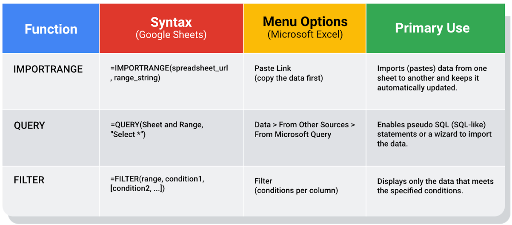
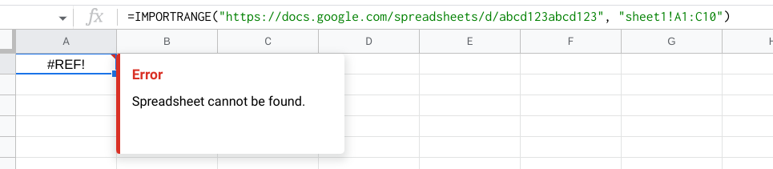

# Advanced functions for speedy data cleaning

In this reading, you will learn about some advanced functions that can help you speed up the data cleaning process in spreadsheets. Below is a table summarizing three functions and what they do:

## Keeping data clean and in sync with a source

The [IMPORTRANGE](https://support.google.com/docs/answer/3093340?hl=en) function in Google Sheets and the [Paste Link](https://professor-excel.com/how-to-paste-cell-links/) feature (a Paste Special option in Microsoft Excel) both allow you to insert data from one sheet to another. Using these on a large amount of data is more efficient than manual copying and pasting. They also reduce the chance of errors being introduced by copying and pasting the wrong data. They are also helpful for data cleaning because you can “cherry pick” the data you want to analyze and leave behind the data that isn’t relevant to your project. Basically, it is like canceling noise from your data so you can focus on what is most important to solve your problem. This functionality is also useful for day-to-day data monitoring; with it, you can build a tracking spreadsheet to share the relevant data with others. The data is synced with the data source so when the data is updated in the source file, the tracked data is also refreshed.

In Google Sheets, you can use the `IMPORTRANGE` function. It enables you to specify a range of cells in the other spreadsheet to duplicate in the spreadsheet you are working in. You must allow access to the spreadsheet containing the data the first time you import the data.

**The URL shown below is for syntax purposes only. Don't enter it in your own spreadsheet. Replace it with a URL to a spreadsheet you have created so you can control access to it by clicking the Allow access button.**

Refer to the [Google support page for IMPORTRANGE](https://support.google.com/docs/answer/3093340?hl=en#) for the sample usage and syntax.

## Example of using `IMPORTRANGE`

An analyst monitoring a fundraiser needs to track and ensure that matching funds are distributed. They use `IMPORTRANGE` to pull all the matching transactions into a spreadsheet containing all of the individual donations. This enables them to determine which donations eligible for matching funds still need to be processed. Because the total number of matching transactions increases daily, they simply need to change the range used by the function to import the most up-to-date data.

On Tuesday, they use the following to import the donor names and matched amounts:

`=IMPORTRANGE("https://docs.google.com/spreadsheets/d/abcd123abcd123", "sheet1!A1:C10", "Matched Funds!A1:B4001")`

On Wednesday, another 500 transactions were processed. They increase the range used by 500 to easily include the latest transactions when importing the data to the individual donor spreadsheet:

`=IMPORTRANGE("https://docs.google.com/spreadsheets/d/abcd123abcd123", "Matched Funds!A1:B4501")`

**Note: The above examples are for illustrative purposes only. Don't copy and paste them into your spreadsheet. To try it out yourself, you will need to substitute your own URL (and sheet name if you have multiple tabs) along with the range of cells in the spreadsheet that you have populated with data.**

## Pulling data from other data sources

The [QUERY](https://support.google.com/docs/answer/3093343?hl=en) function is also useful when you want to pull data from another spreadsheet. The `QUERY` function's SQL-like ability can extract specific data within a spreadsheet. For a large amount of data, using the `QUERY` function is faster than filtering data manually. This is especially true when repeated filtering is required. For example, you could generate a list of all customers who bought your company’s products in a particular month using manual filtering. But if you also want to figure out customer growth month over month, you have to copy the filtered data to a new spreadsheet, filter the data for sales during the following month, and then copy those results for the analysis. With the `QUERY` function, you can get all the data for both months without a need to change your original dataset or copy results.

The `QUERY` function syntax is similar to `IMPORTRANGE`. You enter the sheet by name and the range of data that you want to query from, and then use the SQL `SELECT` command to select the specific columns. You can also add specific criteria after the `SELECT` statement by including a `WHERE` statement. But remember, all of the SQL code you use has to be placed between the quotes!

Google Sheets run the Google Visualization API Query Language across the data. Excel spreadsheets use a query wizard to guide you through the steps to connect to a data source and select the tables. In either case, you are able to be sure that the data imported is verified and clean based on the criteria in the query.

### Examples of using QUERY

Check out the [Google support page for the QUERY function](https://support.google.com/docs/answer/3093343?hl=en) with sample usage, syntax, and examples you can download in a Google sheet.

Link to make a copy of the sheet: [QUERY examples](https://docs.google.com/spreadsheets/d/1815H5TCe91LLT6tD6FmxMHmeJAAkr4o5Q6rNpV6xiFk/copy)

### The solution

Analysts can use SQL to pull a specific dataset into a spreadsheet. They can then use the QUERY function to create multiple tabs (views) of that dataset. For example, one tab could contain all the sales data for a particular month and another tab could contain all the sales data from a specific region. This solution illustrates how SQL and spreadsheets are used well together.

## Filtering data to get what you want

The [FILTER](https://support.google.com/docs/answer/3093197?hl=en) function is fully internal to a spreadsheet and doesn’t require the use of a query language. The `FILTER` function lets you view only the rows (or columns) in the source data that meet your specified conditions. It makes it possible to pre-filter data before you analyze it.

The `FILTER` function might run faster than the QUERY function. But keep in mind, the QUERY function can be combined with other functions for more complex calculations. For example, the QUERY function can be used with other functions like SUM and COUNT to summarize data, but the FILT`ER function can't.

Example of using `FILTER`
Check out the [Google support page for the FILTER function](https://support.google.com/docs/answer/3093197?hl=en) with sample usage, syntax, and examples you can download in a Google sheet.

Link to make a copy of the sheet: [FILTER examples](https://docs.google.com/spreadsheets/d/1caULJLQvQuzBnCN7rO9utg0xSKrYms7wM0Ph7A2JXY4/copy)

## Keypoints

- `IMPORTRANGE`:
  - Function: Imports data from one sheet to another in Google Sheets.
  - Paste Link (Excel): Similar functionality in Microsoft Excel using the Paste Link feature.
  - Benefits: Efficient for large data sets, reduces errors, useful for "cherry-picking" relevant data, syncs with the data source for real-time updates.
  - Example: An analyst uses IMPORTRANGE to track matching transactions for a fundraiser, updating the range to include the latest transactions as they occur.
- `QUERY`:
  - Function: Pulls data from another spreadsheet in Google Sheets.
  - SQL-Like Functionality: Allows SQL-like extraction of specific data within a spreadsheet.
  - Benefits: Faster than manual filtering, useful for repeated filtering, extracts specific columns, enables complex queries.
  - Example: Analysts can use SQL to pull a specific dataset into a spreadsheet and create multiple views using the QUERY function (e.g., sales data for a particular month, sales data from a specific region).
- `FILTER`:
  - Function: Fully internal to a spreadsheet, filters rows or columns based on specified conditions.
  - Benefits: Does not require a query language, pre-filters data before analysis, potentially faster than QUERY.
  - Limitation: Cannot be combined with other functions for complex calculations (unlike QUERY).
  - Example: Analysts can use the FILTER function to view only the rows in the source data that meet specified conditions.

### Reflection Questions:

- How does IMPORTRANGE contribute to efficient data cleaning and analysis in Google Sheets?

IMPORTRANGE facilitates efficient data cleaning and analysis by allowing the import of data from one sheet to another. It reduces errors, supports "cherry-picking" relevant data, and ensures real-time synchronization with the data source.

- In what scenarios would you prefer using the QUERY function over the FILTER function for data extraction?

The QUERY function is preferred over the FILTER function when dealing with larger datasets or when repeated filtering is necessary. It offers SQL-like functionality, allowing for more complex queries and extraction of specific columns.

- What are the potential advantages of using SQL in conjunction with spreadsheets, as illustrated in the example?

Using SQL with spreadsheets, particularly with the QUERY function, allows analysts to pull specific datasets and create multiple views. This enables the creation of tabs containing different perspectives of the dataset, providing a versatile and powerful analytical approach.