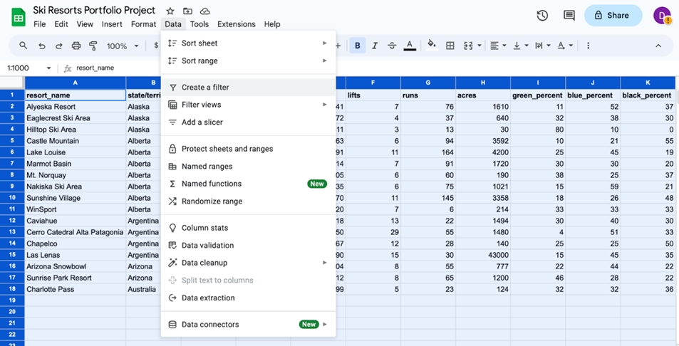

# Sort and filter data to keep it organized

The first two phases of data analysis, **Organize data** and **Format and adjust data**, are important for data analysts because they can use these phases to manipulate their data in ways that make important patterns and trends more obvious. Most of the datasets you’ll use as a data analyst will be organized as tables. Tables are helpful because they let you manipulate and categorize your data. Having distinct categories and classifications lets you focus on, and differentiate between, the groups in your data quickly and easily.

Sorting and filtering are two methods you can use to organize, format, and adjust data. For example, a filter can help you find errors or outliers so you can fix or flag them before your analysis. Outliers are data points that are very different from similarly collected data and might not be reliable values. The benefit of filtering the data is that after you fix errors or identify outliers, you can remove the filter and return the data to its original organization.

In this reading, you’ll review sorting and filtering and consider how they can be used together. You’ll also be introduced to how a particular form of sorting is done in a pivot table.

## Sort data

Sorting is the process of arranging data into a meaningful order to make it easier to understand, analyze, and visualize. It ranks your data based on a specific metric you choose. You can sort data in spreadsheets, SQL databases (when your dataset is too large for spreadsheets), and tables in documents.

To rank items or create chronological lists, you can sort by ascending or descending order. Sorting arranges the data in a meaningful way and gives you immediate insights. Sorting also helps you to group similar data together by a classification. For example, if a ski resort design company wants to evaluate the resorts designed by a competitor, a data analyst can sort competitive resorts by locations, runs, acreage, and other factors. This way, the firm’s designers can visit the types of resorts they also design and gather information that could be used in its own future designs.

### Filter data

Sometimes, an analysis may require only a subset of the data in your dataset. You can use a filter to show only the data that meets a specified criteria while hiding the rest. Filtering is useful when you have lots of data. You can save time by zeroing in on the data that’s important for your current analysis or the data that contains errors. Most spreadsheets and SQL databases allow you to filter your data in a variety of ways. Filtering gives you the ability to find what you are looking for without too much effort.

For example, if the ski resort design company wants to inspect specific criteria for the competitive ski resorts they intend to visit and evaluate, a data analyst can filter the competitive resort database to extract information about the number of runs compared to acreage to identify design trends or other insights.

## Sort a pivot table

A pivot table is a data summarization tool used to sort, reorganize, group, count, total, or average data. Items in the row and column areas of a pivot table are sorted in ascending order by any custom list first. If the items aren’t in a custom list, they will be sorted in ascending order by default. But, if you sort in descending order, you are setting up a rule that controls how the field is sorted even after new data points are added. For example, in the ski resort dataset, the pivot table allows locations to be sorted alphabetically by state, territory, or country.  

Image of a pivot table of the ski resort data, with the pivot table editor open and ready for parameters to be enteredImage of a pivot table of the ski resort data, with the pivot table editor open and ready for parameters to be entered. The data is grouped by state, territory, or country.

## Key takeaways

Data analysts filter and sort data to organize it for better understanding, analysis, and visualization. Sorting arranges data in a meaningful order, while filtering displays only data that meets specific criteria. Combining filtering and sorting allows for organizing only relevant data for analysis. Both spreadsheets and SQL databases allow for data filtering and sorting data.

- Sort Data
  - Applications: Sorting can be done in various environments, including spreadsheets, SQL databases (for larger datasets), and tables in documents.
  - Ascending or Descending Order: Sorting can be done in ascending or descending order, depending on the requirement. This helps in creating chronological lists or ranking items.
  - Insights and Grouping: Sorting provides immediate insights and helps group similar data together based on a chosen classification. For example, a ski resort design company might sort competitive resorts by location, runs, acreage, etc., for evaluation.
  - Visualization: An example of sorting a spreadsheet of ski resorts is provided, illustrating how to arrange data based on columns like resort name, state/territory/country, lifts, runs, and acres.
- Filter Data
  - Definition: Filtering involves showing only a subset of data that meets specified criteria, while hiding the rest. This is particularly useful when dealing with large datasets.
  - Purpose: Filtering is valuable for focusing on important data for the current analysis or isolating data with errors, saving time and effort.
  - Applications: Most spreadsheets and SQL databases support various ways of filtering data.
  - Example Scenario: Using the ski resort design company as an example, a data analyst might filter the competitive resort database to extract information about the number of runs compared to acreage.
  - Visualization: Examples of creating a filter in a spreadsheet of ski resorts and filtering data by specific evaluation criteria are presented.
- Sort a Pivot Table
  - Definition: A pivot table is a data summarization tool used for sorting, reorganizing, grouping, counting, totaling, or averaging data.
  - Custom Sorting: Items in the row and column areas of a pivot table can be sorted in ascending order by any custom list. Sorting can be done in descending order to control how the field is sorted even after new data points are added.
  - Example Scenario: In the ski resort dataset, a pivot table might allow locations to be sorted alphabetically by state, territory, or country.
  - Visualization: An image of a pivot table of ski resort data with the pivot table editor open is provided.
