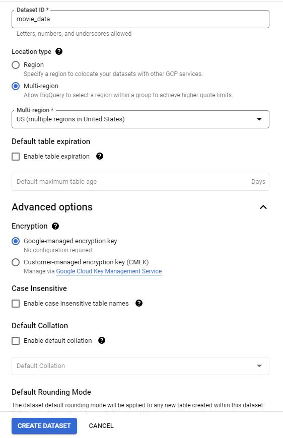
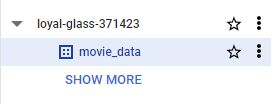
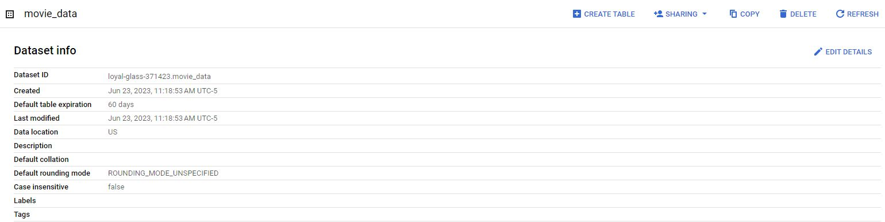
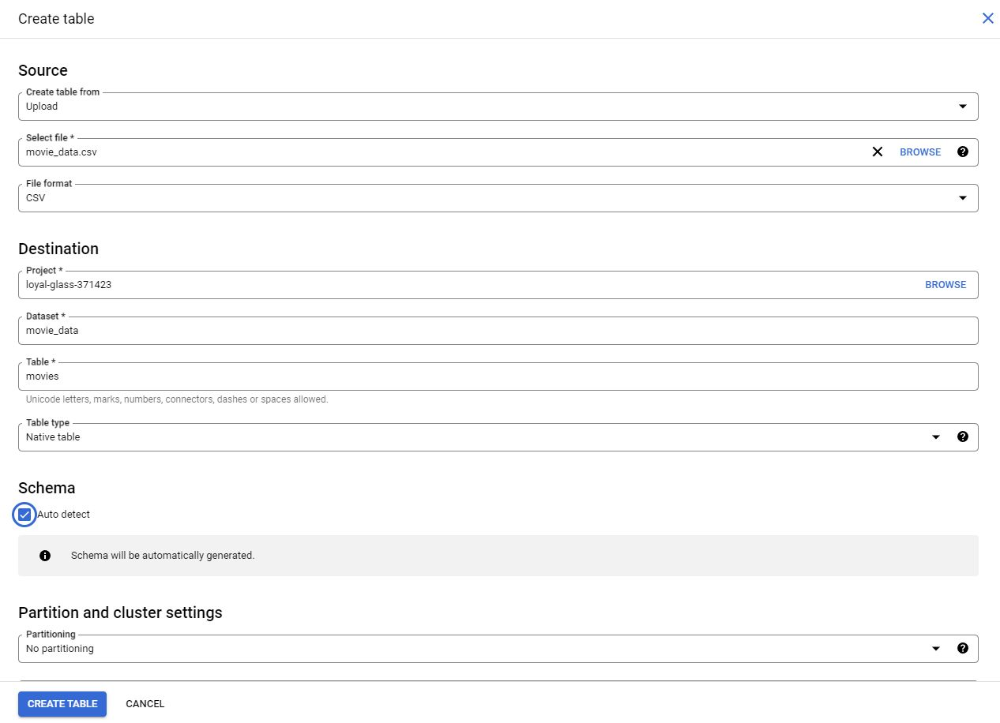
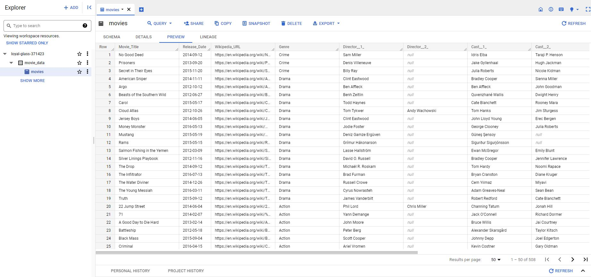

# Upload the movie dataset to BigQuery

The next video demonstrates how to use SQL to filter data in a large dataset in BigQuery.

If you would like to follow along with the instructor, you will need to log in to your BigQuery account and upload the movie dataset provided as a .csv file.

## Prepare for the next video

- First, download the .csv file from the attachment: [movie-data.csv](./resources/movie-data.csv)
- Next, complete the following steps in your BigQuery console to upload the movie dataset.

**Step 1**: Open your BigQuery console and click on the project you want to upload the data to.

**Step 2**:  In the **Explorer** on the left, click the **Actions** icon (three vertical dots) next to your project name and select **Create dataset**.

**Step 3**: In the upcoming video, the name **movie_data** will be used for the dataset. If you plan to follow along with the video, enter **movie_data** for the Dataset ID. In the Location Type section, select **Multi-region**, then from the Multi-region dropdown select **US (multiple regions in United States)**, and make sure the default Encryption method within the Advanced options is set to the **Google_managed encryption key.**

**Step 4:** Click **CREATE DATASET** (blue button) to add the dataset to your project.

**Step 5:** In the **Explorer** on the left, click to expand your project and then click the **movie_data** dataset you just created.

**Step 6**: A new window will appear titled **movie_data**, and make a note of the **Dataset ID.**

**Step 7**: Towards the right hand side of the page, you will see a tab row of additional commands. Click the first blue button titled + CREATE TABLE at the top right. A new window titled Create table will appear.

**Step 8**: Under Source, for the Create table from dropdown, select the data source.

- Select **Upload**.
- Click **Browse** to select the **movie_data.cs**v file you downloaded.
- Select **CSV** from the file format dropdown, but BigQuery should automatically change the format.

**Step 9**: Under Destination, for the Table name, enter **movies** to match the table in the video.

**Step 10**: Under **Schema**, click the **Auto detect** checkbox.

**Step 11**: Once all of the settings have matched the image above, click the **CREATE TABLE** (blue button) at the bottom. You will now see the **movies** table under your **movie_data** dataset in your project.

**Step 12**: Click **movies** and then select the **Preview** tab. Confirm that you have access to the appropriate table.

Congratulations, you are now ready to follow along with the next video.
