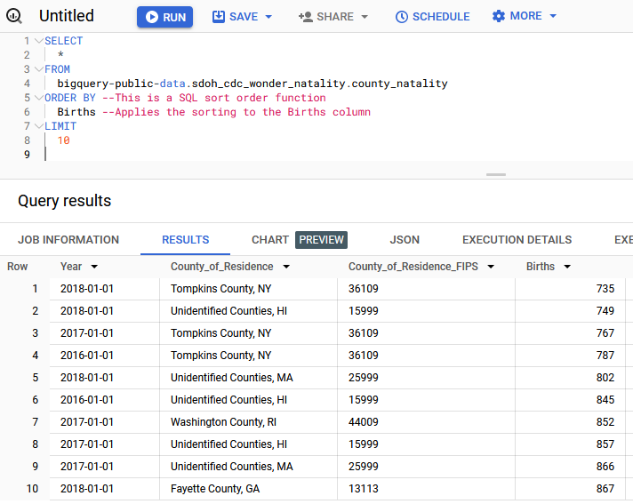
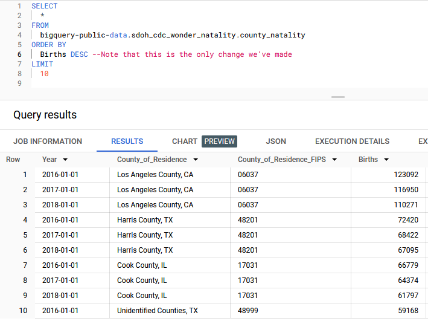

# Practice Quiz: Hands-On Activity: SQL sorting queries

## Activity overview

So far, you’ve learned about SQL and how it’s used to retrieve data from databases. In this activity, you’ll practice sorting data with the `ORDER BY` clause in SQL. Sorting is a powerful tool for a data analyst. It enables you to:

- Organize and analyze your data in a meaningful way
- Find highest or lowest values in a dataset
- Compare data across different dimensions

By the time you complete this activity, you will be able to write SQL queries that sort data depending on your needs.

## Scenario

You’re a public health researcher with a state government agency. For your current project, you need to identify counties in the United States that have the most and least births in the 2016-2018 time frame. To do this, you’ll complete the following steps:

- Load the dataset
- Query the data to explore its structure
- Use `ORDER BY` to sort relevant data
- Use sorted data to answer questions

### Load the CDC Births Data dataset

1. Open the BigQuery console.

2. Select **+ADD** from the **Explorer** pane.

3. In the **Add** window, navigate to and then select **Public Datasets**.

    

4. In the Marketplace search bar, enter `sdoh_cdc_wonder_natality` and press enter.

5. Select the result **Births Data** Summary from the CDC.

6. Select **VIEW DATASET**. This will bring you back to the console and open a **Dataset info** tab about the CDC dataset in the **Details** pane.

7. Select **sdoh_cdc_wonder_natality** in the **Explorer** pane to examine the tables available within the dataset.

8. Select the table **county_natality** and explore this table’s schema, details, and preview.
    

### Query the data to explore its structure

Now, it’s time to start working with the CDC births data. First, run a query to examine the dataset without sorting it.

1. Select **Query**, then **In new tab**.

2. Enter the following query into the Query Editor to display the first 1,000 rows of the county_natality table.

    ```sql
    SELECT
    * 
    FROM
    bigquery-public-data.sdoh_cdc_wonder_natality.county_natality 
    LIMIT
    1000 
    ```

3. Select **RUN**.


Examine the dataset you just loaded. Take a moment to familiarize yourself with the columns and fields available.

### Use `ORDER BY` to sort relevant data

Now, sort the data with SQL’s `ORDER BY` function. Enter the following query into the Query Editor. The text preceded by two hyphens (--) are comments that explain the code. Run the Query.

```sql
SELECT
*
FROM
bigquery-public-data.sdoh_cdc_wonder_natality.county_natality
`ORDER BY` --This is a SQL sort order function
Births --Applies the sorting to the Births column
LIMIT
10
```



Examine the Births column. Notice that it’s sorted from smallest to largest. When the `ORDER BY` function is applied to sort a given column, SQL will default to sorting in ascending order, which orders items from smallest to largest.

If you want the largest number to appear first, then you’d want to specify the sort order to be descending by adding a command to the `ORDER BY` clause. You can make your code easier to read by using a command to specify either sort order.  Here are the corresponding commands:

`ASC` = Ascending

`DESC` = Descending

Next, you’ll use the same query, but this time you’ll explicitly state the order of your `ORDER BY` function using `ASC`. Enter and run the following SQL query:

```sql
SELECT
  *
FROM
  bigquery-public-data.sdoh_cdc_wonder_natality.county_natality
`ORDER BY`
  Births `ASC` --Place the `ASC` or `DESC` specifier directly after the column name separated by a space (no other punctuation)
LIMIT
  10
```

Notice that the results did not change. Tompkins County, NY, had just 735 births in 2018—the lowest birth count of any county in the US between 2016-2018.

Now, change the order from ascending (`ASC`) to descending (`DESC`) to find the most births. Enter and run this query:

```sql
SELECT
  *
FROM
  bigquery-public-data.sdoh_cdc_wonder_natality.county_natality
`ORDER BY`
  Births `DESC` --Note that this is the only change you've made
LIMIT
  10
```



The query returns the 10 rows with the largest values in the Births column. Los Angeles County takes up the top three spots.

### Use sorted data to answer questions

Now that you've become familiar with the basics of sorting functions, use them to answer questions about your data. This exercise will require you to apply both your previous learnings (especially filtering with the `WHERE` clause) and your new understanding of sorting.

In your work as a public health researcher, you’re exploring whether the birth rate trends in several counties in upstate New York have been increasing or decreasing—and whether they follow the same pattern.

To answer this, you’ll need the following information:

- Results from Erie, Niagara, and Chautauqua counties in New York state
- Results ordered by county of residence and year to find the trend

The following query will filter the results by county and sort the results year and county. This will allow you to determine if the number of births is increasing or decreasing in each county.

Enter the following query into the Query Editor, then select **RUN**.

```sql
SELECT
  *
FROM
bigquery-public-data.sdoh_cdc_wonder_natality.county_natality
`WHERE`
  County_of_Residence = 'Erie County, NY' 
  OR County_of_Residence = 'Niagara County, NY'
  OR County_of_Residence = 'Chautauqua County, NY'
`ORDER BY`
  County_of_Residence, 
```

You’ve now successfully used both `ORDER BY` (sort) and `WHERE` (filter) clauses in the same query. Based on the results of this query, are births in these three counties following the same trend?

## Reflection

## Question 1: The last query you ran returned births in three counties, sorted by year and county. Now, you want to identify the lowest number of births in Erie, Chautauqua, or Niagara counties between 2016 and 2018. Modify the previous query to order the data by Births in descending order to make this easy to identify. How many births occurred in the county with the highest number of births in one year?

- `9916`: correct
- 2114
- 1299
- 9870

> A total of 9,916 births occurred in Erie County in 2016. To arrive at this answer, you needed to sort by birth instead of county and year. Adding DESC to the ORDER BY clause would sort the Births column in descending order to make this information easier to identify.

## Question 2:In this activity, you practiced sorting data using SQL queries with `ORDER BY` and filtering data with `WHERE` clauses. In the text box below, write 2-3 sentences (40-60 words) in response to each of the following questions

How can the `ORDER BY` clause help you organize and structure your data?

Why is it helpful to use the `ORDER BY` and `WHERE` clauses together when analyzing data?

Describe a business question that you could answer using the `ORDER BY` and `WHERE` clauses together. How would this method help you answer the question?

What do you think?
Your answer cannot be more than 10000 characters.

### My response

The ORDER BY clause is like a magic wand in SQL that helps organize data by sorting it based on chosen columns. It's super handy when I want to see data in a particular order, like dates or numerical values, making it much easier to understand and analyze.

Using ORDER BY and WHERE together is like having a double filter for my data exploration. With WHERE, I can focus on specific conditions, and then, with ORDER BY, I can sort the results to get a detailed view. It's like zooming in on exactly what I need and then organizing that information for a clearer picture.

Imagine working for an online store and wanting to know the best-selling products during a special sale. The WHERE clause helps me focus on the sale period, and then, with ORDER BY, I can arrange products based on sales. This approach lets me quickly identify the top performers, guiding decisions on inventory and future promotions.

> An effective response would include that sorting the data you return in your queries is a crucial tool for analyzing and understanding data.
>
> You can also answer business questions by sorting the dataset according to a given metric. For instance, a store may want to know which products they sell the most or least. Sorting helps you answer business questions that involve phrases such as “how much,” “how many,” “best,” or “worst”—which will be a valuable skill in your career as a data analyst.
