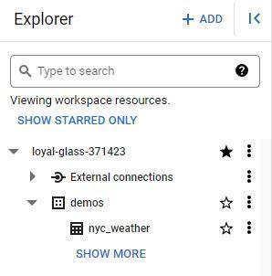

# Practice Quiz: Hands-On Activity: Analyze weather data in BigQuery

## Activity overview

So far, you’ve learned how to use BigQuery to clean, prepare, and analyze data. Now, you’ll query a dataset and save the results as a new table. This is a useful skill when the original, dynamic data source changes continuously and you need to preserve a specific dataset for continued analysis. It’s also valuable when you have access to a large dataset and know you’ll be doing more than one analysis on a subset of the dataset. By the time you complete this activity, you will be able to use SQL queries to create new tables when dealing with complex datasets.

## Scenario

You’re a data analyst at a news station in New York City. You’ve been tasked with answering questions about the weather for meteorologists. You’ll work with a public dataset that contains global summaries of the day (GSOD) from the National Oceanic and Atmospheric Administration (NOAA). The GSOD dataset includes information about daily weather elements, such as mean temperature and wind speed, from more than 9,000 weather stations across the globe. This dataset is updated daily, so in addition to being large, this dataset is constantly changing. So, you’ll save a subset of the data about the New York region in a new table to make your analysis easier.

## Analyze weather data

### Add the NOAA weather data to BigQuery

Log in to your BigQuery account (or [BigQuery sandbox](https://cloud.google.com/bigquery/docs/sandbox)) account and initiate a new project.

First, add the NOAA weather data from BigQuery’s public datasets.

1. Select the + ADD button in the Explorer pane.

2. This opens a new **Add** menu where you can search public datasets available through Google Cloud. Scroll down the list and select **Public Datasets**.

3. This opens the **Marketplace** menu. In the search bar, enter the acronym `gsod` and press enter.

4. Select the search result titled `GSOD`.

5. Select **VIEW DATASET** to return to the main workspace with the NOAA dataset tables in the Explorer pane. The **Details** pane now contains details about this dataset.

### Query the data

The meteorologists you’re working with have asked you to obtain the temperature, wind speed, and precipitation for stations La Guardia and JFK, for every day in 2020. They’ve also requested the data be presented to them in descending order by date and ascending order by Station ID. To return this information:

1. Select the **QUERY** button in the row of tab functions

2. Select the **In split tab** option in the drop-down menu.

3. Enter the following query into the Query Editor:

    ```sql
    SELECT
    stn,
    date,
    IF(
        temp=9999.9,
        NULL,
        temp) AS temperature,
    IF(
        wdsp="999.9",
        NULL,
        CAST(wdsp AS Float64)) AS wind_speed,
    IF(
        prcp=99.99,
        0,
        prcp) AS precipitation
    FROM
    `bigquery-public-data.noaa_gsod.gsod2020`
    WHERE
    stn="725030" -- La Guardia
    OR stn="744860" -- JFK
    ORDER BY
    date DESC,
    stn ASC
    ```

    Note: This query uses the `IF` function to replace values 9999, 999.9, and 99.99 with `NULL`. The dataset description explains that these are the default values when the measurement is missing.

4. Select **RUN**.

Now you’ve run the query and gotten results. But these results aren’t saved anywhere, so each time you want to examine them, you would have to run this query again.

### Save a new table

In addition to the data the meteorologists requested, they also asked you some questions while preparing for the nightly news: They want to know the average temperature in June 2020 and the average wind speed in December 2020.

Instead of rewriting similar, but slightly different, queries over and over again, there is an easier approach: Save the results from the original query as a table for future queries.

To make this subset of data easier to query from, you’ll save this query as a table. First, though, you’ll create a new dataset to store the table.

1. From the **Explorer** pane, select the three vertical dots next to your project and select **Create dataset**. Note that unless you have specified your own project name, a unique name is assigned to your project by BigQuery, typically in the format of two words and a number, separated by hyphens (e.g., loyal-glass-371423 in the image below). You are not allowed to create a new dataset in the `bigquery-public-data project`.

2. Enter `demos` into the Data ID box and set the **Location type** to **Multi-region**, then select **US (multiple regions in United States)**. Leave the rest of the **Advanced Options** as the default. Once you have done this, select **CREATE DATASET**.
3. Open the new dataset.

4. Click on the **+ button** in the **Details** pane.

5. If needed, re-enter the query you ran in the previous section:

    ```sql
    SELECT
    stn,
    date,

        IF(
        temp=9999.9,
        NULL,
        temp) AS temperature,
        IF(
        wdsp="999.9",
        NULL,
        CAST(wdsp AS Float64)) AS wind_speed,
        IF(
        prcp=99.99,
        0,
        prcp) AS precipitation
    FROM
    'bigquery-public-data.noaa_gsod.gsod2020'
    WHERE
    stn="725030" -- La Guardia
    OR stn="744860" -- JFK
    ORDER BY
    date DESC,
    stn ASC
    ```

    Note: Use the IF function to replace values 9999, 999.9, and 99.99 with NULL. The dataset description explains that these are the default values when the measurement is missing.

6. Before you run the query, select the **MORE** menu from the Query Editor and open the Query Settings menu.

7. From the **Query Settings** menu, select the button next to **Set a destination table for query results**.

8. Set the dataset option to **demos** and name the table `nyc_weather`.

9. Run the query to save the results as a new table in the demos dataset.

   - Before:
     - 

   - After:
     - 

10. Return to the **Query settings** menu by selecting the **MORE** dropdown menu.

11. Reset the settings to **Save query results in a temporary table**. This will prevent you from accidentally adding every query as a table to your new dataset.

### Query the new table

Now that you have the subset of this data saved in a new table, you can use the following query to find the average temperature in June 2020. First, replace your_project_name with your project name in BigQuery.

```sql
SELECT
    AVG(temperature)
FROM
    'your_project_name.demos.nyc_weather'  
WHERE
    date BETWEEN '2020-06-01' AND '2020-06-30'
```

**Note**: Format the beginning syntax to your project name before running this query. View the full Table ID by selecting on the **Details** tab of your new **nyc_weather** data table.

You can also use this syntax to find the average wind speed or any other information from this subset of data. Try writing a few more queries to answer the meteorologists’ questions.

The ability to save your results into a new table is helpful when you know you're only interested in a subset of a larger complex dataset that you plan on querying multiple times, such as the weather data for just La Guardia and JFK. This also helps minimize errors during your analysis.

## Reflection

### Question 1: What was the average temperature at the JFK and LaGuardia weather stations between June 1, 2020 and June 30, 2020?

- 87.671
- 74.909
- 92.099
- `72.883`: correct

> The average temperature at JFK and LaGuardia weather stations between June 1, 2020 and June 30, 2020 was 72.883. To find the average temperature during this time period, you successfully created a new table and ran another query against that table. Going forward, you will be able to use your ability to create tables from specific subsets of data. This will help you draw insights from multiple data sources more efficiently in the future

### Question 2:In the text box below, write 2-3 sentences (40-60 words) in response to each of the following questions

How can creating tables from queries help you perform data analysis in the future?

- Why is being able to view specific subsets of a dataset important?
- What do you think?

> Your answer cannot be more than 10000 characters

### My Response

Creating tables from queries enhances the efficiency of future data analysis by allowing quick access to specific datasets without rerunning complex queries. This not only saves time but also reduces the risk of errors during repetitive analyses.

Being able to view specific subsets of a dataset is crucial for focused analysis. It helps in extracting relevant information, addressing specific questions, and gaining insights without navigating through unnecessary data. This targeted approach streamlines the analytical process, making it more effective and manageable.

> In this activity, you explored two public datasets and created a new table using a query. An effective response might include that creating tables using your queries allows you to work with a subset of data without changing the original.
>
> For instance, now you can query weather data from just the relevant weather stations. This is important for finding trends within a subset of data.
