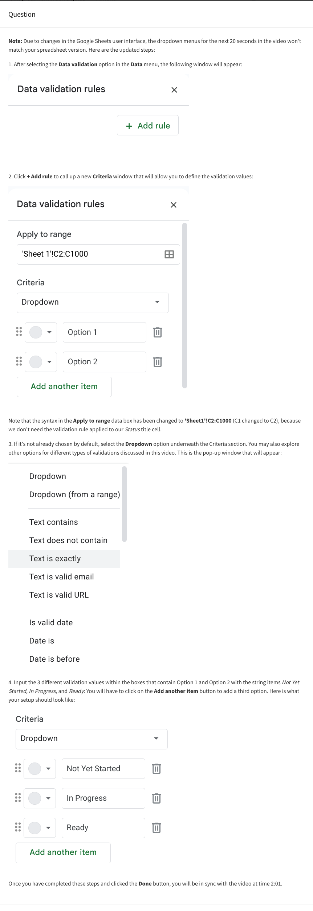

# Data validation

Video transcript

- Welcome back! While we're learning about formatting data, I want to talk to you about another spreadsheet feature: data validation.
- In this video, I'll teach you a little bit about data validation and show you how to use it.
- For now, when I say data validation, I'm talking about the function, which is different from the data validation process.
- We'll get into that later on.
- But first, let's talk about what data validation does in spreadsheets.
- Basically, it allows you to control what can and can't be entered in your worksheet.
- Usually, data validation is used to add drop-down lists to cells with predetermined options for users to choose from.
- If you have a spreadsheet with a lot of collaborators, this can make it easier for them to interact with your table.
- You can think of it like a multiple choice question on a quiz.
- Since you control what's being entered into the worksheet, it cuts down on how much data cleaning you have to do later on.
- Let's figure out how we might do that.
- For this example, we'll work on a project with a lot of milestones and deadlines to keep track of.
- Let's say our team has a spreadsheet that tracks everyone's progress.
- But instead of making everyone write in where they are in their task individually, we can provide a drop-down menu with multiple options, like "Not Yet Started," "In Progress," and "Ready." So we'll select the column that we want to add the drop-down menus to, in this case, the "Status" column.
- Then we'll go to the Data pull-down menu here at the top and click "Data validation." This brings up a pop-up menu with options for data validation.
- In this case, we know that we want to add a list of items for other users to choose from.
- So we'll select the "list of items" option from the possible criteria and type in the selections we want to create.
- Then hit Save, and now all of those cells have drop-down menus that we can use to easily mark progress for each task.
- But there's other things that you can do with data validation and spreadsheets, too, like creating custom check boxes.
- To do this, let's select the cells under the "Review" column to make a checkbox that will let us know if tasks have been approved or not.
- We'll go back to the data validation menu.
- But instead of choosing "List from a range," we'll choose "Checkbox." There's an option to use custom cell values.
- Let's choose that and put in "Approved" and "Not approved." Now these tasks can be checked off by whoever's reviewing them, like a project manager, for example.
- Another way we can use data validation is to protect structured data and formulas.
- The more people that are working together in a spreadsheet, the more likely someone can accidentally break a formula.
- But good news: the data validation menu has an option to reject invalid inputs, which helps make sure our custom tools will continue to run correctly, even if someone puts the wrong data in by mistake.
- All right, now you know three uses for data validation in your spreadsheets: adding drop-down lists, creating custom checkboxes, and protecting structured data and formulas.
- Data validation can help your team track progress, protect your tables from breaking when working in big teams, and help you customize tables to your needs.
- Coming up, we'll learn more about conditional formatting and some ways you can use conditional formatting and data validation together.
- See you soon!

## Question

Would you like to follow along with the instructor using the same spreadsheet? To use the spreadsheet template, click the link below and select "Use Template."

Link to template: [Project Spreadsheet - for Data Validation](https://docs.google.com/spreadsheets/d/1ickWmdIkqf_X4yISh6F9vt6P5jj6bjc8-z3_mxJ3Axo/template/preview#gid=1265595766)

OR If you don't have a Google account, you can download the spreadsheet directly from the attachment: [project-spreadsheet_for-data-validation.xlsx](./resources/project-spreadsheet_for-data-validation.xlsx)

### Question 1

A data analyst wants to add a spreadsheet dropdown list with three options: Draft, Edit, and Final. Which option from the Data Validation menu should they select?

- Custom formula
- List of items
- Date
- Text

> The analyst should select List of Items. This option will enable them to select the three options Draft, Edit, Final.

## Section Overview

This reading focuses on the importance of converting data in spreadsheets to ensure accurate analysis. It provides practical scenarios where data conversion is essential and offers external resources for learning how to perform specific conversions in Excel and Google Sheets.

- Data validation in Spreadsheets
  - Add dropdown lists with predetermined options
  - Create custom checkboxes
  - Protect structured data and formulas

- Data Conversion Scenarios:
  - String to Date: Explains the common scenario of transforming a series of numbers into dates. External - resources are provided for Excel and Google Sheets users.
  - String to Numbers: Highlights the importance of converting text to numbers for accurate calculations. - External resources cover conversions in both Excel and Google Sheets.
  - Combining Columns: Discusses scenarios where merging text from multiple cells is necessary. Resources for - Excel and Google Sheets are provided.
  - Number to Percentage: Emphasizes formatting numbers as percentages and provides resources for Excel and - Google Sheets users.
- External Resources:
  - Links to external resources for detailed tutorials and guides on specific data conversion scenarios in both - Excel and Google Sheets.
  - Topics covered include converting text to dates or numbers, combining columns, and formatting numbers as - percentages.
- Consistency in Data Formatting:
  - Stresses the importance of maintaining consistency in data formatting, especially when dealing with multiple - columns of data requiring different formats.
- Pro Tip - Consistency is Key:
  - Recommends ensuring entire columns have the same format for consistency.
  - Highlights that keeping consistent formats across columns is a best practice.
- Additional Resources:
  - Encourages users to explore Microsoft Support for Excel and Google Docs Editor Help for Google Sheets for - further assistance with data conversion.
  - Suggests bookmarking the provided links for quick access to resources.
- Quick and Easy Conversion:
  - Assures that data conversion is a quick and easy process, with the ability to reuse the same functions.
  - Encourages users to bookmark the provided links for future reference.
