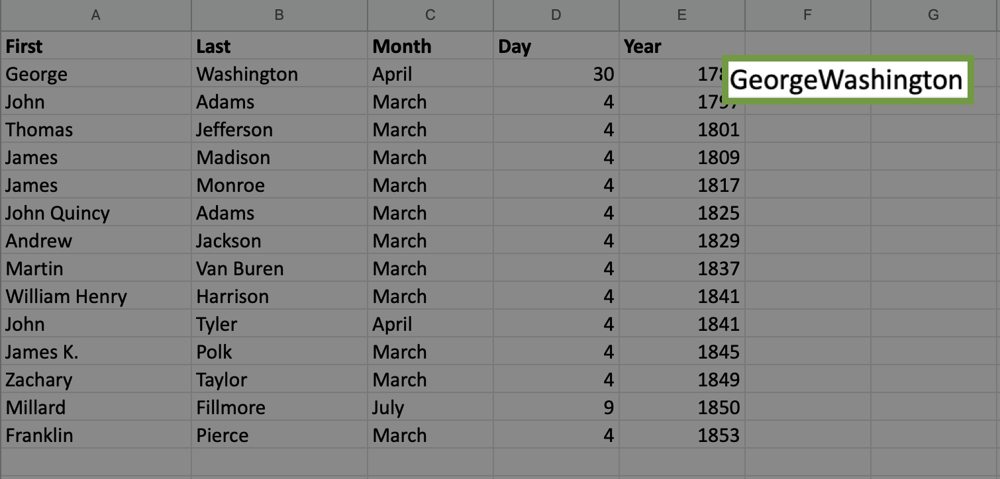
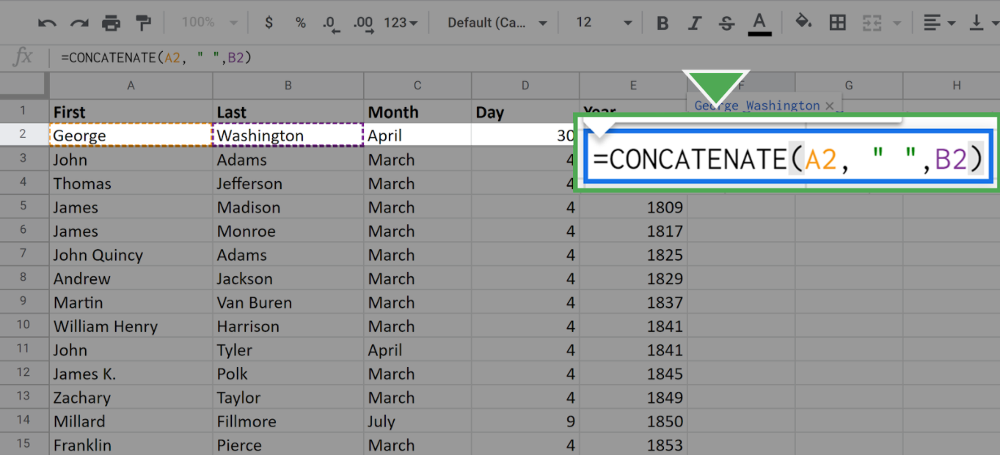
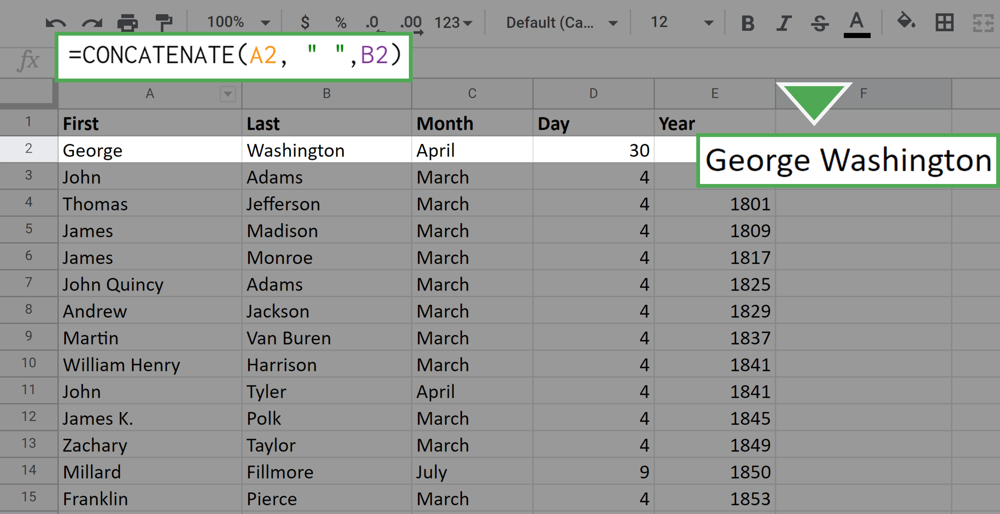
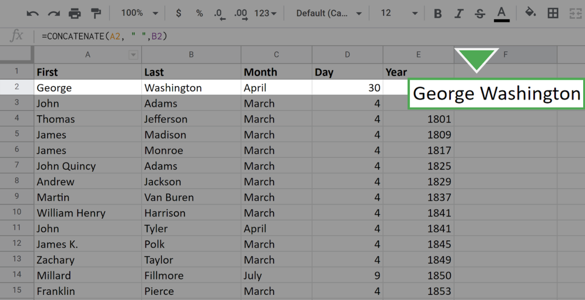
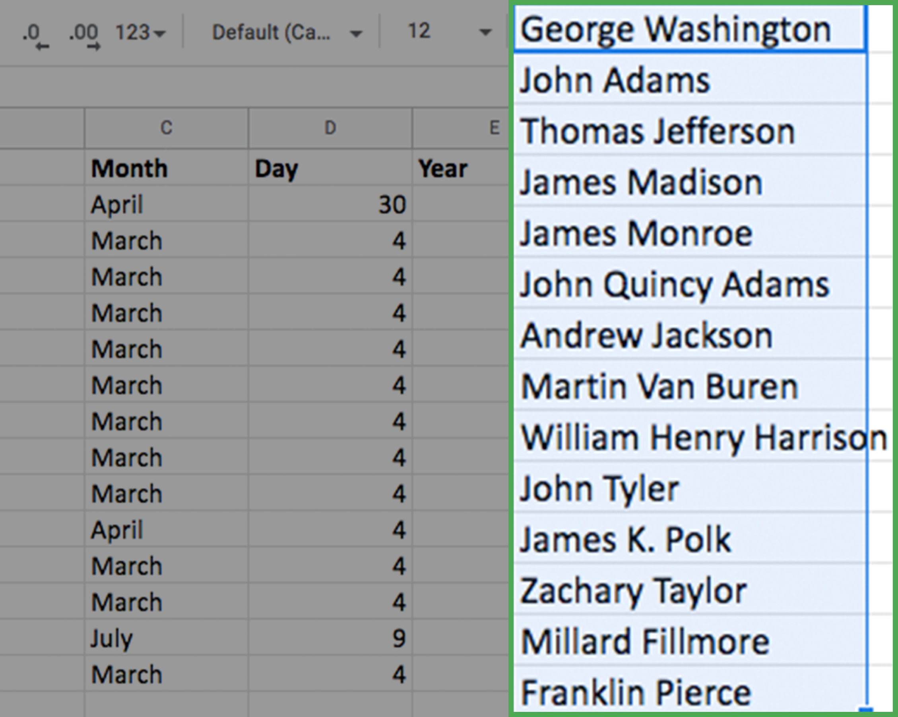
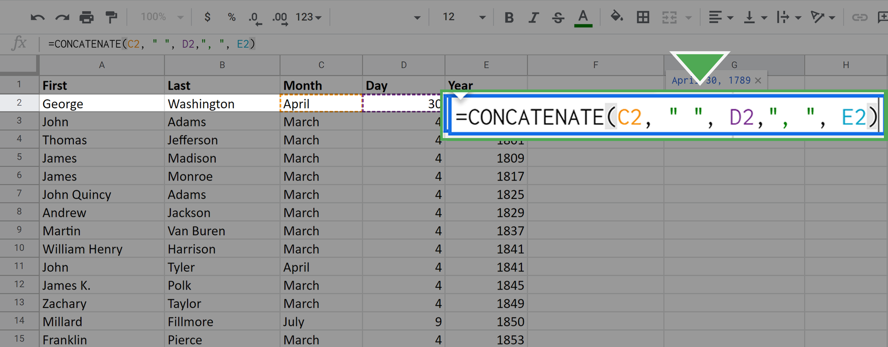
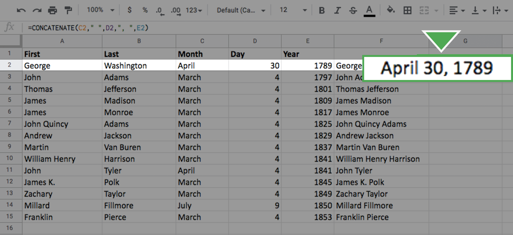
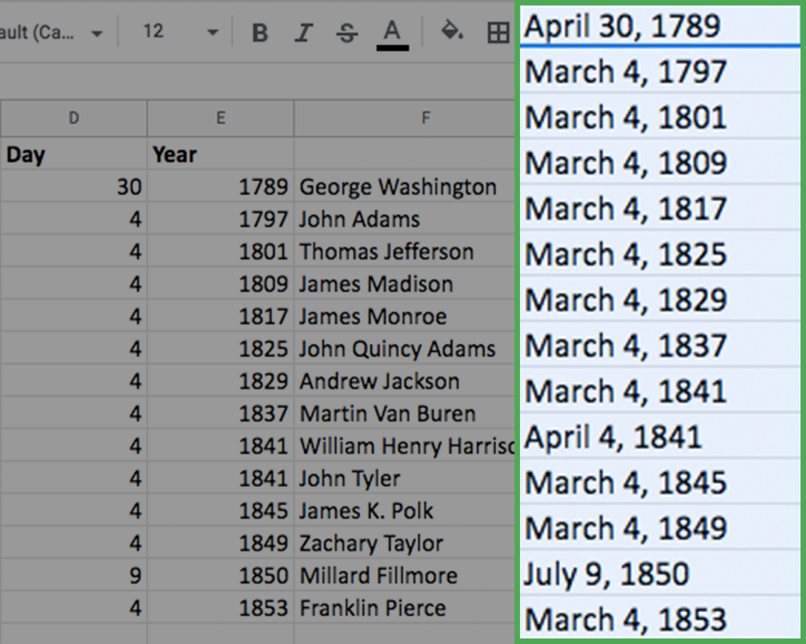

# Hands-On Activity: Combine multiple pieces of data

## Activity overview

In previous activities, you gained experience using spreadsheet functions for manipulating and cleaning data. In this activity, you’ll use the `CONCAT` and `CONCATENATE` functions to help you quickly and efficiently combine multiple pieces of raw data into new data.

By the time you complete this activity, you will be able to use these functions to combine data. This will enable you to simplify and condense data, which is important for processing and cleaning data in your career as a data analyst.

### What you will need

To get started, you will need the `CONCAT` function exercise spreadsheet.

To use the template for the spreadsheet, click the link below and select “Use Template.”

Link to template: [CONCAT Function Exercise Spreadsheet](https://docs.google.com/spreadsheets/d/1Na9M4xb-3CA746BHECX75n3B9V04pxLo0xNs9i8jMNo/template/preview)

OR If you don’t have a Google account, you can download the spreadsheet directly from the attachment [dataset-for-project_CONCAT-function.xlsx](./resources/dataset-for-project_CONCAT-function.xlsx).

## Using the CONCAT and CONCATENATE functions

Occasionally, you will encounter a dataset with data values in separate cells that you want to combine as a single value in a single cell. This is common when dealing with names and dates. The dataset may have separate columns for first names and last names, but you may want a column with the full names. 

City / state and month / year combinations are also often desirable to have together, as they are likely to be recorded together.

The `CONCAT` function in spreadsheets can combine these kinds of data.

## Combining data from two cells

First, using the spreadsheet you downloaded, you’ll combine the two sets of names in columns **First Name** and **Last Name** in a new column called Full Name.

To do this, follow these steps:

1. Click on cell F2. This is where you start the data for the new column. After you click on the cell, enter =CONCAT(A2,B2) into the function bar and hit Enter (Windows) or Return (Mac).

    

    the following data should appear in the cell:

    

    You have merged or, technically, **concatenated** the two data values from cells **A2** and **B2**. Because you listed A2 first in the `CONCAT` function argument, it comes first in the final result.

    Notice that the two names were combined without a space between them.

    If you want to put the space in between, you need to use the full `CONCATENATE` function, which allows you to combine multiple strings.

2. Click again on the cell **F2**. In the function call, place a space in `"` quotes between **A2** and **B2** separated by commas.

    

    Once you press enter or return, your screen should appear like this:

    

    Now there is a space between the first name and the last name.

Next, repeat this process for all the remaining cells in Column **F**. Of course, you don't want to do this manually for each cell. (Especially if the dataset were larger, it would be laborious to do this cell-by-cell.) Luckily, you can fill out the data in the column by using your mouse.

1. Click on the cell F2. Locate the small square in the lower-right corner of the highlighted boundary of the cell.

    

2. Click on this square, drag your mouse to the bottom of the column, and release. All the cells in the column should populate with the full name of the appropriate president.

    

- Note: While it does not happen in this dataset, you may have extra spaces in your result after you CONCAT. If you notice you have extra spaces, you can use the TRIM function to remove them.

## Combining data from three cells

The procedure for combining three pieces of data from different cells is almost identical to what you just did. The only difference is that you include a third cell in the full `CONCATENATE` argument.

Now, combine the month, day, and year into a single data value: Date. This will occupy column **G**.

1. Click on the cell where you would like the new data to start. Here, this is cell **G2**.

2. Enter the `CONCAT` command as `=CONCATENATE(C2," ",D2,", ",E2)`

    

    Pay particular attention to the extra strings you added between the month and the day, and between the day and the year. This is how you get the spaces and comma in your final result.

    

3. Fill out the rest of the column using the same click-and-drag technique as before. Your screen should appear like this:

    

Congratulations! You’ve combined data in spreadsheets using the CONCAT and CONCATENATE functions.

## Reflection

### Question 1: In an empty cell in the CONCAT function exercise spreadsheet, enter the function =CONCATENATE(A7, " ", B7). What does this function return?

- `John Quincy Adams`
- JohnQuincyAdams
- #N/A
- John QuincyAdams

> The function `=CONCATENATE(A7, " ", B7)` would return "John Quincy Adams." The correct function to use here would be `CONCATENATE`, which you can use to combine strings. Using CONCAT with these arguments would resolve this correctly in Microsoft Excel, but return an error in Google Sheets. Going forward, you can use this distinction to write proper spreadsheet functions.

## Question 2:In this activity, you used spreadsheet functions to combine data. In the text box below, write 2-3 sentences (40-60 words) in response to each of the following questions

- What are some other kinds of data you could combine using `CONCAT` or `CONCATENATE`?
- What happens if a data analyst tries to work with dates or names that haven’t been combined with `CONCAT` or `CONCATENATE`?

What do you think?
Your answer cannot be more than 10000 characters.

### Response

CONCAT or CONCATENATE can be used to combine various data types, such as addresses (combining street, city, and zip code), product codes (combining category and item codes), or any information split across multiple cells.

Without combining names or dates, analysts may struggle with disjointed information. For names, it could lead to difficulties in sorting and analyzing. For dates, it might hinder time-based analysis, making it challenging to derive insights based on chronological order. The combination enhances data organization and analysis capabilities.

> Congratulations on completing this hands-on activity! A good response would include how combining data with CONCAT and CONCATENATE helps you simplify and clean data by combining string data from multiple cells into a single cell.
>
> In order to properly and efficiently analyze data, the data has to be clean and understandable. Data analysts use functions like CONCAT to make data easier to work with, which may require combining multiple cells. Coming up, you will learn more spreadsheet functions that will help you analyze data in spreadsheets.
