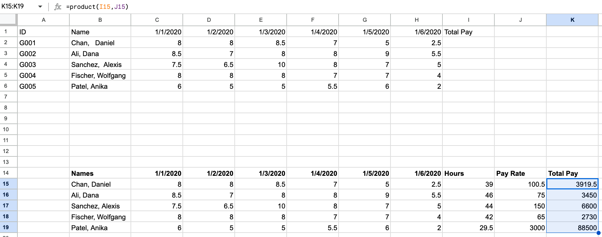

# Hands-On Activity: Use `VLOOKUP` to perform a task

## Activity Overview

You’ve been learning about `VLOOKUP`, a spreadsheet function that vertically searches for a certain value in a column to return a corresponding piece of information. In this activity, you’ll practice cleaning data and using `VLOOKUP` to consolidate information between two spreadsheet tabs. You’ll complete your analysis by creating a pivot table.

By the time you complete this activity, you will be able to use `VLOOKUP` to find information in one sheet and add it to the correct row in another spreadsheet. This is an important skill that can help you work with large datasets in your career as a data analyst.

### Scenario

Review the following scenario. Then complete the step-by-step instructions.

You’re the payroll manager at an accounting firm. To calculate payroll, you need to know how many hours each of your employees worked and their hourly rate of pay. This is easy to do manually in a small spreadsheet, but it becomes more difficult as the amount of information grows or is spread across multiple spreadsheets. You’d like to use the `VLOOKUP` function as a way to automate the information-gathering. So, follow the steps below to calculate the total weekly pay for your employees.

### Step-By-Step Instructions

Follow the instructions to complete each step of the activity. Then answer the questions at the end of the activity before going to the next course item.

### Step 1: Access the template

To get started, access the `VLOOKUP` Practice Worksheet. Select the link to the worksheet below and select USE TEMPLATE to create a copy. If you don’t have a Google account, you can download the `VLOOKUP` Practice Sheet directly from the attachment below.

Link to the worksheet: [`VLOOKUP` Practice Sheet](https://docs.google.com/spreadsheets/d/1Js6kRVYy6Nx6VENibaX9dmNOAP_7CXWuOqUjUz9cBtA/template/preview)

OR attachment file [vlookup-practice-sheet.xlsx](./resources/vlookup-practice-sheet.xlsx)

### Step 2: Prepare the data

Sheet1 of the `VLOOKUP` Practice Sheet contains a timesheet of hours worked by several employees. However, this data has not been cleaned. You'll create a clean version of the table in Sheet1 so you can manipulate the data without changing the data from the original table. Then, you’ll combine data from two sheets in the `VLOOKUP` Practice Sheet spreadsheet (Sheet1 and Sheet2) using the `VLOOKUP` function.

### Step 3: Label the columns

Working with data gets messy quickly, and it’s important to keep track of what your columns mean. First, add labels to the columns in your new table to help keep your data organized.

Add the following labels to the Sheet1:

1. In cell **B14**, enter: **Names**.
2. In cells **C14** to **H14**, enter: **1/1/2020, 1/2/2020, 1/3/2020, 1/4/2020, 1/5/2020, and 1/6/2020**.
3. In cell **I14**, enter: **Hours**.
4. In cell **J14**, enter: **Pay Rate**.
5. In cell **K14**, enter: **Total Pay**.

### Step 4: Clean the data

Some of the employee names in column B have extra spaces. Use the following steps to remove the extra spaces and clean your data.

1. In cell **B15**, enter `=TRIM(**B2**)`.
2. Select and drag the fill handle to cell **B19**, then release it. This populates the names, with extra spaces removed, in these cells.

### Step 5: Populate the daily employee hours

Next, move employee hours to your new table with cleaned employee names. Perform the following steps to populate the daily hours for the employees:

1. In cell **C15**, tyepe `=value(**C2**)`.
2. Select and drag the fill handle to cell **C19**. This populates the hours for the other employees.

    Your new table should contain the following data in rows **15-19** of column **C**:

    | Row | C |
    |-----|---|
    |15|8|
    |16|8.5|
    |17|7.5|
    |18|8|
    |19|6|

    Your table should have the values 8, 8.5, 7.5, 8, and 6 in the cells **C15** through **C19** respectively.

    Use the populated cells from **C15** through **C19** to populate the remaining hours needed for each employee. To do this, perform the following steps:

3. Select and drag the fill handle for cell **C15** to cell **H15**. This populates the remaining hours for Daniel Chan. You should see the values 8, 8, 8.5, 7, 5, and 2.5 in cells **C15** through **H15**.
4. Select and drag the fill handle for cell **C16** to cell **H16**. This populates the remaining hours for Dana Ali. You should see the values 8.5, 7, 8, 8, 9, and 5.5 in cells **C16** through **H16**.
5. Repeat this process in rows 17, 18, and 19 for the remaining employees.
    a. In row 17, you should see the values 7.5, 6.5, 10, 8, 7, and 5 in cells **C17** through **H17**.
    b. In row 18, you should see the values 8, 8, 8, 7, 7, and 4 in cells **C18** through **H18**.
    c. In row 19, you should see the values 6, 5, 5, 5.5, 6, and 2 in cells **C19** through **H19**.

Verify that your spreadsheet contains the following data:
| Row | C   | D   | E   | F   | G   | H   |
| --- | --- | --- | --- | --- | --- | --- |
| 15  | 8   | 8   | 8.5 | 7   | 5   | 2.5 |
| 16  | 8.5 | 7   | 8   | 8   | 9   | 5.5 |
| 17  | 7.5 | 6.5 | 10  | 8   | 7   | 5   |
| 18  | 8   | 8   | 8   | 7   | 7   | 4   |
| 19  | 6   | 5   | 5   | 5.5 | 6   | 2   |

### Step 6: Sum the total hours for each employee

Fill in the Hours column for the employees.

1. In cell **I15**, enter =sum(**C15**:**H15**).
2. Select and drag the fill handle for cell **I15** to cell **H15**. This populates the sums for the remaining employees.

Column I in rows 15–19 should contain the following data:

| Row | Column I |
| --- | -------- |
| 15  | 39       |
| 16  | 46       |
| 17  | 44       |
| 18  | 42       |
| 19  | 29.5     |

Your table should have the values 39, 46, 44, 42, and 29.5 in the cells **I15** through **I19** respectively.

### Step 7: Import pay rate data

You keep track of your employee’s hourly pay rate in Sheet2 of the `VLOOKUP` Practice Sheet. This sheet also includes employee ID, date of hire (DOH), and employee status.

Use `VLOOKUP` to import pay rate data from Sheet2 into Sheet1.

1. In cell **J15** on Sheet1, enter: =`VLOOKUP`(**A2**, Sheet2!$A$2:$D$6, 4, false).

    Consider the syntax for this `VLOOKUP` function:

    "**A2**" refers to cell **A2** in Sheet1.

    **Note**: In Sheet2, the rate of pay and related fields are referenced by ID instead of employee name. You need to use employee ID to import the pay rate from Sheet2.

    - "Sheet2!" refers to the sheet from which you want to access the data.
    - "$A$2:$D$6" to the range of cells that make up the table array. The "$" placed in front of the column tabs and cell numbers locks the formula so that it can be copied by dragging cell **J15** down to cell **J19** to import the pay rate for the other employees.
    - The "4" refers to the column from which the returned value will come. The "4" means that the returned value will come from the 4th column in the selected range.
    - "false" signifies that you want an exact, character-for-character match to the lookup value. Using "true" will return an approximate match (or the closest match available) for the lookup value.

2. Select and drag the fill handle for cell **J15** to cell **J19**. This populates the pay rate for the remaining employees.

    Rows 15–19 in column J should contain the following data:

    | Row | Column J |
    | --- | -------- |
    | 15  | 100.5    |
    | 16  | 75       |
    | 17  | 150      |
    | 18  | 65       |
    | 19  | 3000     |

    Your table should have the values 100.5, 75, 150, 65, and 3,000 in the cells **J15** through **J19** respectively.

3. In cell **K15**, enter: =PRODUCT(**I15**, **J15**)to calculate the total pay.
4. Select and drag the fill handle of cell **K15** to cell **K19** to populate the total pay for the remaining employees.

    

    Rows 15–19 in column K should contain the following data for Total Pay:

    | Row | Column K |
    | --- | -------- |
    | 15  | 3919.5   |
    | 16  | 3450     |
    | 17  | 6600     |
    | 18  | 2730     |
    | 19  | 88500    |

Your table should have the values 3919.5, 3450, 6600, 2730, and 88500 in the cells **K15** through **K19** respectively.

### Step 8: Create a pivot table

Now that the data is clean and includes the pay rate information, you can create a pivot table. This makes it easier to quickly identify trends and patterns and generate reports without having to search the raw data. This section demonstrates how to create a pivot table in Google Sheets. If you are using Excel, follow the [documentation for how to manually create a pivot](https://support.microsoft.com/en-us/office/create-a-pivottable-to-analyze-worksheet-data-a9a84538-bfe9-40a9-a8e9-f99134456576) table in Excel.

To create a table for data in cells **B14**:**K19**:

1. Select the data in cells **B14**:**K19**.
2. Select Insert from the menu, then select Pivot Table.
3. From the pop-up window, select New Sheet, then select Create.

A new tab titled Pivot Table 1 will appear between Sheet1 and Sheet2. A Pivot table editor will pop up on the screen. Use this editor to create a pivot table that contains each employee’s name, pay rate, and total pay:

1. Select Add for Rows. Then, select Names from the dropdown options.
2. Select Add for Values. Then, select Pay Rate from the dropdown options.
3. Select Add for Values again. Then, select Total Pay from the dropdown options.
4. Select cells **B2** through **C6**, then select the $ symbol from the toolbar to reformat these cells as currency.

Rows 1-7 in columns A, B, and C in the sheet Pivot Table 1 should contain the following data:

| Row | Names               | SUM of Pay Rate | SUM of Total Pay |
| --- | ------------------- | --------------- | ---------------- |
| 2   | Ali, Dana           | $75.00          | $3,450.00        |
| 3   | Chan, Daniel        | $100.50         | $3,919.00        |
| 4   | Fischer, Wolfgang   | $65.00          | $2,730.00        |
| 5   | Patel, Anika        | $3,000.00       | $88,500.00       |
| 6   | Sanchez, Alexis     | $150.00         | $6,600.00        |
| 7   | Grand Total         | $3,390.50       | $105,199.50      |

Your table should have the following values:

In row 2, you see the name Ali, Dana with a pay rate of $75.00 and a total pay of $3,450.00. In row 3, you see the name Chan, Daniel with a pay rate of $100.50 and a total pay of $3,919.00. In row 4, you see the name Fischer, Wolfgang with a pay rate of $65.00 and a total pay of $2,730.00. In row 5, you see the name Patel, Anika with a pay rate of $3,000.00 and a total pay of $88,500.00. In row 6, you see the name Sanchez, Alexis with a pay rate of $150.00 and a total pay of $6,600.00. In row 7 are the grand totals, which include the total combined pay rate of $3,390.50 and the total combined pay of $105,199.50.

Congratulations! You have now cleaned and labeled your data, used `VLOOKUP` to import data from another spreadsheet, and created a pivot table. Now you’ll be able to easily complete payroll for your employees.

### Pro tip: Save the activity template

Be sure to save a copy of the spreadsheet template you used to complete this activity. You can use it for further practice or to help you work through your thought processes for similar tasks in a future data analyst role.

## Reflection

### Question 1: One of your employees,  Alexis Sanchez, asks you to confirm her hourly pay rate. Assuming you have access to Sheet1 and Sheet2 in the `VLOOKUP` Practice Sheet, but not the pivot table, which `VLOOKUP` function would return her hourly pay rate from Sheet2?

- =`VLOOKUP`(**B17**, **B15**:**J19**, 9, false)
- =`VLOOKUP`(**B20**, **B15**:**J19**, 8, true)
- =`VLOOKUP`(**B17**, **B15**-**J19**, 9, false)
- =`VLOOKUP`(**B17**, **B15**:**J19**, 8, false)

### Question 2

In this activity, you used the `VLOOKUP` function to find values within a spreadsheet. In the text box below, write 2–3 sentences (40–60 words) in response to each of the following questions:

- Why is it important to clean and label data when using `VLOOKUP` and pivot tables?
- What are some other ways that you might use `VLOOKUP` with the data in this table?