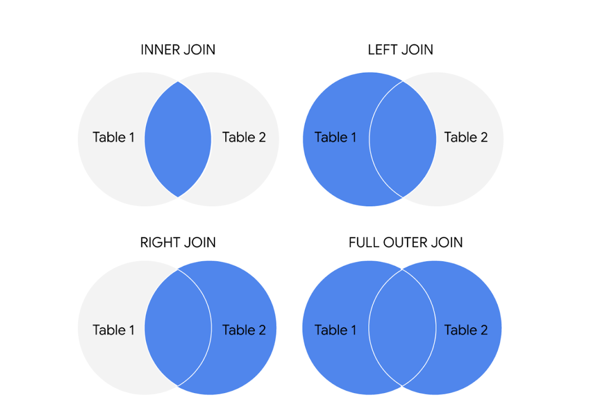

# Use JOINs Effectively

In this reading, you will review how JOINs are used and will be introduced to some resources that you can use to learn more about them. A JOIN combines tables by using a primary or foreign key to align the information coming from both tables in the combination process. JOINs use these keys to identify relationships and corresponding values across tables.

If you need a refresher on primary and foreign keys, refer to the [glossary](../../m4_perform-data-calculations/p7_course_wrap-up/s1_r_course-5-glossary.md) for this course, or go back to [Databases in data analytics](../../../3_Prepare-Data-for-Exploration/3_Module-3_All-about-databases/1_Working-with-databases/3_READING_Databases-in-data-analytics.md).

## General JOIN Syntax

```sql
SELECT 
   -- table columns from tables are inserted here
   table_name1.column_name
   table_name2.column_name
FROM
   table_name1
JOIN
   table_name2
ON table_name1.column_name = table_name2.column_name
```

As you can see from the syntax, the JOIN statement is part of the FROM clause of the query. JOIN in SQL indicates that you are going to combine data from two tables. ON in SQL identifies how the tables are to be matched for the correct information to be combined from both.

## Type of JOINs

There are four general ways in which to conduct JOINs in SQL queries: INNER, LEFT, RIGHT, and FULL OUTER.

 <!-- Replace with an actual image link -->

Here is what these different JOIN queries do.

### INNER JOIN

INNER is optional in this SQL query because it is the default as well as the most commonly used JOIN operation. INNER JOIN returns records if the data lives in both tables. For example:

```sql
SELECT
   customers.customer_name,
   orders.product_id,
   orders.ship_date
FROM
   customers 
INNER JOIN 
   orders 
ON customers.customer_id = orders.customer_id
```

The results might look like the following:

| customer_name          | product_id | ship_date   |
|------------------------|------------|-------------|
| Martin's Ice Cream      | 043998     | 2021-02-23  |
| Beachside Treats        | 872012     | 2021-02-25  |
| Mona's Natural Flavors  | 724956     | 2021-02-28  |
| ... etc.                | ... etc.    | ... etc.     |

### LEFT JOIN

LEFT JOIN returns all the records from the left table and only the matching records from the right table. For example:

```sql
SELECT
   customers.customer_name, 
   sales.sales_rep
FROM 
   customers 
LEFT JOIN 
   sales 
ON customers.customer_id = sales.customer_id
```

The results might look like the following:

| customer_name          | sales_rep   |
|------------------------|-------------|
| Martin's Ice Cream      | Luis Reyes  |
| Beachside Treats        | NULL        |
| Mona's Natural Flavors  | Geri Hall   |
| ... etc.                | ... etc.    |

### RIGHT JOIN

RIGHT JOIN returns all records from the right table and the corresponding records from the left table. Practically speaking, RIGHT JOIN is rarely used. Most people simply switch the tables and stick with LEFT JOIN. For example:

```sql
SELECT
   sales.sales_rep,
   customers.customer_name
FROM 
  sales 
RIGHT JOIN 
  customers 
ON sales.customer_id = customers.customer_id
```

The query results are the same as the previous LEFT JOIN example.

| customer_name          | sales_rep   |
|------------------------|-------------|
| Martin's Ice Cream      | Luis Reyes  |
| Beachside Treats        | NULL        |
| Mona's Natural Flavors  | Geri Hall   |
| ... etc.                | ... etc.    |

### FULL OUTER JOIN

FULL OUTER JOIN returns all records from the specified tables. For example:

```sql
SELECT
   customers.customer_name,
   orders.ship_date
FROM 
   customers 
FULL OUTER JOIN 
   orders
ON customers.customer_id = orders.customer_id
```

The results might look like the following:

| customer_name          | ship_date   |
|------------------------|-------------|
| Martin's Ice Cream      | 2021-02-23  |
| Beachside Treats        | 2021-02-25  |
| NULL                   | 2021-02-25  |
| The Daily Scoop         | NULL        |
| Mountain Ice Cream      | NULL        |
| Mona's Natural Flavors  | 2021-02-28  |
| ... etc.                | ... etc.    |

## For More Information

JOINs are going to be useful for working with relational databases and SQL, and you will have plenty of opportunities to practice them on your own. Here are a few other resources that can give you more information about JOINs and how to use them:

- [SQL JOINs](https://www.w3schools.com/sql/sql_join.asp): This is a good basic explanation of JOINs with examples.

- [Database JOINs - Introduction to JOIN Types and Concepts](https://www.essentialsql.com/introduction-database-joins/): A thorough introduction to JOINs explaining different scenarios.

- [SQL JOIN Types Explained in Visuals](https://dataschool.com/how-to-teach-people-sql/sql-join-types-explained-visually/): Visual representation of different JOINs.

- [SQL JOINs: Bringing Data Together One Join at a Time](https://towardsdatascience.com/sql-join-8212e3eb9fde): Detailed explanation of JOINs with examples, combining JOINs with aliasing.
- [SQL JOIN](https://www.dofactory.com/sql/join): This is another resource that provides a clear explanation of JOINs and uses examples to demonstrate how they work. The examples also combine JOINs with aliasing. This is a great opportunity to see how JOINs can be combined with other SQL concepts that you have been learning about in this course.  
