# Practice Quiz - Hands-On Activity: Work with Conditions

## Activity Overview

In previous activities, you used basic spreadsheet functions such as COUNT, SUM, AVERAGE, and MAX. In this activity, you will work with the conditional versions of these functions: COUNTIF, SUMIF, AVERAGEIF, and MAXIFS.

Conditional functions are functions that perform a specific task, but only on cells that satisfy some defined criteria. They are usually identified with an IF suffix adjoined to the desired operation. They are frequently used when constructing more complex queries that cannot be accomplished using more basic functions.

By the time you complete this activity, you will be able to use conditional functions and understand when and why they are appropriate. This will enable you to do more complex analysis with spreadsheets as you continue to develop your data analyst skill set.

### Step by step instructions

Follow the instructions to complete each step of the activity. Then answer the question at the end of the activity before going to the next course item.

### Step 1: Access the template

To get started, you will need to access the Working with Conditions spreadsheet.

Click the link to the spreadsheet to create a copy. If you don’t have a Google account, you may download the spreadsheet directly from the attachments below. Make sure to select “Use Template” on the downloadable item.

Link to spreadsheet: [Working with Conditions](https://docs.google.com/spreadsheets/d/1sKNqBzV63Na76jjoKLukjTtDyDMwVW0Vjz4mM-sJDEM/template/preview#gid=895883562)

OR attachment [working-with-conditions.xlsx](./resources/working-with-conditions.xlsx)

### Step 2: Use the COUNTIF function

First, open the Working with Conditions spreadsheet.

In this scenario, your stakeholders have asked you to calculate the number of salespeople that the company has in New York state. The COUNTIF function allows you to do this easily. COUNTIF counts and returns the number of records in a table that meet a certain criteria—in this case, the number of salespeople a company has in the state of New York. The syntax is =COUNTIF(range, criteria).

The range is the array (or collection) of cells that you are checking and the criteria is what you are checking for. All cells in the array that match the provided criteria will be counted and this number returned as the value of the function.

To use this function to count the number of salespeople working from “NY,” click on an open cell. In the function bar, enter `=COUNTIF(B2:B21, "NY")`.

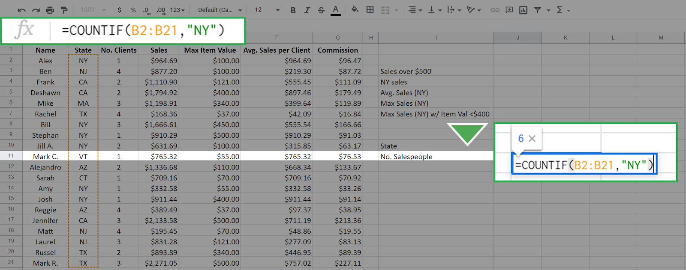

The range is the array of cells from B2 to B21. This is all from column B with the exception of the column header. The function checks all cells in this array against the value “NY” (entered in quotes) which is the criteria. Every cell in this array with a value of “NY” will be counted, and the result is returned in the cell. It is 6 in this case.

Press **Enter**/**Return**. The result should display like this:

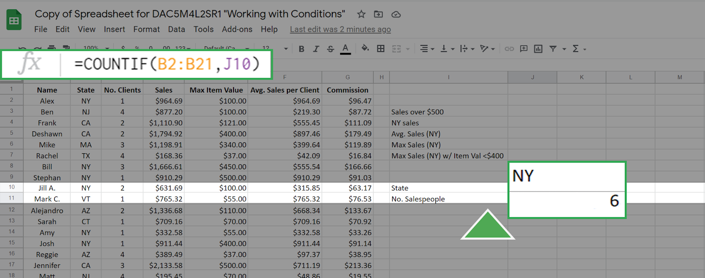

You can achieve the same result by entering a cell address as the criteria. For example, the cell **J10** has the value "NY." If you enter this in the function bar the `COUNTIF` function will seek out the value in cell **J10** and use it as the criteria. This gives the same result as before:  

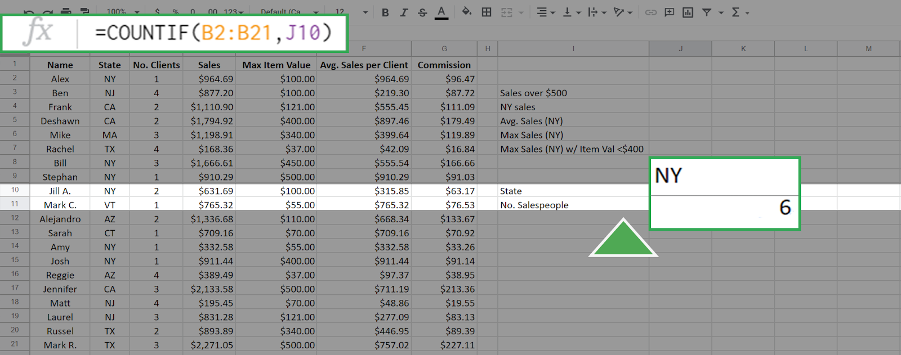

Other examples of using COUNTIF include a hotel manager checking on how many rooms are currently occupied for staffing and inventory, or it could be used in a factory to count the number of defective items in a batch.

### Step 3: Use the SUMIF function

The SUMIF function is used to create a sum of the values of cells that meet a specific criteria. SUMIF supports the logical operators (>, <, <>, =). The syntax for this function is =SUMIF(range, criteria, [sum_range] ).

The range, also called the input range, is the array of cells that you check against the value of criteria. The sum_range is the array of values that you will sum up if the criteria is met. In this syntax above, the square brackets around sum_range indicate that this input is optional. However, you do not add square brackets when writing the function. If the argument sum_range is absent, then the SUMIF will sum the values in range by default.

As an example of this function, suppose that you want to create a sum of all sales more than $500.00. This can be executed as `=SUMIF(D2:D21, ">500")`.

The result is **19007.61**:

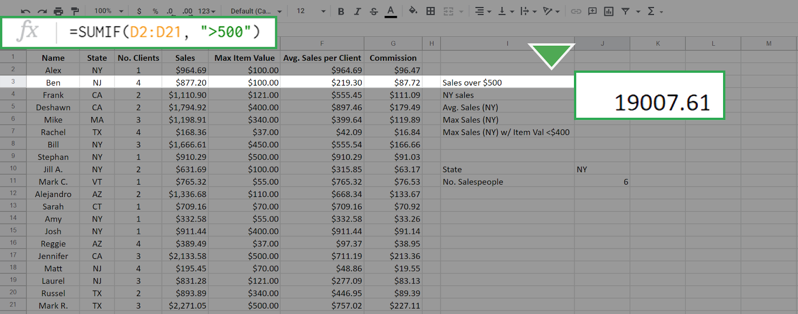

Because you didn't include the sum_range input, all the values in the cells D2 to D21 that match the criteria were summed by default. To sum only the sales from New York, but not restrict to those greater than $500, enter the following function: `=SUMIF(B2:B21, "NY", D2:D21)`.

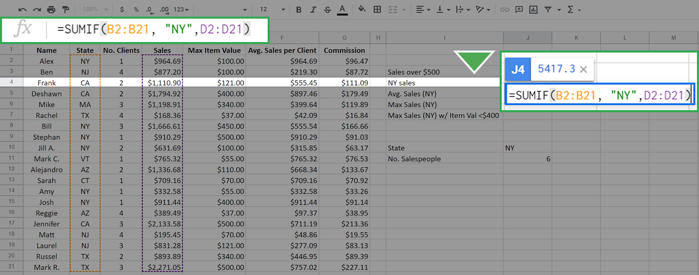

This results in **5417.3**:

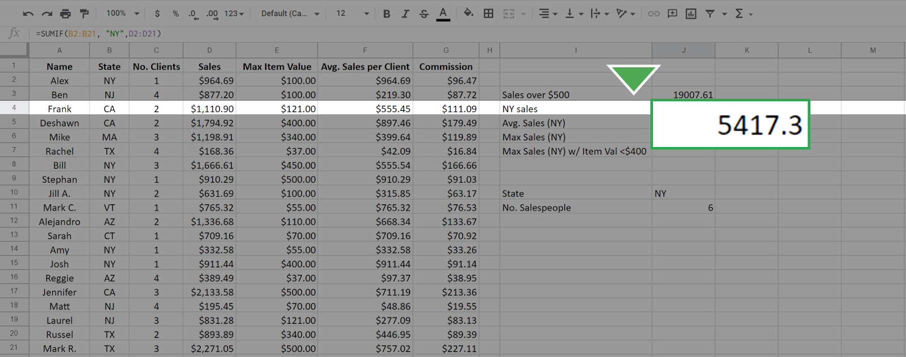

The first input, B2:B21, is the range of cells that are checked for the criteria "NY" and the summing is done across the sum_range of cells D2:D21 that have the state meeting the criteria "NY." This is different than in the first case. In that case, the array that you check is the same array that you sum across.

Other examples of using SUMIF include tracking the total value of a specific product to better manage inventory. A medical accountant might use SUMIF to total the expenses related to a particular department or piece of equipment, such as an MRI machine.  

### Step 4: Use the AVERAGE function

Just like the previous two functions, the AVERAGEIF function will average the values in an array based on a specific criteria. The syntax is `=AVERAGEIF(range, criteria, [sum_range])`.

The inputs to this function—range, criteria, and sum_range—work in exactly the same manner as in the SUMIF function. Again, the sum_range is optional.

You know from your previous queries that there are six salespeople in New York. To find the average sales per for these salespeople, enter the following function: `=AVERAGEIF(B2:B21, "NY", D2:D21)`.

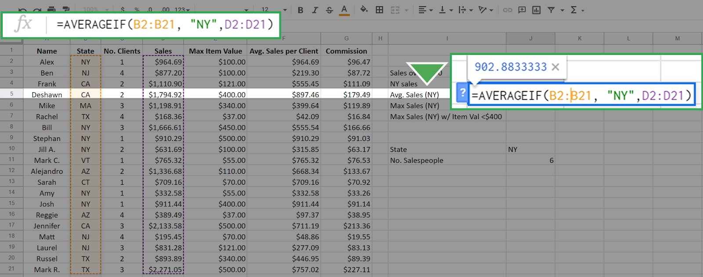

The result is 902.83333, which means that the average salesperson for this company in New York state sells $902.83 worth of merchandise.

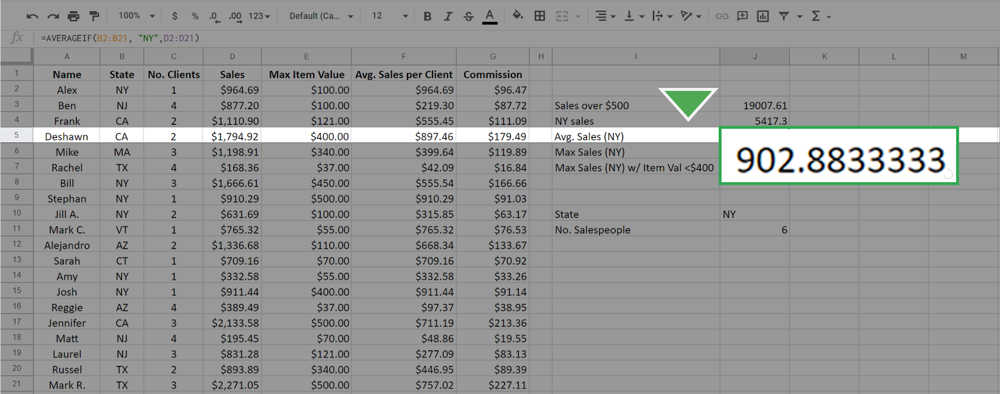

Averaging data conditionally allows you to get more specific insights into your dataset. For example, you might want to know the average sales that are made on weekends to plan promotional events more effectively.

### Step 5: use the MAXIFS function

The MAXIFS function is slightly different from the other three functions—it returns the maximum value in a range based on one or more conditions. The easiest way to observe the difference is to examine the syntax: `=MAXIFS(max_range, range1, criteria1, [range2], [criteria2], ...)`

*Note for Microsoft Excel: MAXIFS can only be used with an Office 365 subscription on Excel 2016 or newer. If you cannot use a version of Excel that allows the function MAXIFS, use Google Sheets for this part of the activity.*

The first argument, max_range, is the array for which you want to find the maximum value. The second argument (range1) is the array you are checking. The third argument (criteria1) is the value that you are checking for. The inputs in the square brackets are for optional additional constraints.

To use MAXIFS to find the maximum sales from any salesperson in New York, enter the following: `=MAXIFS(D2:D21, B2:B21, "NY")`.

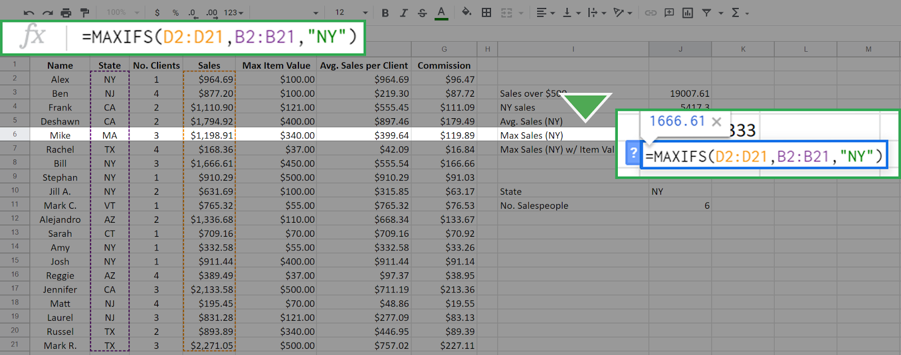

The resulting calculation is 1666.61. It’s important to keep in mind that the order in which you enter the inputs matters. If you reverse the position of the arrays and enter `=MAXIFS(B2:B21, D2:D21, "NY")` the result is 0.

This is because you are now asking the function to find the maximum of the array B2:B21 where the sales equal "NY". This is impossible because the values in the array D2:D21 (the sales array) are numerical—none of them equals "NY." The function returns 0 when nothing in the range meets the criteria.

The MAXIFS function can input more than one constraint. This is where the optional range2 and constraint2 come into play. For example, to find the maximum sales in New York where the Max Item Cost is below $400, enter the following into the function bar: `=MAXIFS(D2:D21, B2:B21, "NY", E2:E21, "<400")`.

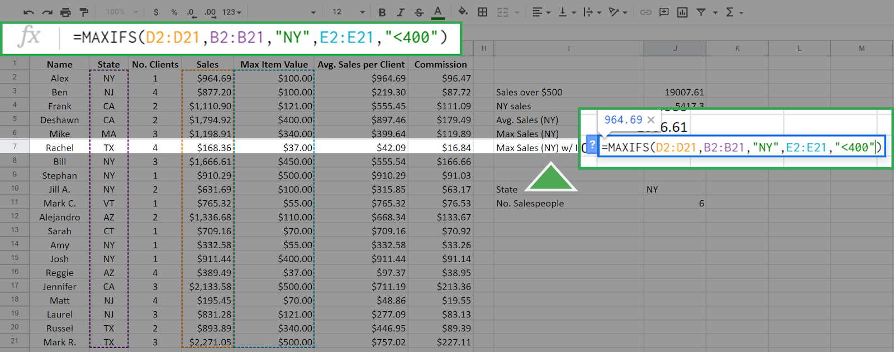

Additional constraints follow the logic that every constraint must be satisfied for a cell in the max_range to be considered.

The first three inputs are the same as above, but now you've added the additional constraint that Max Item Value must be less than $400. The array E2:E21 is the Max Item array and its cells are checked against the criteria <400. The function returns the following, which is the maximum sales of any New York salesperson who did not sell any single item over (or equal to) $400.

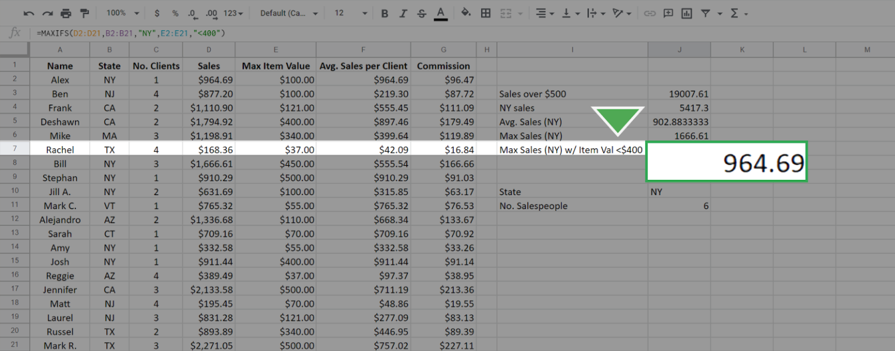

### Step 6: Compare the conditional functions

Each of the previous functions—`COUNTIF`, `SUMIF`, and `AVERAGEIF`—have equivalents that work similarly to MAXIFS. These include `COUNTIFS`, `SUMIFS`, and `AVERAGEIFS`. The syntax and functionality of these functions, apart from the specific calculation, are identical to `MAXIFS`. For example, the `SUMIFS` function will give the sum for single and multiple constraints just like `MAXIFS` function does for the maximum. It also has the same syntax as `MAXIFS`.sheet with `MAXIFS` function with two constraints results highlighted.

### Pro Tip: Save the actitivty tempalte

Be sure to save a copy of the spreadsheet template you used to complete this activity. You can use it for further practice or to help you work through your thought processes for similar tasks in a future data analyst role.

## Reflection

In this activity, you tested the formula =COUNTIF(B2:B21, "NY"), which returned the value 6. To determine how many of those six salespeople have only one client, you enter =COUNTIFS(B2:B21, "NY", C2:C21, "1"). What value does this return?

- 1
- 3
- `4`: correct
- 5

> The formula =COUNTIFS(B2:B21, "NY", C2:C21, "1") returns the value 4. It uses the COUNTIFS function to define multiple conditions. It checks both column B for instances of “NY” in the States column and for the value 1 in column C which contains each salesperson’s number of clients. There are only four instances in this table where a salesperson in New York has one client!
