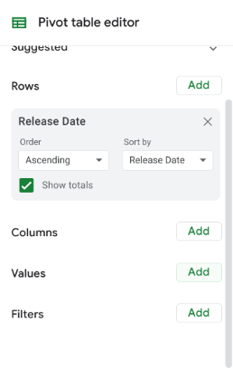

# Video- Start working with pivot tables

Video transcript

- Hey, there.
- By now, we've learned a lot about functions and formulas.
- They are very helpful tools for your toolbox and great for finding shortcuts to complete calculations.
- But there's another tool out there that does some of the same things in a spreadsheet: the pivot table.
- As a quick reminder, pivot tables let you view data in multiple ways to find insights and trends.
- We've talked before about how pivot tables help with cleaning and organizing your data including sorting and grouping data.
- But pivot tables can also help with calculations.
- For example, they're great for quickly calculating sums and averages.
- Let's revisit our movie data set to show you how pivot tables and calculations worked hand in hand.
- Earlier, we summarized and organized this data in pivot tables.
- We'll do that here too.
- But in this case the organization is a bonus to using pivot tables for calculations.
- You can do these steps in Excel as well, though some of the steps might look different.
- If you're using Excel, you can check out the reading after this video for more detail about pivot tables and Excel spreadsheets.
- In this example, your manager ask you to find some trends to help them think through new movie ideas using revenue calculations.
- This spreadsheet has data about movies from several years ago.
- So it probably wouldn't be as useful right now.
- Still, the steps we take to analyze the data absolutely apply then and now.
- So let's get into it.
- First, we need to find out how much revenue was generated each year.
- A pivot table is a good way to organize this.
- So we'll build a pivot table to show this.
- In our pivot table, we can also find the average revenue per movie.
- We can then check our findings for some possible trends.
- We'll start by finding the revenue generated each year.
- This gives us the release date for each movie in column B and the box office revenue in column N.
- Instead of reorganizing the table by year and building a formula to calculate the revenue per year we'll create a pivot table.
- Well, at the pivot table in a new sheet keeping the data range of cell A1 to cell N509.
- Adding a new sheet is especially helpful when working in a large dataset like this.
- It helps keep our calculations together in one place and separate from the rest of the data.
- We'll rename this sheet revenue to call out where our calculations are, both for ourselves and for anyone else on our team who might need our analysis.
- Now we can build our pivot table, starting with the rows.
- We'll sort the rows by release date to find out the revenue for each year.
- You might notice this creates a row for every date on which one or more movies in this dataset was released.
- Since we only need the years, we'll right click in one of the cells in the release date column to create a pivot date group and group by year.
- Now we have rows, one for each year in which these movies were released.
- Next, we want to work with the values.
- Well, at the box office revenue data here.
- This populates the columns next to the release dates with the total box office revenue and each year.
- These calculations are automatic because the pivot table is already set to summarize the data using the sum function.
- So no need to change this setting.
- There are other functions and the summarized by menu though, such as min for the minimum amount of revenue each year and count for the number of movies that generated revenue in each year.
- Okay, let's check out what we've got here.
- This data shows that 2014 have the highest revenue, while 2016 have the lowest.
- This might be useful information, but finding the average revenue per movie would most likely be more useful since there was a different number of movies released each year.
- So we'll add another column for the average revenue earned by each year's movie.
- We can do this in the same pivot table.
- We'll add another value and change the function that we use to summarize from sum to average.
- The average function gives us the average revenue per year for the movies in the dataset.
- We can see that the average revenue in 2015 was much lower than the other years.
- Since this data stands out so much, let's keep exploring to find out why.
- Taking your analysis to another level like this is a sign of a great analyst.
- When you're in your job, you want to answer the questions that your manager and stakeholders ask.
- But you also want to answer the ones that come up while you're doing your analysis.
- So let's try to figure this out.
- First, we'll know how many movies from each year were included in the dataset, we'll add a new value and use the count function this time.
- This shows us that there are more movies in the data set from 2015 than from any other year.
- But 2015 still has the second lowest total box office revenue.
- This could mean a few things.
- It's likely that a lot of the movies from 2015 just didn't earn much revenue compared to the other years, which would bring down the overall average revenue.
- Even if the total revenue remained on par with the other years.
- We'll explore just this one possibility here.
- But you can always go further when you analyze data in your own job.
- It will depend on your objectives and the questions you need to answer.
- For now let's copy and paste our pivot table so we can test our hypothesis.
- We'll rename the columns and our copy table to differentiate them from our original table.
- We'll name them based on the data we'll be looking at, which I'll explain in the next video.
- Now our copied pivot table is ready for us to test our hypothesis.
- Next, we're going to use filters to find out how many movies earned less than $10 million revenue in 2015.
- Then we'll also create a calculated field to determine what percentage of the total movies from that year they represent.
- I'll be here when you're ready to learn more about pivot tables.

## Questions and Notes

### Notes

- Pivot tables: let you view data in multiple ways to find insights and trends
- The menu option has slightly changed. To insert a pivot table select Insert and Pivot Table.
- Analysis steps for the example in the video:
  - Find out how much revenue was generated each year
  - Build a pivot table to show the revenue per year
  - Find the average revenue per movie
  - Check our findings for some possible trends
- To view the options that are shown next, in the Pivot table editor you must first click the Add button for Values.

    

### Questions

Would you like to follow along with the instructor using the same spreadsheet?

To use the template for the spreadsheet, click the link below and select “Use Template.”

Link to template: [Movie Data Starter Project](https://docs.google.com/spreadsheets/d/1FLaUmMn62YlHYihV6pK1DJqWcFYCnuoqoxFWmm_o5b0/template/preview)

OR If you don't have a Google account, you can download the spreadsheet directly from the attachment [movie-data-starter-project.xlsx](./resources/movie-data-starter-project.xlsx).

- Analysis steps:
  - Find out how much revenue was generated each year
  - Build a pivot table to show the revenue per year
  - Find the average revenue per movie
  - Check our findings for some possible trends