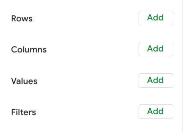
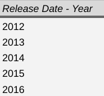
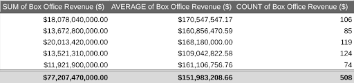
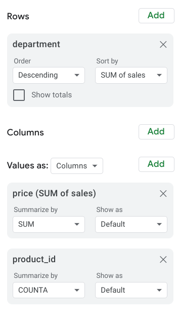

# Elements of a pivot table

Previously, you learned that a pivot table is a tool used to sort, reorganize, group, count, total, or average data in spreadsheets. In this reading, you will learn more about the parts of a pivot table and how data analysts use them to summarize data and answer questions about their data.

Pivot tables make it possible to view data in multiple ways in order to identify insights and trends. They can help you quickly make sense of larger data sets by comparing metrics, performing calculations, and generating reports. They’re also useful for answering specific questions about your data.

A pivot table has four basic parts: rows, columns, values, and filters.

The **rows** of a pivot table organize and group data you select horizontally. For example, in the [Start working with pivot tables](../p2_pivot_pivot_pivot/s1_v_start-working-with-pivot-tables.md) video, the Release Date values were used to create rows that grouped the data by year.

The **columns** organize and display values from your data vertically. Similar to rows, columns can be pulled directly from the data set or created using **values**. **Values** are used to calculate and count data. This is where you input the variables you want to measure. This is also how you create **calculated fields** in your pivot table. As a refresher, a calculated field is a new field within a pivot table that carries out certain calculations based on the values of other fields.

In the previous movie data example, the Values editor created columns for the pivot table, including the `SUM` of Box Office Revenue, the `AVERAGE` of Box Office Revenue, and the `COUNT` of Box Office Revenue columns.

Finally, the **filters** section of a pivot table enables you to apply filters based on specific criteria—just like filters in regular spreadsheets! For example, a filter was added to the movie data pivot table so that it only included movies that generated less than $10 million in revenue.

Being able to use all four parts of the pivot table editor will allow you to compare different metrics from your data and execute calculations, which will help you gain valuable insights.

## Using pivot tables for analysis

Pivot tables can be a useful tool for answering specific questions about a dataset so you can quickly share answers with stakeholders. For example, a data analyst working at a department store was asked to determine the total sales for each department and the number of products they each sold. They were also interested in knowing exactly which department generated the most revenue.

Instead of making changes to the original spreadsheet data, they used a pivot table to answer these questions and easily compare the sales revenue and number of products sold by each department.

They used the department as the rows for this pivot table to group and organize the rest of the sales data. Then, they input two Values as columns: the `SUM` of sales and a count of the products sold. They also sorted the data by the `SUM` of sales column in order to determine which department generated the most revenue.

Now they know that the Toys department generated the most revenue!

## Key takeaways

Pivot tables are an effective tool for data analysts working with spreadsheets because they highlight key insights from the spreadsheet data without having to make changes to the spreadsheet. Coming up, you will create your own pivot table to analyze data and identify trends that will be highly valuable to stakeholders.
