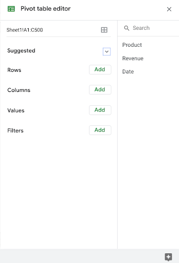

# Use pivot tables in analysis

In this reading, you will learn how to create and use pivot tables for data analysis. You will also get some resources about pivot tables that you can save for your own reference when you start creating pivot tables yourself. **Pivot tables** are a spreadsheet tool that let you view data in multiple ways to find insights and trends.

Pivot tables allow you to make sense of large data sets by giving you tools to easily compare metrics, quickly perform calculations, and generate readable reports. You can create a pivot table to help you answer specific questions about your data. For example, if you were analyzing sales data, you could use pivot tables to answer questions like, “Which month had the most sales?” and “What products generated the most revenue this year?” When you need answers to questions about your data, pivot tables can help you cut through the clutter and focus on only the data you need.

## Create your pivot table

Before you can analyze data with pivot tables, you will need to create a pivot table with your data. The following includes the steps for creating a pivot table in Google Sheets, but most spreadsheet programs will have similar tools.

1. Open the **Insert** menu from the toolbar; there will be an option for **Pivot table**.

   

2. A pop-up menu titled **Create pivot table** will appear. You can choose to create a new sheet or use an existing sheet for your pivot table. Click **Create**.

   

3. Once you have created your pivot table, you will have access to the **pivot table editor** on the right of your data.

   

   This is where you can customize your pivot table, including what variables you want to include for your analysis.

## Using your pivot table for analysis

You can perform a wide range of analysis tasks with your pivot tables to quickly draw meaningful insights from your data, including performing calculations, sorting, and filtering your data. Below is a list of online resources that will help you learn about performing basic calculations in pivot tables as well as resources for learning about sorting and filtering data in your pivot tables.

### Perform calculations

| **Microsoft Excel** | **Google Sheets** |
| ------------------- | ----------------- |
| [Calculate values in a pivot table](https://support.microsoft.com/en-us/office/calculate-values-in-a-pivottable-11f41417-da80-435c-a5c6-b0185e59da77): Microsoft Support’s introduction to calculations in Excel pivot tables. This is a useful starting point if you are learning how to perform calculations with pivot tables specifically in Excel. | [Create and use pivot tables]([link_to_google_sheets_pivot_tables_guide](https://support.google.com/docs/answer/1272900?co=GENIE.Platform%3DDesktop&hl=en)): This guide is focused on using pivot tables in Google Sheets and it provides instructions for creating calculated fields. This is a quick how-to guide you can save and reference as a quick reminder on how to add calculated fields. |
| [Pivot table calculated field example]([link_to_pivot_table_calculated_field_example](https://exceljet.net/pivot-table/pivot-table-calculated-field-example)): This resource includes a detailed example of a pivot table being used for calculations. This step-by-step process demonstrates how calculated fields work and provides you with some idea of how they can be used for analysis. | [All about calculated field in pivot tables]([link_to_all_about_calculated_field](https://infoinspired.com/google-docs/spreadsheet/all-about-calculated-field-in-pivot-table-in-google-sheets/)): This is a comprehensive guide to calculated fields for Google Sheets. If you are working with Sheets and are interested in learning more about pivot tables, this is a great resource. |
| [Pivot table calculated fields: step-by-step tutorial]([link_to_step_by_step_tutorial](https://powerspreadsheets.com/pivottable-calculated-fields/)): This tutorial for creating your own calculated fields in pivot tables is a really useful resource to save and bookmark for when you start to apply calculated fields to your own spreadsheets. | [Pivot tables in Google Sheets]([link_to_google_sheets_pivot_tables_guide](https://www.benlcollins.com/spreadsheets/pivot-tables-google-sheets/)): This beginner’s guide covers the basics of pivot tables and calculated fields in Google Sheets and uses examples and how-to videos to help demonstrate these concepts. |

### Sort your data

### Filter your data

### Format your data