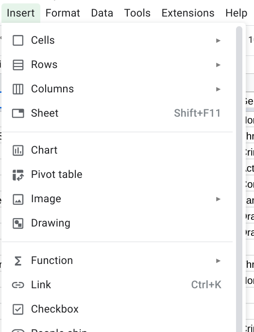
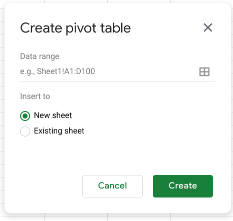
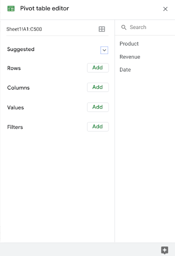

# Use pivot tables in analysis

In this reading, you will learn how to create and use pivot tables for data analysis. You will also get some resources about pivot tables that you can save for your own reference when you start creating pivot tables yourself. **Pivot tables** are a spreadsheet tool that let you view data in multiple ways to find insights and trends.

Pivot tables allow you to make sense of large data sets by giving you tools to easily compare metrics, quickly perform calculations, and generate readable reports. You can create a pivot table to help you answer specific questions about your data. For example, if you were analyzing sales data, you could use pivot tables to answer questions like, “Which month had the most sales?” and “What products generated the most revenue this year?” When you need answers to questions about your data, pivot tables can help you cut through the clutter and focus on only the data you need.

## Create your pivot table

Before you can analyze data with pivot tables, you will need to create a pivot table with your data. The following includes the steps for creating a pivot table in Google Sheets, but most spreadsheet programs will have similar tools.

1. Open the **Insert** menu from the toolbar; there will be an option for **Pivot table**.

   

2. A pop-up menu titled **Create pivot table** will appear. You can choose to create a new sheet or use an existing sheet for your pivot table. Click **Create**.

   

3. Once you have created your pivot table, you will have access to the **pivot table editor** on the right of your data.

   

   This is where you can customize your pivot table, including what variables you want to include for your analysis.

## Using your pivot table for analysis

You can perform a wide range of analysis tasks with your pivot tables to quickly draw meaningful insights from your data, including performing calculations, sorting, and filtering your data. Below is a list of online resources that will help you learn about performing basic calculations in pivot tables as well as resources for learning about sorting and filtering data in your pivot tables.

### Perform calculations

| **Microsoft Excel** | **Google Sheets** |
| ------------------- | ----------------- |
| [Calculate values in a pivot table](https://support.microsoft.com/en-us/office/calculate-values-in-a-pivottable-11f41417-da80-435c-a5c6-b0185e59da77): Microsoft Support’s introduction to calculations in Excel pivot tables. This is a useful starting point if you are learning how to perform calculations with pivot tables specifically in Excel. | [Create and use pivot tables]([link_to_google_sheets_pivot_tables_guide](https://support.google.com/docs/answer/1272900?co=GENIE.Platform%3DDesktop&hl=en)): This guide is focused on using pivot tables in Google Sheets and it provides instructions for creating calculated fields. This is a quick how-to guide you can save and reference as a quick reminder on how to add calculated fields. |
| [Pivot table calculated field example]([link_to_pivot_table_calculated_field_example](https://exceljet.net/pivot-table/pivot-table-calculated-field-example)): This resource includes a detailed example of a pivot table being used for calculations. This step-by-step process demonstrates how calculated fields work and provides you with some idea of how they can be used for analysis. | [All about calculated field in pivot tables]([link_to_all_about_calculated_field](https://infoinspired.com/google-docs/spreadsheet/all-about-calculated-field-in-pivot-table-in-google-sheets/)): This is a comprehensive guide to calculated fields for Google Sheets. If you are working with Sheets and are interested in learning more about pivot tables, this is a great resource. |
| [Pivot table calculated fields: step-by-step tutorial]([link_to_step_by_step_tutorial](https://powerspreadsheets.com/pivottable-calculated-fields/)): This tutorial for creating your own calculated fields in pivot tables is a really useful resource to save and bookmark for when you start to apply calculated fields to your own spreadsheets. | [Pivot tables in Google Sheets]([link_to_google_sheets_pivot_tables_guide](https://www.benlcollins.com/spreadsheets/pivot-tables-google-sheets/)): This beginner’s guide covers the basics of pivot tables and calculated fields in Google Sheets and uses examples and how-to videos to help demonstrate these concepts. |

### Sort your data

| **Microsoft Excel** | **Google Sheets** |
| ------------------- | ----------------- |
| [Sort data in a pivot table or PivotChart](https://support.microsoft.com/en-us/office/sort-data-in-a-pivottable-or-pivotchart-e41f7107-b92d-44ef-861f-24430830450a): This is a Microsoft Support how-to guide to sorting data in pivot tables. This is a useful reference if you are working with Excel and are interested in checking out how filtering will appear in Excel specifically. | [Customize a pivot table](https://support.google.com/docs/answer/7572895?co=GENIE.Platform%3DDesktop&hl=en): This guide from Google Support focuses on sorting pivot tables in Google Sheets. This is a useful, quick reference if you are working on sorting data in Sheets and need a step-by-step guide. |
| [Pivot tables- Sorting data](https://www.tutorialspoint.com/excel_pivot_tables/excel_pivot_tables_sorting_data.htm): This tutorial for sorting data in pivot tables includes an example with real data that demonstrates how sorting in Excel pivot tables works. This example is a great way to experience the entire process from start to finish. | [How to sort pivot table columns](https://infoinspired.com/google-docs/spreadsheet/pivot-table-columns-in-custom-order-in-google-sheets/): This detailed guide uses real data to demonstrate how the sorting process for Google Sheet pivot tables will work. This is a great resource if you need a slightly more detailed guide with screenshots of the actual Sheets environment. |
| [How to sort a pivot table by value](https://exceljet.net/lessons/how-to-sort-a-pivot-table-by-value): This source uses an example to explain sorting by value in pivot tables. It includes a video, which is a useful guide if you need a demonstration of the process. | [Pivot table ascending and descending order](https://medium.com/actiondesk/pivot-table-ascending-descending-order-in-google-sheets-and-excel-1-minute-ultimate-beginners-8f9f4c560492): This 1-minute beginner’s guide is a great way to brush up on sorting in pivot tables if you are interested in a quick refresher. |

### Filter your data

| **Microsoft Excel** | **Google Sheets** |
| ------------------- | ----------------- |
| [Filter data in a pivot table](https://support.microsoft.com/en-us/office/filter-data-in-a-pivottable-cc1ed287-3a97-4e95-b377-ddfafe79fa8f): This resource from the Microsoft Support page provides an explanation of filtering data in pivot tables in Excel. If you are working in Excel spreadsheets, this is a great resource to have bookmarked for quick reference. | [Customize a pivot table](https://support.google.com/docs/answer/7572895?co=GENIE.Platform%3DDesktop&hl=en): This is the Google Support page on filtering pivot table data. This is a useful resource if you are working with pivot tables in Google Sheets and need a quick resource to review the process. |
| [How to filter Excel pivot table data](https://www.dummies.com/software/microsoft-office/excel/how-to-filter-excel-pivot-table-data/): This how-to guide for filtering data in pivot tables demonstrates the filtering process in an Excel spreadsheet with data and includes tips and reminders for when you start using these tools on your own. | [Filter multiple values in pivot table](https://infoinspired.com/google-docs/spreadsheet/filter-multiple-values-in-pivot-table-sheets/): This guide includes details about how to filter for multiple values in Google Sheet pivot tables. This resource expands some of the functionality that you have already learned and sets you up to create more complex filters in Google Sheets. |

### Format your data

| **Microsoft Excel** | **Google Sheets** |
| ------------------- | ----------------- |
| [Design the layout and format of a PivotTable](link_to_design_pivottable_excel): This Microsoft Support article describes how to change the format of the PivotTable by applying a predefined style, banded rows, and conditional formatting. | [Create and edit pivot tables](link_to_create_edit_pivottables_sheets): This Help Center article provides information about how to edit a pivot table to change its style, and group data. |

Pivot tables are a powerful tool that you can use to quickly perform calculations and gain meaningful insights into your data directly from the spreadsheet file you are working in! By using pivot table tools to calculate, sort, and filter your data, you can immediately make high-level observations about your data that you can share with stakeholders in reports.

But, like most tools we have covered in this course, the best way to learn is to practice. This was just a small taste of what you can do with pivot tables, but the more you work with pivot tables, the more you will discover.
