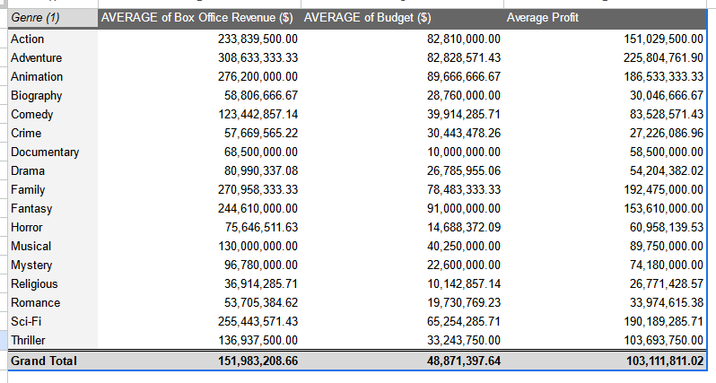

# Practice Quiz - Hands-On Activity: Explore movie data with pivot tables

## Activity overview

In the previous video, you were introduced to pivot tables as a tool for quickly comparing metrics, performing calculations, and generating readable reports. In this activity, you’ll navigate an example of a workplace scenario where you will create a pivot table to answer stakeholder questions and visualize data.

By the time you complete this activity, you will be able to apply pivot tables in your own analysis projects. This will enable you to draw insights and create reports directly from your spreadsheets, which is important for your career as a data analyst.

Review the following scenario. Then complete the step-by-step instructions.

## Scenario

You are a data analyst working with a filmmaking company. The company is trying to identify what genre of film they should make next. In order to help them make this decision, your manager has asked you to answer the following questions:

- On average, how much money do movies make in each genre?
- On average, how much money is spent on a movie broken by genre?
- On average, which genre has the most profitable movies?

Pivot tables make answering these types of questions much quicker and more accurate when compared to doing these same calculations by hand!

## Step by steps Instructions

Follow the instructions to complete each step of the activity. Then answer the questions at the end of the activity before going to the next course item.

### Step 1: Access the template

To get started, access the movie spreadsheet from the previous video.

Select the link to the movie spreadsheet to create a copy. If you don’t have a Google account, you may download the data directly from the attachments below.

Link to movie data: [movie data starter project](https://docs.google.com/spreadsheets/d/1FLaUmMn62YlHYihV6pK1DJqWcFYCnuoqoxFWmm_o5b0/template/preview)

OR [movie-data-starter-project.xlsx](./resources/movie-data-starter-project.xlsx)

### Step 2: Create Pivot table

For this exercise, you will use Google Sheets to work with pivot tables. If you are using Excel, the interface might be different. However, the majority of the functions are similar.

1. Open the Movie Data Starter Project spreadsheet.
2. Navigate to the Movie Data sheet.
3. With your cursor in a non-blank field, select the Insert menu.
4. Select Pivot Table.

    

5. Verify the following Create pivot table settings:
   - Data range = 'Movie Data'!A1:N509
   - Insert to = New Sheet
6. Select Create.
7. In the newly created sheet, right-select on the tab and select Rename to rename the sheet to Summary.
8. Now, your Pivot table editor is likely going to be open on the right side of the screen.


If the Pivot table editor isn’t already open, move your cursor over the pivot table area to reveal a small green pencil Edit icon. Select it to open the Pivot table editor.


### Step 3: Find the average Amount of Money Movies make in each genre

In the Pivot table editor:

1. Select on the **Add** button to the right of the **Rows** section.
2. Select **Genre (1)**.

   

3. Next, select on the **Add** button to the right of the Values section.
4. Select **Box Office Revenue ($)**.
5. In that smaller box, change the **Summarize by** selection by using the dropdown and changing the summarization from `SUM` to `AVERAGE`.

    

Now you have the breakdown of Average Box Office Revenue ($) by Genre.

### Step 4: Find the Average amount of Money spent on Movies in each genre

Now, investigate the budget of these movies so you can compare them to the revenue you just calculated and determine their profit. Repeat the previous process to find the Budget ($):

1. Select on the Add button to the right of the Values section.
2. Select Budget ($).
3. In that smaller box, change the Summarize by selection by using the dropdown and changing the summarization from `SUM` to `AVERAGE`.


Now you have the average revenue and budget broken down by genre.

### Step 5: Find the Genre that is most profitable on Average

Pivot tables will also allow you to calculate profitability directly in the pivot table:

1. Select the Add button to the right of the Values section.
2. Select Calculated Field.
3. Copy and paste the following into the formula:

   ```excel
   =AVERAGE('Box Office Revenue ($)')-AVERAGE('Budget ($)')
   ```

4. Change the Summarize by selection from `SUM` to Custom.
5. Select on cell D1 (in your Summary tab) and enter Average Profit to rename the newly calculated field.

    

    Perhaps your manager also asks you if there’s any way to sort the sheet to make it easier to identify which genres are most profitable. To do that, follow these steps:

6. In the Pivot table editor, go to the Genre (1) in your rows and update these settings:
   - For the Sort by dropdown, change the value from Genre (1) to Average Profit.
   - For the Order dropdown, change the value from Ascending to Descending.

    
    

   Here is that pivot table, now sorted to have the most profitable genres as the top of the list!

### Step 6: Visualize data

Tables provide useful information, but visualizations can be even more effective for communicating data insights.

1. Select any blank cell in your pivot.
2. Navigate to the Insert menu.
3. Select Chart.

    

    This creates a chart in the same worksheet as your pivot table.

4. Now, let’s move the chart to your table:
   - Select the chart.
   - Left-select in the chart and—while holding down your cursor—drag the cursor next to your table. This should move the chart with the movement of your cursor.
5. Next, set up your chart:
   - In the chart editor, navigate to Setup.
   - In the Setup window, change the Chart Type to Bar chart.
   - Under Series, select on the three dots to the right of `AVERAGE` of Budget ($).
   - Select Remove.
   - Next, under Series, select on the three dots to the right of `AVERAGE` of Box Office Revenue ($).
   - Select Remove.

   

6. Next, customize your chart:
   - In the chart editor, navigate to Customize.
   - Under Chart & Axis Titles, select Chart title.
   - Change the chart title to Average Net Profit by Genre.

    

Great work! Now you have a visual that stack-ranks all of the movie genres by average profit.

**Note**: You may have noticed that there may be a Grand Total, which doesn’t appear to fall into the middle of your sorting. That’s okay! This is because it’s the total across all genres. You can choose to remove this by going back into your pivot table editor, in your Rows section, uncheck the Show totals box. This should automatically update any other references (charts or other) that were pointed at your pivot table!

### Pro tip: Save the activity template

Be sure to save a copy of the spreadsheet template you used to complete this activity. You can use it for further practice or to help you work through your thought processes for similar tasks in a future data analyst role.

## Reflection

### Question 1: Reflection

Using pivot tables, you were able to answer all three of your stakeholders’ questions about movie revenue, budget, and profit by genre! Not only that, you presented your findings in an organized way to make your findings clearer to your audience and provided them with a useful visualization.

Pivot tables are incredibly powerful. The ability to calculate these types of values will allow you to be more efficient in how you work, as well.

Referencing your pivot table, which director (use the Director (1) field) had the highest average profit?

- Michael Mann
- `Tim Miller`
- Peter Jackson
- Zach Snyder

> Correct: Tim Miller Averaged $724M in profits. While other directors had higher box office revenue ($956M-Peter Jackson) or budget ($237.5M-Zach Snyder), Tim Miller had an incredibly low average Budget ($) at 58M.

**Question 2: In the text box below, write 2-3 sentences (40-60 words) in response to each of the following questions:**

**How can using pivot tables directly in a spreadsheet help you analyze data in the future?**

Pivot tables streamline data analysis by allowing quick comparisons, calculations, and visualization directly within the spreadsheet. They enhance efficiency and accuracy, providing valuable insights for informed decision-making.

**What are some of the benefits of being able to summarize data directly in your spreadsheet?**

Summarizing data in the spreadsheet facilitates a concise overview, simplifying complex information. It enables easy communication of insights, aiding stakeholders in understanding trends and making data-driven decisions.

1 point What do you think? Your answer cannot be more than 10000 characters.

- Pivot tables directly applied in a spreadsheet expedite data analysis by efficiently organizing, comparing, and calculating data. This streamlines the analytical process, making it easier to derive insights and generate reports. Pivot tables also support dynamic visualization, enhancing the interpretability of complex datasets. Leveraging pivot tables in future analyses will be instrumental in quickly exploring trends, patterns, and relationships within data.
- Summarizing data in the spreadsheet offers accessibility, collaboration, and clarity. It enables stakeholders to engage with key findings without delving into raw data and facilitates better communication. The ability to generate summaries directly in the spreadsheet fosters a seamless workflow, supporting iterative analysis and prompt responses to evolving inquiries. This capability proves invaluable in creating actionable insights for data-driven decision-making.
