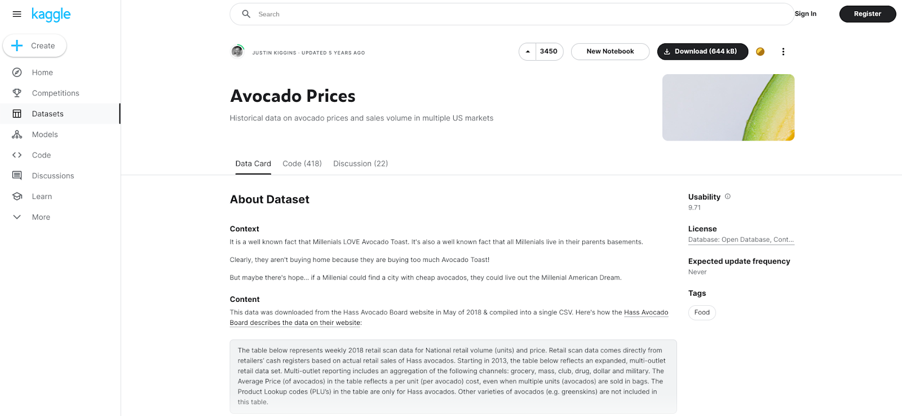
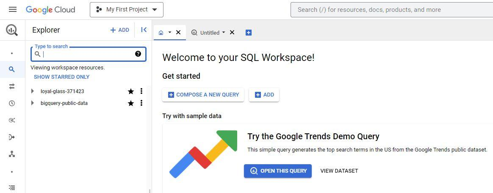
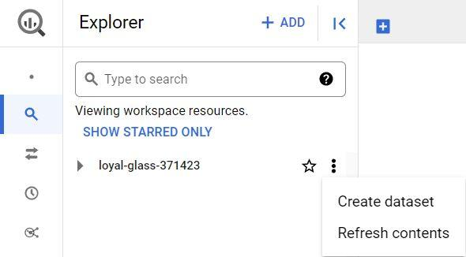
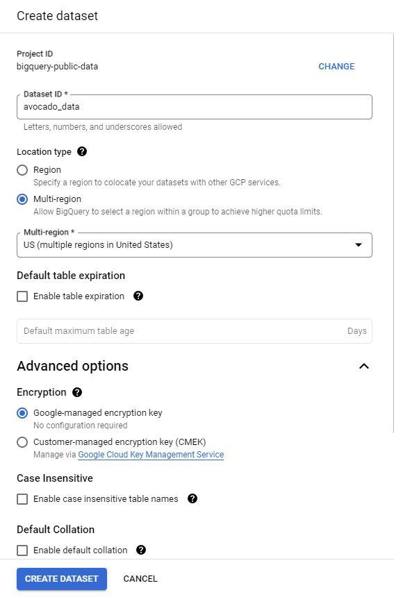
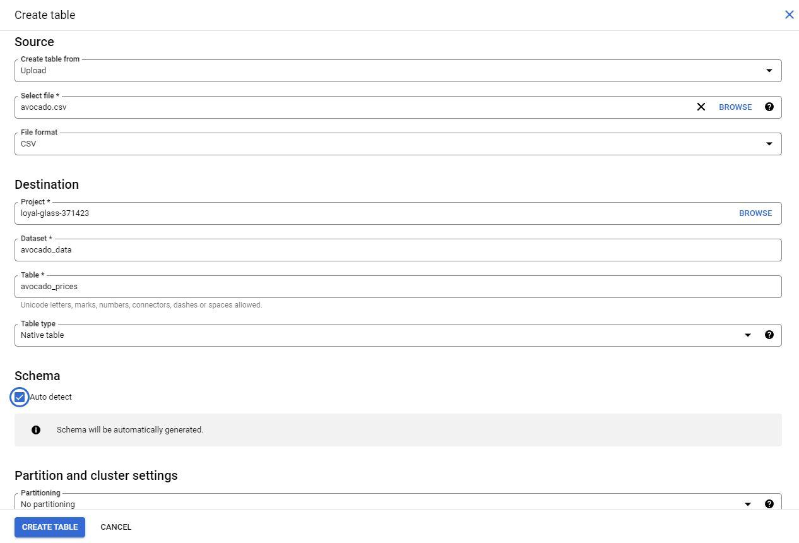
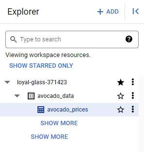
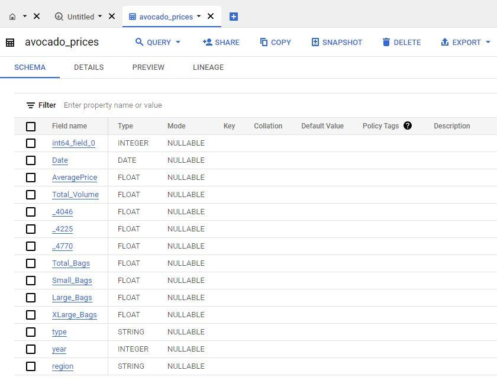

# Reading: Upload the Avocado Dataset to BigQuery

Using public datasets is a great way to practice working with SQL. Later in the course, you are going to use historical data on avocado prices to perform calculations in BigQuery. This is a step-by-step guide to help you load this data into your own BigQuery console so that you can follow along with the upcoming video.

## Upload the Avocado Dataset to BigQuery

In an upcoming video, the instructor demonstrates how to embed simple calculations in SQL. For this example, they use a publicly available Avocado Prices dataset from Kaggle. Follow the directions below to upload the avocado dataset to BigQuery. Once you’ve uploaded this data, you’ll be able to practice with this data on your own!

### Step 1: Download the publicly available dataset

[Avocado Prices from Kaggle](https://www.kaggle.com/neuromusic/avocado-prices).

This data has been made available by [**Justin Kiggins**](https://www.kaggle.com/neuromusic) under an [**Open Data Commons**](https://opendatacommons.org/licenses/odbl/1-0/) license. Kaggle is a great resource for all types of data analytics resources, and there are also other public datasets on the platform that you can download and use.

*Note: You will need to create a free account before downloading the zipped data files.*

You will find some more information about the avocado dataset, including the context, content, and original source on this page. For now, you can simply download the file.

**OR** download this from this attachment [avocado-prices-in-us.zip](./resources/avocado-prices-in-us.zip)

### Step 2: Create the dataset

1. After you have downloaded the dataset from Kaggle, extract the zipped folder. Remember where you save the avocado .csv file for upload into your BigQuery console.

2. Open your BigQuery Console and create a new dataset.

3. In the Explorer pane on the left side of your console, select the project where you want to add a dataset. Note that your project will have a unique name and won't be the same as the one in the example pictured below (loyal-glass-371423). If you already have it starred, don't choose bigquery-public-data as your project because that's a public project that you can't change.

    

4. Select the Actions icon (three vertical dots) next to your project and select Create dataset.

    

5. Name the dataset `avocado_data`. In the Location type section, select Multi-region, then select US (multiple regions in United States), and make sure the default Encryption method within the Advanced options is set to the Google_managed encryption key. Then, select Create dataset (blue button) to create your new dataset. This will add data in the Explorer on the left of your console.

    

6. Navigate to the dataset in your console by expanding your project and selecting the correct dataset listed. In this case, it will be `avocado_data`.

    

7. On the far right of the screen, select the blue + CREATE TABLE button to open the Create table window. To fill out this window:

- Under Source, for the Create table from selection, select Upload.
- Click Browse to select the unzipped .csv file titled `avocado` you just downloaded to your computer from Kaggle. The File format should automatically change from Avro to CSV when you select the file.
- For Table name, enter `avocado_prices`.
- For Schema, click the Auto detect checkbox.
- Finally, to create the table, select Create table (blue button).

    

### Step 3: Review the table information

1. In the Explorer, the `avocado_prices` table will appear under the dataset you created.

   

2. Select the table you created to develop a greater understanding of the table schema, details, and the data preview in the main editor window.

    

Well done! You are now ready to follow along with the video and learn more about performing calculations with queries!
