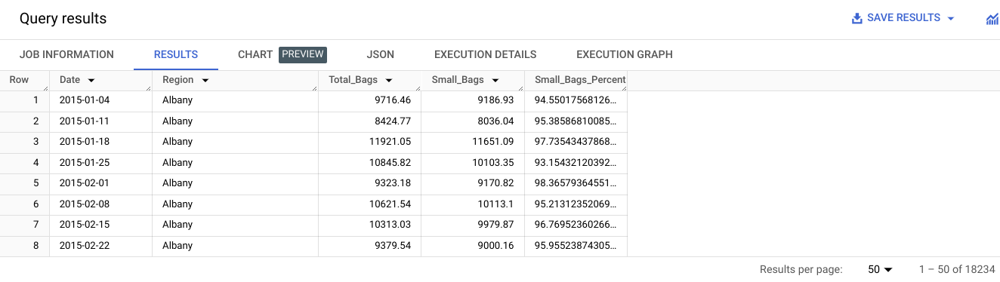

# Step-by-Step: Embed Simple Calculations with SQL

This reading outlines the steps the instructor performs in the next video, [**Embed simple calculations with SQL**](./s3_r_steps_embed-simple-calculations-with-sql.md). In this video, the goal is to find out the total number of bags of avocados sold on each date at each location using the dataset you loaded to BigQuery.

Keep this step-by-step guide open as you watch the video. It can serve as a helpful reference if you need additional context or clarification while following the video steps. This is not a graded activity, but you can complete these steps to practice the skills demonstrated in the video.

## What you’ll need

In order to follow along with the instructor, you will need the [avocado dataset on kaggle](https://www.kaggle.com/datasets/neuromusic/avocado-prices) or file [avocado-prices-in-us.zip](./resources/avocado-prices-in-us.zip)uploaded into your project space. If you haven’t already uploaded this data, follow the instructions in the [Upload the avocado dataset to BigQuery](./s4_v_embed-simple-calculations-with-sql.md) reading.

### Example 1: Verify the total number of bags

Use the following steps to perform some simple calculations with SQL and verify the total number of bags.

1. Open the BigQuery editor.

2. On line 1, enter `SELECT` and press Enter. You'll use the `SELECT` command to pull certain columns from the table. Because you are selecting several columns, press Enter after `SELECT` and after the comma after each column name.

3. Enter the following column names into your editor:

    ```sql
    SELECT
        Date,
        Region,
        Small_Bags,
        Large_Bags,
        XLarge_Bags,
        Total_Bags
    ```

4. Note the use of underscores in this example. Spaces can confuse certain servers and applications. Using underscores helps avoid potential issues while keeping the names readable.

5. Now add the calculation to the query using the names of the three columns with plus signs between them, as shown below. Add `_Calc` to your new column to compare the columns to each other after you calculate your results.

    ```sql
    SELECT
        Date,
        Region,
        Small_Bags,
        Large_Bags,
        XLarge_Bags,
        Total_Bags,
        Small_Bags + Large_Bags + XLarge_Bags AS Total_Bags_Calc
    ```

6. Finally, finish the query with `FROM` and the names of your project, database, and table: `your-project.avocado_data.avocado_prices`. Note that `your-project` is unique to you. If you haven't named it yourself, BigQuery assigns a name for you, typically in the form of two words and a six-digit number, each separated by a hyphen (for example, loyal-glass-371423). In the code examples throughout this reading, be sure to replace `your-project` with your unique project name.

    ```sql
    SELECT
        Date,
        Region,
        Small_Bags,
        Large_Bags,
        XLarge_Bags,
        Total_Bags,
        Small_Bags + Large_Bags + XLarge_Bags AS Total_Bags_Calc
    FROM your-project.avocado_data.avocado_prices
    ```

7. Select `RUN` to run the query. Your query should return a table containing seven columns, as pictured [here](link_to_screenshot_query_results).

### Example 2: Calculate the percentage of small bags

Now that you have verified the total number of bags, you can use those values in another query. You need to find what percent of the total number of bags were small bags. This information might help stakeholders make decisions about how to package avocados or which size bag to run a sale on. Run a new query to calculate the percentage of small bags:

1. Create a new query.

2. Use the `SELECT` command to select the `Date`, `Region`, `Total_Bags`, and `Small_Bags` columns.

    ```sql
    SELECT
        Date,
        Region,
        Total_Bags,
        Small_Bags
    ```

3. To find the percentage of small bags, divide the number of small bags by the number of total bags using a slash (/) as the operator. Put this part of the calculation in parentheses to let the server know that this calculation should be performed first. Then add *100 to give a percentage versus a decimal.

    ```sql
    SELECT
        Date,
        Region,
        Total_Bags,
        Small_Bags,
        (Small_Bags / Total_Bags)*100
    ```

4. Use the `AS` command to name this new column `Small_Bags_Percent`.

    ```sql
    SELECT
        Date,
        Region,
        Total_Bags,
        Small_Bags,
        (Small_Bags / Total_Bags)*100 AS Small_Bags_Percent
    ```

5. Add `FROM` and the dataset.

    ```sql
    SELECT
        Date,
        Region,
        Total_Bags,
        Small_Bags,
        (Small_Bags / Total_Bags)*100 AS Small_Bags_Percent
    FROM 
        your-project.avocado_data.avocado_prices
    ```

6. Select `RUN` to run the query.

7. The "division by zero" error is the result of values of zero in the `Total_Bags` column when used to calculate the percentage in line 6. Add a step to solve this. Use the `WHERE` command. `WHERE` lets you add a condition to your calculation. In this case, specify to perform the selection only on rows where the total number of bags does not equal zero: `WHERE Total_Bags <> 0`.

    ```sql
    SELECT
        Date,
        Region,
        Total_Bags,
        Small_Bags,
        (Small_Bags / Total_Bags)*100 AS Small_Bags_Percent
    FROM
        your-project.avocado_data.avocado_prices
    WHERE
        Total_Bags <> 0
    ```

8. Select `RUN` to run the query again. Your query should return a table containing five columns, the last one being the one you created: `Small_Bags_Percent`, as depicted in the following.  Notice your new column shows the percentage of the total bag count that is made up of small bags.

With SQL, you can complete just about any calculation you want during your analysis. Embedding the calculations in your queries will help you keep your analysis organized while getting your results. The methods shown here are just the beginning!
