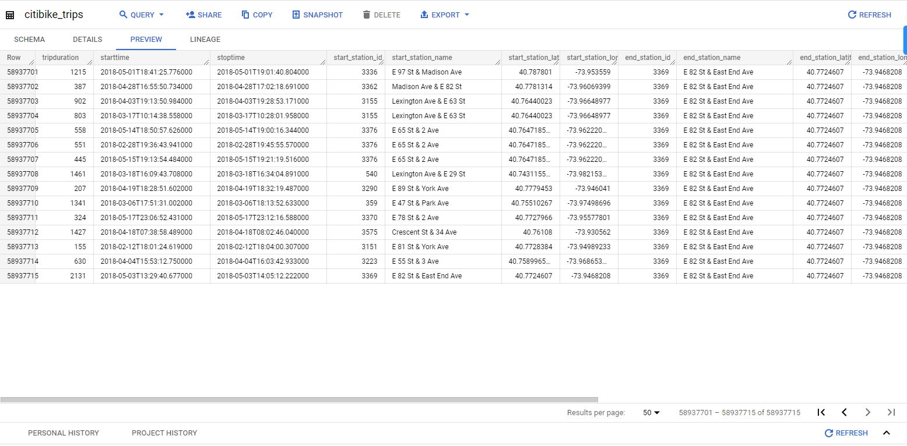

# Video: Calculations with other statements

Video transcript

- Hey, good to see you.
- As a data analyst, you'll find that your calculations come in all shapes and sizes.
- Earlier we showed you how to do some of the more basic calculations in SQL.
- While, basic calculations are great.
- Sometimes you'll need to group data before completing calculations.
- The GROUP BY and ORDER BY commands help you do this.
- These commands are usually paired with aggregate functions like SUM or COUNT.
- We'll show you how you can use these commands and functions to calculate and summarize data from groups of rows in a table.
- Let's explore the GROUP BY command first.
- GROUP BY is a command that groups rows that have the same values from a table into summary rows.
- The GROUP BY command is used with SELECT statements.
- In a basic SELECT FROM or SELECT-FROM-WHERE query, GROUP BY comes at the end of the query.
- All right, let's try using GROUP BY.
- We'll work with a database, with data from a bike sharing system.
- We want to find out how many rides people took on these bikes per year.
This data has several columns, but for this task, we only need the start time column.
Since this data set isn't organized by date, and the start time column isn't organized by year, we'll need to include steps in our code to organize it.
- We also want a total number of rides each year.
- So we'll need to include a calculation in our query for this.
- And depending on the questions we've been tasked with answering, this might be the first step of many in our analysis.
We'll start our query with the SELECT command.
- We'll then add EXTRACT to our query.
The EXTRACT command lets us pull one part of a given date to use.
- We'll extract the year from the start time column.
- To do this, we'll add an open parenthesis, followed by YEAR, which lets the server know the part of the date we need.
- Then we'll add the FROM command and STARTTIME so we can get the year from all of the start times in that column.
- We'll close the parentheses and then use AS and the word year to name the column we're creating.
On the next line of the query, we'll use the aggregate function COUNT followed by an asterisk in parenthesis.
- This will count the bike rides in the start time column.
- Using the asterisk makes sure that all the start times are counted in the data.
- Then we'll name our column number of rides with underscore between each word instead of spaces.
We will add FROM in the database we are pulling on the next line.
- In this case, that's bigquery-public-data.new_york.citybike_trips.
And here is our GROUP BY command.
- We'll use this to group the data by year.
- So we'll type GROUP BY followed by year.
We can further organize our results by using the ORDER BY command.
- Adding this after GROUP BY orders the results.
We'll add year to order the data by year.
- It's good to note that by default, ORDER BY sorts data in ascending order.
Now we can run our query to get the results.
The years are ordered started with 2013 and ending with 2016.
- If we want to change this to descending order, we can add the keyword DESC to the end of the query and run it again.
But whichever order you use, the GROUP BY and ORDER BY commands are great for helping us complete and organise a calculation for our analysis.
- This is one way to include calculations when aggregating data.
- And it's just one of many ways SQL helps keep your analysis running smoothly and moving forward.
- There's still more to come on calculations and SQL.
- Coming up, we'll learn more about data validation.
- See you soon.

## Questions & Notes

### Notes

Aggregation commands

- GROUP BY: A command that groups rows that have the same values from a table into summary rows
- EXTRACT: lets us pull one part of a given date to use
- HAVING

**NOTE**:  If you are following along in BigQuery with the video, you may notice after clicking Preview that the first 100 observations of the `citibike_trips` in the **new_york_citibike** dataset all have NULL values. Nonetheless, the initial observations of the table in the video have non-zero values populating the data Preview.

Near the bottom of the screen of your BigQuery Preview window, note the total amount of observations equaling 58,937,715. Click on the arrow button that will navigate to the end of the list, and you will see data populate each column. At this point you may begin to understand why BigQuery is used to search this table instead of downloading ~59M rows of data!

Full query:

```sql
SELECT
  EXTRACT(YEAR
  FROM
    starttime) AS year,
  COUNT(*) AS number_of_rikes
FROM
  `bigquery-public-data.new_york_citibike.citibike_trips`
GROUP BY
  year
ORDER BY
  year DESC
```



### Questions

What is the purpose of the EXTRACT command in a query?

- To extract a column from a database
- `To extract a part from a given date`
- To extract a single value from a column
- To extract a single word from a string

> Correct: The purpose of the EXTRACT command in a query is to extract a part from a given date. The EXTRACT command can extract any part from a date/time value.
