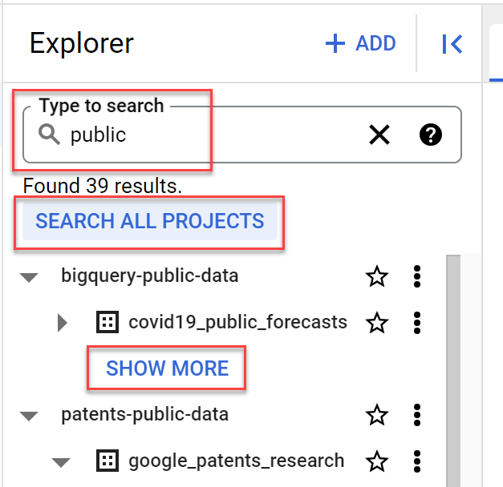
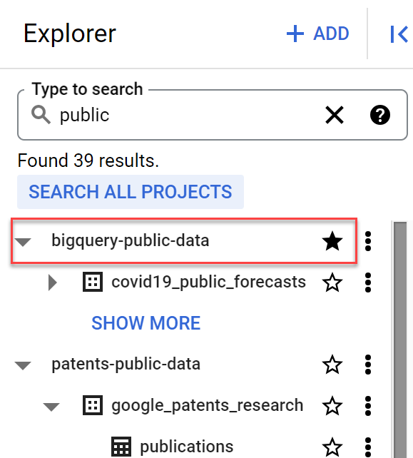
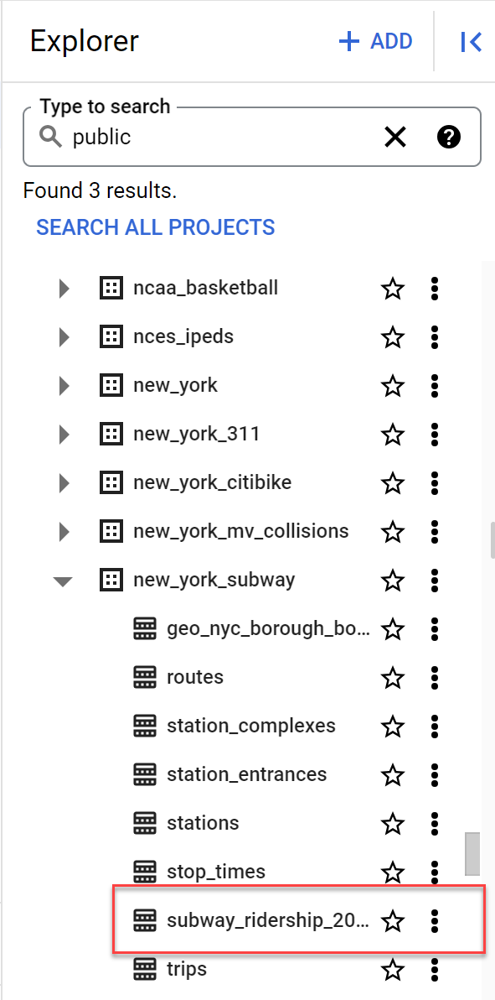
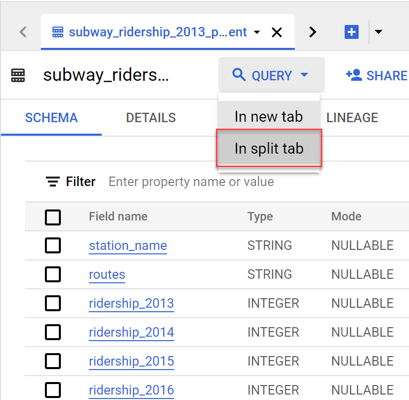
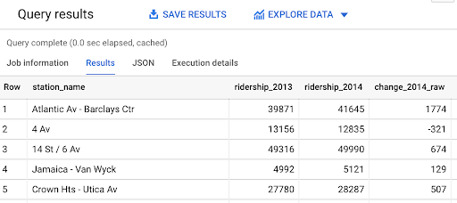
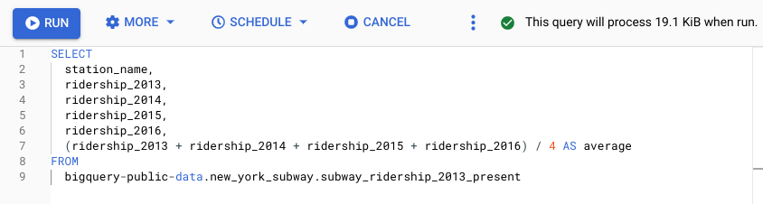
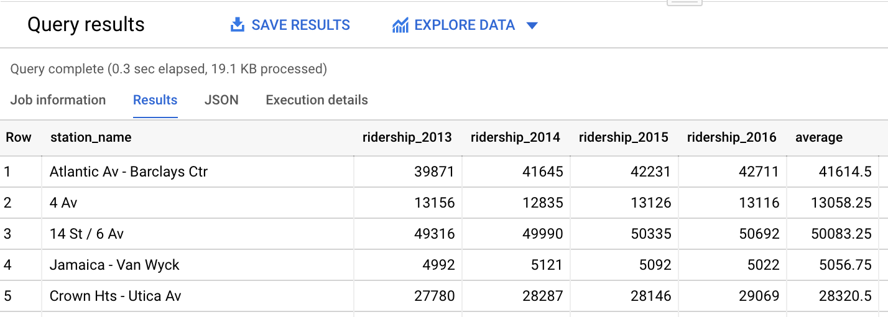

# Practice Quiz - Hands-On Activity: Calculations with SQL

## Activity Overview

## Step by steps Instructions

Follow the instructions to complete each step of the activity. Then answer the questions at the end of the activity before going to the next course item.

### Step 1: Access the template

For this activity, you’ll analyze subway ridership data to help improve the quality of the city’s public transportation. To do this, you’ll use data that describes the average weekly subway ridership in New York City from 2013-2018.

1. Navigate to your [BigQuery console](https://console.cloud.google.com/bigquery).

- **Note**: BigQuery Sandbox frequently updates its user interface. The latest changes may not be reflected in the screenshots presented in this activity, but the principles remain the same. Adapting to changes in software updates is an essential skill for data analysts, and it’s helpful for you to practice troubleshooting. You can also reach out to your community of learners on the discussion forum for help.

### Step 2: Create Pivot table

1. Locate the public data by typing the word public in the search bar. Select SEARCH ALL PROJECTS and SHOW MORE to access all of the public datasets.

    

2. Select the star icon next to bigquery-public-data. This will pin it to the Explorer menu.
    
3. Select the dropdown arrow next to the bigquery-public-data to expand all the available datasets.

4. Navigate down the list until you find the new_york_subway dataset. Note: You may have to select the SHOW MORE button twice to reach the correct dataset. Now, select the dropdown arrow next to new_york_subway and select subway_ridership_2013_present.
    

**Note**: This dataset may not be accessible through other search methods. Follow the previous steps to locate the correct data for this activity.

### Step 3: Find the average Amount of Money Movies make in each genre

First, identify data exploring the change in weekly ridership from 2013 to 2014. Use SQL to subtract the number of riders in 2013 from the number of riders in 2014.

1. Select the dropdown arrow next to QUERY and select In split tab. You will then be able to see the Query editor and the datasets. If you prefer to only see the Query editor, you could select In new tab.

    

2. In the Query editor, add the names of the columns you want to use in your calculations in your SELECT statement. In this case,  select the following columns:

   - station_name
   - ridership_2013
   - ridership_2014

   Be sure to add a comma after each column name. 2. Add the calculation to the query by adding the names of the two columns with a minus sign between them.

   - ridership_2014 - ridership_2013

3. List the result in a new column. To do this, enter AS followed by the new column’s name. Name it change_2014_raw because it represents the change in ridership from 2013 to 2014 in raw numbers.

4. End your query with the `FROM` command and the name of the dataset and subset you’re pulling data from. After `FROM`, select Enter or Return and enter `bigquery-public-data.new_york_subway.subway_ridership_2013_present`.

    ```sql
    SELECT
        station_name,
        ridership_2013,
        ridership_2014,
        ridership_2014-ridership_2013 AS change_2014_raw
    FROM
        bigquery-public-data.new_york_subway.subway_ridership_2013_present
    ```

5. Select RUN to get the results.

    The results show the change in ridership from 2013 to 2014 at different stations. For example, the Atlantic Av - Barclays Ctr station gained an average of 1,774 riders per week. The 4 Av station lost 321 riders.

    By including a basic calculation in your query, you can quickly gain important knowledge about your data. In this example, you now have insights into the change in ridership for each subway station in any given year.  

    

### Step 4: Find the Average amount of Money spent on Movies in each genre

Next, find the average weekly ridership for a longer period of time, such as the multi-year period from 2013-2016.

To do this, combine multiple arithmetic operations in a query. The average of a set of numbers is the sum of the numbers divided by the total number of values in the set. There are four values in your new set (ridership data for 2013, 2014, 2015, 2016). Use SQL to sum the numbers for each year and divide that sum by 4.

1. Select the **COMPOSE NEW QUERY** button to refresh the query editor.

2. Enter `SELECT` to select the columns you want to pull from the table. You’re selecting several columns, so press **Enter** or **Return** after `SELECT` and add a comma after each column name. The columns selected for this query will be:

   - enter station_name
   - ridership_2013
   - ridership_2014
   - ridership_2015
   - ridership_2016

3. Add the calculation to the query. Use parentheses to control the order of the operations if you use more than one arithmetic operator in a calculation. In this case, sum the years, then divide the sum by 4. Put parentheses around the sum of the four column names. Enter `(ridership_2013 + ridership_2014 + ridership_2015 + ridership_2016)`. Then enter a division operator / and the number **4**.

4. List the result in a new column by entering `AS` followed by the new column’s name. Name the new `average` because it represents average weekly ridership for the period 2013-2016.

5. End your query with the `FROM` command and the name of the dataset and subset that you’re pulling data from. After `FROM`, select Enter and type bigquery-public-data.new_york_subway.subway_ridership_2013_present.
    
6. Select RUN to get the results. The results clearly show the trend in ridership at each station from 2013 to 2016. For example, weekly ridership at the Atlantic Av - Barclays Ctr station increased every year since 2013. Further, for the years 2014, 2015, and 2016, weekly ridership at Atlantic Av - Barclays Ctr exceeded the overall average for the period 2013-2016 (listed in the average column).
    
This kind of data is useful for managing public transportation. It can help you determine which stations or routes to expand due to increased ridership. Using basic calculations in your query allows you to quickly discover significant patterns in your data.

## Reflection

Now you’ve spent some time performing calculations using SQL. In the text box below, write 2-3 sentences (40-60 words) in response to each of the following questions:

1. *When working with datasets, when might you use basic SQL calculations?*
   - Basic SQL calculations are valuable when working with datasets to derive insights, identify patterns, and perform numerical analysis. They are particularly useful for calculating changes, averages, or other derived metrics from the existing dataset.

2. *How can those basic SQL calculations help make sense of large quantities of data?*
   - Basic SQL calculations provide a structured way to analyze and make sense of large datasets. They allow data analysts to perform aggregations, identify trends, and derive meaningful information. By using calculations, analysts can uncover patterns and gain valuable insights from the vast amount of data, facilitating data-driven decision-making.

> Correct: An effective reflection would note that you can use basic calculations in your query to help you quickly discover significant patterns in your data. While this example used public transportation, queries can be used with all sorts of datasets to provide you with useful information and patterns.
