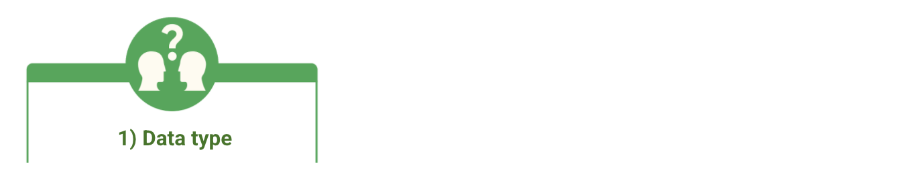
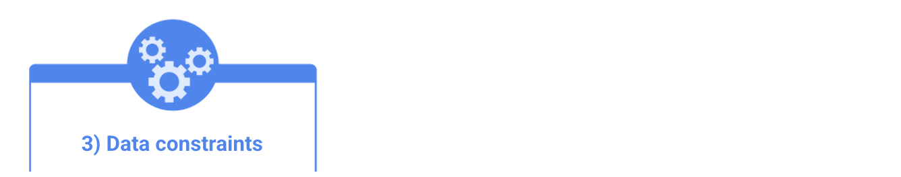
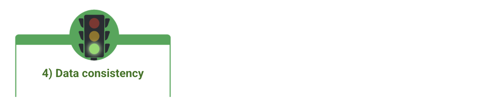
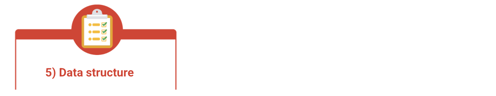
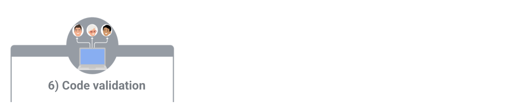

# Types of Data Validation

This reading describes the purpose, examples, and limitations of six types of data validation. The first five are validation types associated with the data (type, range, constraint, consistency, and structure), and the sixth type focuses on the validation of application code used to accept data from user input.

As a junior data analyst, you might not perform all of these validations. But you could ask if and how the data was validated before you begin working with a dataset. Data validation helps to ensure the integrity of data. It also gives you confidence that the data you are using is clean. The following list outlines six types of data validation and the purpose of each, and includes examples and limitations.

**Purpose:** Check that the data matches the data type defined for a field.

**Example:** Data values for school grades 1-12 must be a numeric data type.

**Limitations:** The data value 13 would pass the data type validation but would be an unacceptable value. For this case, data range validation is also needed.

**Purpose:** Check that the data falls within an acceptable range of values defined for the field.

**Example:** Data values for school grades should be values between 1 and 12.

**Limitations:** The data value 11.5 would be in the data range and would also pass as a numeric data type. But, it would be unacceptable because there aren't half grades. For this case, data constraint validation is also needed.

**Purpose:** Check that the data meets certain conditions or criteria for a field. This includes the type of data entered as well as other attributes of the field, such as the number of characters.

**Example:** Content constraint: Data values for school grades 1-12 must be whole numbers.

**Limitations:** The data value 13 is a whole number and would pass the content constraint validation. But, it would be unacceptable since 13 isn’t a recognized school grade. For this case, data range validation is also needed.

**Purpose:** Check that the data makes sense in the context of other related data.

**Example:** Data values for product shipping dates can’t be earlier than product production dates.

**Limitations:** Data might be consistent but still incorrect or inaccurate. A shipping date could be later than a production date and still be wrong.

**Purpose:** Check that the data follows or conforms to a set structure.

**Example:** Web pages must follow a prescribed structure to be displayed properly.

**Limitations:** A data structure might be correct with the data still incorrect or inaccurate. Content on a web page could be displayed properly and still contain the wrong information.

**Purpose:** Check that the application code systematically performs any of the previously mentioned validations during user data input.

**Example:** Common problems discovered during code validation include: more than one data type allowed, data range checking not done, or ending of text strings not well defined.

**Limitations:** Code validation might not validate all possible variations with data input.