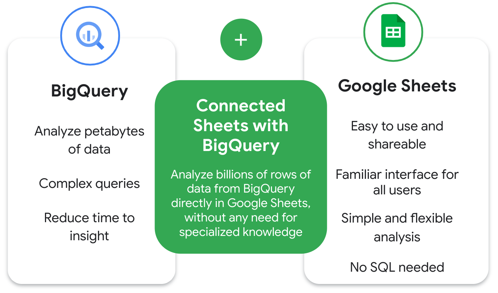

# Use Connected Sheets with BigQuery

In this reading, you will learn about Connected Sheets, a tool that enables data professionals to analyze large datasets in BigQuery using basic spreadsheet functions. Connected Sheets allows users to generate insights without requiring SQL knowledge, making it accessible to a broader audience, not just data professionals.

## What is Connected Sheets?

Recall that BigQuery allows users to analyze petabytes of data with complex queries, reducing the time needed to develop insights.

Google Sheets is an easy-to-use spreadsheet tool with a familiar interface, allowing simple and flexible analysis.

Connected Sheets integrates both, enabling users to analyze vast amounts of data in Sheets without specialized knowledge like SQL.

Connected Sheets Benefits:

- Analyze billions of rows without SQL.
- Handles big data efficiently, overcoming limitations of traditional spreadsheet tools.
- Facilitates collaboration, ensuring a single source of truth for data analysis.
- Ideal for various tasks such as collaborating, defining variables, sharing insights securely, and streamlining workflows.

## Why Use Connected Sheets?

As a data analytics professional, Connected Sheets can assist in tasks like:

- Collaborating in a familiar spreadsheet interface.
- Maintaining a single source of truth for data analysis.
- Defining variables for consistent data usage.
- Sharing insights securely within the team.
- Streamlining reporting and dashboard workflows.

Example Use Cases:

- Business planning: Analyzing sales data to identify product performance in different locations.
- Customer service: Identifying stores with the most complaints per 10,000 customers.
- Sales: Creating internal finance and sales reports, sharing revenue insights.
- Logistics, fulfillment, and delivery: Running real-time inventory management and analytics.

## Connected Sheets Benefits

1. **Collaboration:** Lives in Google Workspace, facilitating easy collaboration with teammates and stakeholders. Permissions control access.

2. **Familiar Tools:** Access billions of BigQuery data rows directly in Sheets, using familiar tools like pivot tables, charts, and formulas.

3. **Data Visualization:** Easily visualize data using Sheets features, simplifying large dataset interpretation compared to advanced languages like SQL.

4. **Up-to-Date Data:** Ensure decisions are based on a single source of truth with automatic refreshes of BigQuery data in Sheets.

5. **Data Integrity and Security:** Reduced security risk as data isn't stored on individual workstations but in the cloud.

## Connected Sheets Shortcomings

1. **Limited Free Tier:** The free pricing tier provides only 1 terabyte (TB) of processed query data each month. Paid tiers are required for more extensive processing.

2. **Data in BigQuery:** Access to the dataset in BigQuery is necessary; without it, data analysis in Connected Sheets is not possible.

3. **Query Failures with Large Results:** Connected Sheets queries may fail with large results, impacting pivot tables with significant outcomes. Use filters or row limits to address this.

## Key Takeaways

Connected Sheets offers a significant opportunity to analyze large datasets without requiring SQL skills. Leveraging familiar spreadsheet functions, such as pivot tables and charts, enhances accessibility for data analysts, including junior analysts, to perform key tasks within BigQuery and improve their marketable skills.

## Resources for More Information

- [Get started with BigQuery data in Google Sheets](https://support.google.com/docs/answer/9702507)
- [Insights at scale with Google Sheets](https://www.youtube.com/watch?v=jMKxhOJogEE)
- [Connected Sheets product announcement](https://workspace.google.com/blog/product-announcements/connected-sheets-is-generally-available)