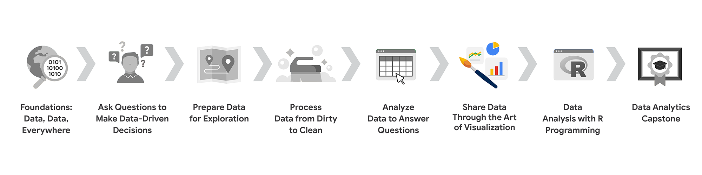

## Course 6 Overview: Set Your Expectations

Welcome to the sixth course in the Google Data Analytics Certificate! In this course, you’ll learn how to create data visualizations. Visualizations, along with compelling data storytelling, will help you communicate the meaning of a dataset to your audience. Sharing the results of an analysis is one of the most important parts of an analyst’s job.

This course starts with the basics: learning principles and best practices for data visualization in spreadsheets. You’ll get hands-on experience creating data visualizations in Tableau, a specialized data visualization tool. Beyond the basics, there’s a focus on professional tips for creating exciting visualizations, presentations, and talking points about your data. This course also covers how to prepare and deliver effective presentations, so you can confidently handle the most challenging questions about your data analysis. Once you’ve completed this course, you’ll be on your way to becoming a talented data storyteller!

### Certificate Program Progress

The Google Data Analytics Certificate program has eight courses. Share data through the art of visualization is the sixth course.

1. FOUNDATIONS: Data, Data, Everywhere
2. Ask Questions to Make Data-Driven Decisions
3. Prepare Data for Exploration
4. Process Data from Dirty to Clean
5. Analyze Data to Answer Questions
6. **Share Data Through the Art of Visualization** (this course)
7. Data Analysis with R Programming
8. Google Data Analytics Capstone: Complete a Case Study

### Course 6 Content

This course is broken into four modules. Here’s an overview of the skills you’ll gain in each module:

#### **Module 1: Visualize Data**

In this module, you’ll delve into the various types of data visualizations and explore what makes an effective visualization. You'll also learn about accessibility, design thinking, and other factors that will help you use data visualizations to effectively communicate data insights.

#### **Module 2: Create Data Visualizations with Tableau**

Tableau is a business intelligence and analytics platform that helps people visualize, understand, and make decisions with data. In this part of the course, you’ll become well-versed in Tableau’s dynamic capabilities and learn to inject creativity and clarity into your visualizations, ensuring that your findings are easy to understand.

#### **Module 3: Craft Data Stories**

Connecting your objective with your data through insights is essential to data storytelling. In this part of the course, you’ll get acquainted with the principles of data-driven storytelling and learn to craft compelling narratives using Tableau's dashboard and filtering capabilities, giving life to your data insights.

#### **Module 4: Develop Presentations and Slideshows**

In this part of the course, you’ll discover how to give an effective presentation about your data analysis. This final module teaches you to construct insightful presentations that resonate with your audience. You'll learn to anticipate and address potential questions and to articulate the limitations of your data, ensuring a robust and credible narrative for your stakeholders.

### What to Expect

Each course offers many types of learning opportunities:

- Videos for instructors to teach new concepts and demonstrate the use of tools
- In-video questions that pop up from time to time to help you check your understanding of key concepts and skills
- Step-by-step guides you can use to follow along with instructors as they demonstrate tools
- Readings to explore topics more in-depth and build on the concepts from the videos
- Discussion forums to share, explore, and reinforce lesson topics
- Discussion prompts to promote thinking and engagement in the discussion forums
- Practice quizzes to prepare you for graded quizzes
- Graded quizzes to measure your progress and give you valuable feedback

This program was designed to let you work at your own pace—your personalized deadlines are just a guide. There is no penalty for late assignments. To earn your certificate, you simply need to complete all of the work.

If you miss two assessment deadlines in a row, or if you miss an assessment deadline by two weeks, you'll see a `Reset deadlines` option on the **Grades** page. Click it to switch to a new course schedule with updated deadlines. You can use this option as many times as you need—it won’t remove any progress you’ve already made in the course, but you may find new course content if the instructor updated the course after you started. If you cancel a subscription and then reactivate it, your deadlines will automatically reset.

In this course, you'll be assessed with quizzes that are based on the wide variety of learning materials and activities that reinforce the important skills you’ll develop. Both types of quizzes can be taken more than once.

### Tips for Success

- It is strongly recommended that you go through the items in each lesson in the order they appear because new information and concepts build on previous knowledge.
- Participate in all learning opportunities to gain as much knowledge and experience as possible.
- If something is confusing, don’t hesitate to replay a video, review a reading, or repeat a self-review activity.
- Use the additional resources that are referenced in this course. They are designed to support your learning. You can find all of these resources in the [Resources](https://www.coursera.org/learn/ask-questions-make-decisions/resources/xW7lI) tab.
- When you encounter useful links in this course, bookmark them so you can refer to the information later for study or review.
- Understand and follow the [Coursera Code of Conduct](https://www.coursera.support/s/article/208280036-Coursera-Code-of-Conduct?) to ensure that the learning community remains a welcoming, friendly, and supportive place for all members.

### Updates to the Course

As you complete this course, you may notice updates to the content, like new practice materials and additional examples. These updates ensure the program provides up-to-date skills and guidance that will help you in your data analytics career. If you previously completed a graded activity, you may need to repeat the assessment to complete this course. For more information, check out the course discussion forum.
