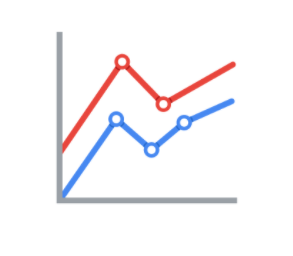
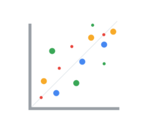
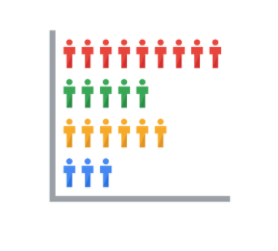
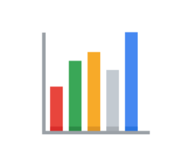
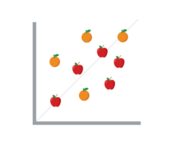
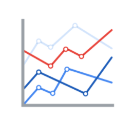
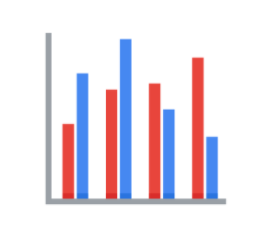

# Effective Data Visualizations

It can be difficult to understand data insights by examining individual data points or a table of information. Often, insights become more obvious when presented in an effective visual format. You can use data visualization (often called “data viz”) techniques to help your audience interpret data in a concise, visual manner.

When creating data visualizations, you must strike a balance between presenting enough information for your audience to understand the meaning of the visualization and not overwhelming them with too much detail. In this reading, you’ll learn tips and techniques for crafting visualizations that are both impactful and effective. You’ll explore:

- Two frameworks for organizing data
- Pre-attentive attributes

## Frameworks for Organizing Data

Frameworks help organize your thoughts about data visualization and give you a useful checklist to reference as you plan and evaluate your data visualization. Here are two frameworks that employ slightly different techniques. Both are intended to improve the quality of your visuals.

### [The McCandless Method](https://www.informationisbeautiful.net/visualizations/what-makes-a-good-data-visualization/)

You learned about the David McCandless method earlier in the course; as a refresher, the McCandless method lists four elements of good data visualization:

- **Information:** the data with which you’re working
- **Story:** a clear and compelling narrative or concept
- **Goal:** a specific objective or function for the visual
- **Visual Form:** an effective use of metaphor or visual expression

The McCandless method provides terminology that isolates the specific elements of a graphic, allowing the person making a visual the ability to evaluate how well those criteria have been met. The aim when crafting a visualization is to incorporate all four elements effectively. Visualizations that fail to incorporate all four elements can be ineffective at communicating insights in various ways.

### [Kaiser Fung’s Junk Charts Trifecta Checkup](https://junkcharts.typepad.com/junk_charts/junk-charts-trifecta-checkup-the-definitive-guide.html)

This approach is a set of questions that can help consumers of data visualization critique what they are consuming and determine how effective it is. You can also use these questions to determine if your data visualization is effective:

1. **What is the practical question?**
2. **What does the data say?**
3. **What does the visual say?**

Each of these questions offers an opportunity to investigate a given problem with a slightly different context. A well-designed visual effectively answers all three of those questions at once. Moreover, this framework helps you think about your data viz from the perspective of your audience.

## Pre-Attentive Attributes

In addition to the frameworks mentioned above, several standard building blocks can help you construct your data visualizations. Creating effective visuals means leveraging what is known about how the brain works and then using specific visual elements to communicate the information effectively. Pre-attentive attributes are the elements of a data visualization that people recognize automatically and without conscious effort. The essential, basic building blocks that make visuals immediately understandable are called marks and channels.

### Marks

**Marks** are basic visual objects such as points, lines, and shapes. Every mark can be broken down into four qualities:

1. **Position:** Where is a specific mark in space relative to a scale or to other marks?

    For example, if you’re looking at two different trends, position allows you to compare the pattern of one element relative to another.

    

2. **Size:** How big, small, long, or tall is a mark?

    The comparison of object sizes can be an easy visual interpretation for humans. The comparison of object sizes can be an easy visual interpretation for humans. This can be very useful for conveying the relationship between categories or data points. However, this also presents a potential problem: The human eye can inadvertently interpret comparisons that aren’t intended to convey meaning.

    For example, sometimes objects that appear to be the same size when they are not. Controlling the scale of a visual is important even when comparative sizes are not intended to offer information.

    

3. **Shape:** Does the shape of a specific object communicate something about it?

    Rather than using simple dots or lines, a bit of creativity can enhance how quickly people interpret a visual by using shapes that align with a given application.

    

4. **Color:** What color is a mark?

    Colors can be used both as a simple differentiator of groupings or as a way to communicate other concepts.

    

### Channels

**Channels** are visual aspects or variables that represent characteristics of the data in a visualization. They are basically specialized marks that have been used to visualize data. It’s important to understand that channels vary in terms of how effective they are at communicating data based on three elements:

1. **Accuracy:** Are the channels helpful in accurately estimating the values being represented?

    For example, color is very accurate when communicating categorical differences, such as apples and oranges.

    

2. **Popout:** How easy is it to distinguish certain values from others?

    There are many ways of drawing attention to specific parts of a visual, and lots of them leverage pre-attentive attributes including line length, size, line width, shape, enclosure, hue, and intensity.

    

3. **Grouping:** How effective is a channel at communicating groups that exist in the data?

    Consider the proximity, similarity, enclosure, connectedness, and continuity of the channel.

    

But, remember: The more you emphasize one single thing, the more that counts. Emphasis diminishes with each item you emphasize because the items begin to compete with one another.

## Key Takeaways

Throughout your career as an analyst, you will use different techniques and types of data visualizations to present data and insights in a concise, impactful manner. This will include organizing your data, selecting the right type of data visualizations, and designing them in such a way that they are easy to understand and highly communicative while avoiding any visuals that are misleading or inaccurate.

Keep in mind that data visualization is an art form, and it takes time to develop these skills. Over your career as a data analyst, you will learn how to design and evaluate data visualizations. Use these tips to think critically about data visualization—both as a creator and as an audience member.

**Resources:**

- [The Beauty of Data Visualization](https://www.ted.com/talks/david_mccandless_the_beauty_of_data_visualization?language=en#t-150183): In this video, David McCandless explains the need for design to not just be beautiful, but for it to be meaningful as well. Data visualization must be able to balance function and form for it to be relevant to your audience.
- [‘The McCandless Method’ of Data Presentation](https://artscience.blog/home/the-mccandless-method-of-data-presentation):At first glance, this blog appears to be written by a David McCandless fan, and it is. However, it contains very useful information and provides an in-depth look at the 5-step process that McCandless uses to present his data.
- [Information Is Beautiful](https://informationisbeautiful.net/): Founded by McCandless himself, this site serves as a hub of sample visualizations that make use of the McCandless method. Explore data from the news, science, the economy, and so much more and learn how to make visual decisions based on facts from all kinds of sources. 
- [Beautiful News](https://informationisbeautiful.net/beautifulnews/): In this McCandless collection, explore uplifting trends and statistics that are beautifully visualized for your creative enjoyment. A new chart is released every day so be sure to visit often to absorb the amazing things happening all over the world.
- [The Wall Street Journal Guide to Information Graphics: The Dos and Don'ts of Presenting Data, Facts, and Figures](https://www.amazon.com/Street-Journal-Guide-Information-Graphics/dp/0393072959): This is a comprehensive guide to data visualization, including chapters on basic data visualization principles and how to create useful data visualizations even when you find yourself in a tricky situation. This is a useful book to add to your data visualization library, and you can reference it over and over again.
