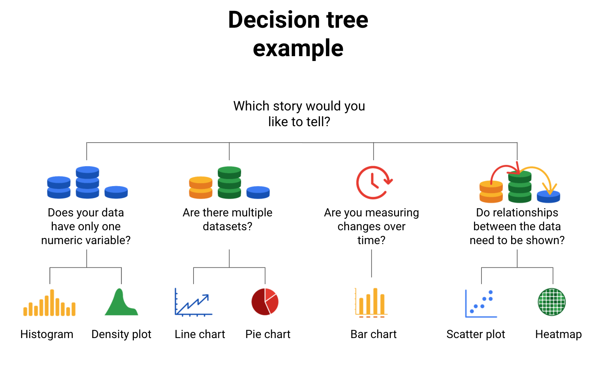
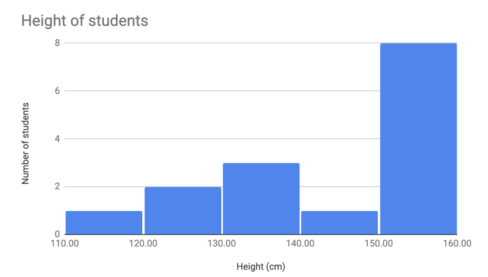
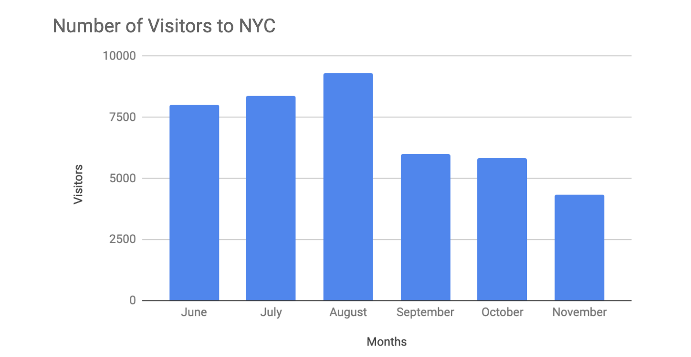

# Data Grows on Decision Trees

With so many visualization options out there for you to choose from, how do you decide what is the best way to represent your data?

A decision tree is a decision-making tool that allows you, the data analyst, to make decisions based on key questions that you can ask yourself. Each question in the visualization decision tree will help you make a decision about critical features for your visualization. Below is an example of a basic decision tree to guide you towards making a data-driven decision about which visualization is the best way to tell your story. Please note that there are many different types of decision trees that vary in complexity and can provide more in-depth decisions.

**Decision Tree:**

- Does your data have only one numeric variable? Histogram or Density plot
- Are there multiple data sets? Line chart or pie chart
- Are you measuring changes over time? Bar chart
- Do relationships between the data need to be shown? Scatter plot or heatmap

## **Begin with Your Story**

Start off by evaluating the type of data you have and go through a series of questions to determine the best visual source:

1. **Does your data have only one numeric variable?**
   - If you have data that has one, continuous, numerical variable, then a histogram or density plot are the best methods of plotting your categorical data. Depending on your type of data, a bar chart can even be appropriate in this case. For example, if you have data pertaining to the height of a group of students, you will want to use a histogram to visualize how many students there are in each height range.

   

2. **Are there multiple datasets?**
   - For cases dealing with more than one set of data, consider a line or pie chart for accurate representation of your data. A line chart will connect multiple data sets over a single, continuous line, showing how numbers have changed over time. A pie chart is good for dividing a whole into multiple categories or parts. An example of this is when you are measuring quarterly sales figures of your company.

   

   

3. **Are you measuring changes over time?**
   - A line chart is usually adequate for plotting trends over time. However, when the changes are larger, a bar chart is the better option. If, for example, you are measuring the number of visitors to NYC over the past 6 months, the data would look like this:

   

4. **Do relationships between the data need to be shown?**
   - When you have two variables for one set of data, it is important to point out how one affects the other. Variables that pair well together are best plotted on a scatterplot. However, if there are too many data points, the relationship between variables can be obscured so a heat map can be a better representation in that case. If you are measuring the population of people across all 50 states in the United States, your data points would consist of millions so you would use a heat map. If you are simply trying to show the relationship between the number of hours spent studying and its effects on grades, your data would look like this:

   

## **Additional Resources**

The decision tree example used in this reading is one of many. There are multiple decision trees out there with varying levels of details that you can use to help guide your visual decisions. If you want more in-depth insight into more visual options, explore the following resources:

- [From Data to Visualization](https://www.data-to-viz.com/): This is an excellent analysis of a larger decision tree. With this comprehensive selection, you can search based on the kind of data you have or click on each graphic example for a definition and proper usage.

- [Selecting the Best Chart](https://www.youtube.com/watch?v=C07k0euBpr8): This two-part YouTube video can help take the guesswork out of data chart selection. Depending on the type of data you are aiming to illustrate, you will be guided through when to use, when to avoid, and several examples of best practices. [Part 2](https://www.youtube.com/watch?v=qGaIB-bRn-A) of this video provides even more examples of different charts, ensuring that there is a chart for every type of data out there.
