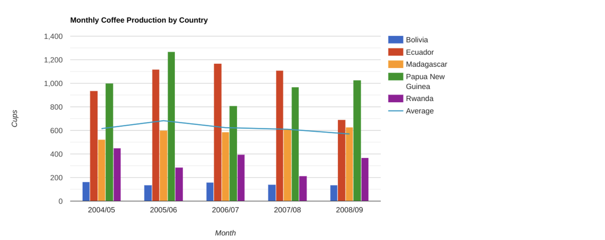

# Principles of Design

In this reading, you are going to learn more about using the elements of art and principles of design to create effective visualizations. So far, we have learned that communicating data visually is a form of art. Now, it's time to explore the nine design principles for creating beautiful and effective data visualizations that can be informative and appeal to all audiences.

After we go through the various design principles, spend some time examining the visual examples to ensure that you have a thorough understanding of how the principle is put into practice. Let’s get into it!

## Nine basic principles of design

There are nine basic principles of design that data analysts should think about when building their visualizations.

1. **Balance:** The design of a data visualization is balanced when the key visual elements, like color and shape, are distributed evenly. This doesn’t mean that you need complete symmetry, but your visualization shouldn’t have one side distracting from the other. For example, [this column chart](https://developers.google.com/chart/interactive/docs/gallery/columnchart) (also shown below) is balanced; even though the columns are different heights and the chart isn’t symmetrical, the colors, width, and spacing of the columns keep this data visualization balanced. The colors provide sufficient contrast to each other so that you can pay attention to both the motivation level and the energy level displayed.

   

2. **Emphasis:** Your data visualization should have a focal point, so that your audience knows where to concentrate. In other words, your visualizations should emphasize the most important data so that users recognize it first. Using color and value is one effective way to make this happen. For example, you will notice a heat map data visualization below from The Pudding’s “Where Slang Comes From" article. This heat map uses colors and value intensity to emphasize the states where search interest is highest. You can visually identify the increase in the search over time from low interest to high interest. This way, you are able to quickly grasp the key idea being presented without knowing the specific data values.

   

3. **Movement:** Movement can refer to the path the viewer’s eye travels as they look at a data visualization, or literal movement created by animations. Movement in data visualization should mimic the way people usually read. You can use lines and colors to pull the viewer’s attention across the page. For example, notice how the average line in this combo chart (also shown below) draws your attention from left to right. Even though this example isn’t moving, it still uses the movement principle to guide viewers’ understanding of the data.

   

4. **Pattern:** You can use similar shapes and colors to create patterns in your data visualization. This can be useful in a lot of different ways. For example, you can use patterns to highlight similarities between different data sets, or break up a pattern with a unique shape, color, or line to create more emphasis. In the example below, the different colored categories of this stacked column chart (also shown below) are a consistent pattern that makes it easier to compare book sales by genre in each column. Notice in the chart that the Fantasy & Sci Fi category (royal blue) is increasing over time even as the general category (green) is staying about the same.

   

5. **Repetition:** Repeating chart types, shapes, or colors adds to the effectiveness of your visualization. Think about the book sales chart from the previous example: the repetition of the colors helps the audience understand that there are distinct sets of data. You may notice this repetition in all of the examples we have reviewed so far. Take some time to review each of the previous examples and notice the elements that are repeated to create a meaningful visual story.

6. **Proportion:** Proportion is another way that you can demonstrate the importance of certain data. Using various colors and sizes helps demonstrate that you are calling attention to a specific visual over others. If you make one chart in a dashboard larger than the others, then you are calling attention to it. It is important to make sure that each chart accurately reflects and visualizes the relationship among the values in it. In this dashboard (also shown below), the slice sizes and colors of the pie chart compared to the data in the table help make the number of donuts eaten by each person the focal point.

   

These first six principles of design are key considerations that you can make while you are creating your data visualization. These next three principles are useful checks once your data visualization is finished. If you have applied the initial six principles thoughtfully, then you will probably recognize these next three principles within your visualizations already.

1. **Rhythm:** This refers to creating a sense of movement or flow in your visualization. Rhythm is closely tied to the movement principle. If your finished design doesn’t successfully create a flow, you might want to rearrange some of the elements to improve the rhythm.

2. **Variety:** Your visualizations should have some variety in the chart types, lines, shapes, colors, and values you use. Variety keeps the audience engaged. But it is good to find balance since too much variety can confuse people. The variety you include should make your dashboards and other visualizations feel interesting and unified.

3. **Unity:** The last principle is unity. This means that your final data visualization should be cohesive. If the visual is disjointed or not well organized, it will be confusing and overwhelming.

Being a data analyst means learning to think in a lot of different ways. These nine principles of design can help guide you as you create effective and interesting visualizations.

## **Key Points:**

- The reading introduces nine basic principles of design for creating effective and visually appealing data visualizations.
- The nine principles are: Balance, Emphasis, Movement, Pattern, Repetition, Proportion, Rhythm, Variety, and Unity.
- **Balance:** Achieved when key visual elements are distributed evenly, creating a sense of symmetry without distracting from the main message.
- **Emphasis:** Involves highlighting the most important data using techniques like color and value to guide the audience's attention.
- **Movement:** Refers to the path the viewer's eye travels, created through design elements or animations to guide understanding.
- **Pattern:** Creation of patterns using similar shapes and colors to highlight similarities or emphasize specific elements in the data.
- **Repetition:** Repeating chart types, shapes, or colors enhances the effectiveness and cohesiveness of visualizations.
- **Proportion:** Demonstrates the importance of specific data by using various colors and sizes to call attention to certain visuals.
- **Rhythm, Variety, and Unity:** These principles serve as checks once the visualization is finished, ensuring a sense of movement, engagement through variety, and overall cohesiveness.