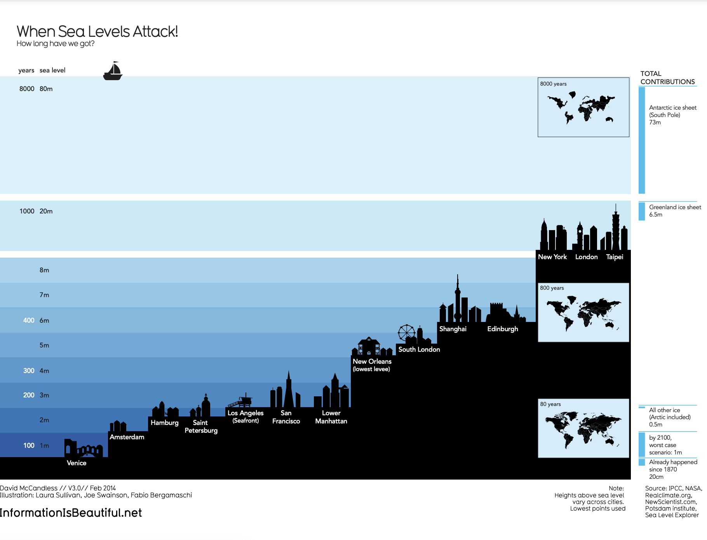

# Reading: Data is Beautiful

At this point, you might be asking yourself: What makes a good visualization? Is it the data you use? Or maybe it is the story that it tells? In this reading, you are going to learn more about what makes data visualizations successful by exploring David McCandless’ elements of successful data visualization and evaluating three examples based on those elements. Data visualization can change our perspective and allow us to notice data in new, beautiful ways. A picture is worth a thousand words—that’s true in data too! You will have the option to save all of the data visualization examples that are used throughout this reading; these are great examples of successful data visualization that you can use for future inspiration.

You can also access a .pdf version of this visualization and save it for your own reference by clicking the file below:

## **Four elements of successful visualizations**

The Venn diagram by David McCandless identifies four elements of successful visualizations:

1. **Information (data):** The information or data that you are trying to convey is a key building block for your data visualization. Without information or data, you cannot communicate your findings successfully.

2. **Story (concept):** Story allows you to share your data in meaningful and interesting ways. Without a story, your visualization is informative, but not really inspiring.

3. **Goal (function):** The goal of your data visualization makes the data useful and usable. This is what you are trying to achieve with your visualization. Without a goal, your visualization might still be informative, but can’t generate actionable insights.

4. **Visual form (metaphor):** The visual form element is what gives your data visualization structure and makes it beautiful. Without visual form, your data is not visualized yet.

All four of these elements are important on their own, but a successful data visualization balances all four. For example, if your data visualization has only two elements, like the information and story, you have a rough outline. This can be really useful in your early planning stages, but is not polished or informative enough to share. Even three elements are not quite enough—you need to consider all four to create a successful data visualization.

In the next part of this reading, you will use these elements to examine two data visualization examples and evaluate why they are successful.

## Example 1: Visualization of dog breed comparison

### View the data Example 1

Data visualization titled “Best in Show: The Ultimate Data Dog” with dog breeds measured by data score and popularity. It uses two axes, popularity and data score, to place different dog breeds on a four-square chart. The squares are labelled “Inexplicably Overrated,” “The Rightly Ignored,” “Hot Dogs!,” and “Overlooked Treasures.” Different dog breeds, visualized with plotted points shaped like dogs, are distributed on the chart based on their popularity and their data score.

The Best in Show visualization uses data about different dog breeds from the American Kennel Club. The data has been compiled in a spreadsheet. Click the link below and select "Use Template" to view the data.  

Link to the template: [KIB - Best in Show](https://docs.google.com/spreadsheets/d/1cbqOIishrWTrfSgxjCrdua-m91B67Qls/edit?usp=share_link&ouid=100233597079733080159&rtpof=true&sd=true)

Or, if you don't have a Google account, download the file [kib-best-in-show-public.xlsx](./resources/kib-best-in-show-public.xlsx).

Save this data visualization as a .pdf by clicking the file below:

[viusalizations-of-dog-breed-comparison.pdf](./resources/viusalizations-of-dog-breed-comparison.pdf)

### Examine the four elements Example 1

This visualization compares the popularity of different dog breeds to a more objective data score. Consider how it uses the elements of successful data visualization:

- **Information (data):** If you view the data, you can explore the metrics being illustrated in the visualization.

- **Story (concept):** The visualization shows which dogs are overrated, which are rightly ignored, and those that are really hot dogs! And, the visualization reveals some overlooked treasures you may not have known about previously.

- **Goal (function):** The visualization is interested in exploring the relationship between popularity and the objective data scores for different dog breeds. By comparing these data points, you can learn more about how different dog breeds are perceived.

- **Visual form (metaphor):** In addition to the actual four-square structure of this visualization, other visual cues are used to communicate information about the dataset. The most obvious is that the data points are represented as dog symbols. Further, the size of a dog symbol and the direction the dog symbol faces communicate other details about the data.  

## Example 2: Visualization of rising sea levels

Visualization titled “When Sea Levels Attack!” demonstrates how much sea levels are projected to rise over the course of 8,000 years. On the y-axis, it lists both the number of years and the sea level in meters. From right to left, starting with the lowest sea level, the chart includes silhouettes of different cities around the world to demonstrate how long it would take for most of the world to be underwater. It also includes inset maps of the continents and how they would appear at different times as sea levels continue to rise.

Save this data visualization as a .pdf by clicking the file below:

[visualization-of-rising-sea-levels.pdf](./resources/visualization-of-rising-sea-levels.pdf)

### Examine the four elements Example 2

This "When Sea Levels Attack" visualization illustrates how much sea levels are projected to rise over the course of 8,000 years. The silhouettes of different cities with different sea levels, rising from right to left, helps to drive home how much of the world will be affected as sea levels continue to rise. Here is how this data visualization stacks up using the four elements of successful visualization:

- **Information (data):** This visualization uses climate data on rising sea levels from a variety of sources, including NASA and the Intergovernmental Panel on Climate Change. In addition to that data, it also uses recorded sea levels from around the world to help illustrate how much rising sea levels will affect the world.

- **Story (concept):** The visualization tells a very clear story: Over the course of 8,000 years, much of the world as we know it will be underwater.

- **Goal (function):** The goal of this project is to demonstrate how soon rising sea levels are going to affect us on a global scale. Using both data and the visual form, this visualization makes rising sea levels feel more real to the audience.

- **Visual form (metaphor):** The city silhouettes in this visualization are a beautiful way to drive home the point of the visualization. It gives the audience a metaphor for how rising sea levels will affect the world around them in a way that showing just the raw numbers can’t do. And for a more global perspective, the visualization also uses inset maps.

## Key takeaways

Notice how each of these visualizations balance all four elements of successful visualization. They clearly incorporate data, use storytelling to make that data meaningful, focus on a specific goal, and structure the data with visual forms to make it beautiful and communicative. The more you practice thinking about these elements, the more you will be able to include them in your own data visualizations.