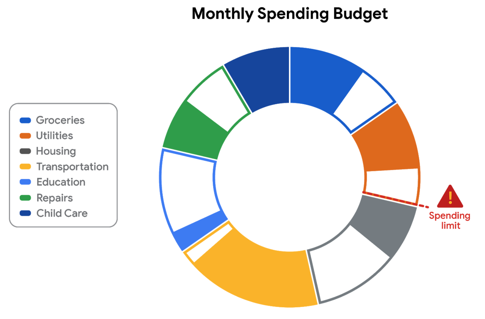

# Reading: [Optional] Design Thinking for Visualization Improvement

Design thinking for data visualization involves five phases:

1. **Empathize:** Thinking about the emotions and needs of the target audience for the data visualization.

2. **Define:** Figuring out exactly what your audience needs from the data.

3. **Ideate:** Generating ideas for data visualization.

4. **Prototype:** Putting visualizations together for testing and feedback.

5. **Test:** Showing prototype visualizations to people before stakeholders see them.

As interactive dashboards become more popular for data visualization, new importance has been placed on efficiency and user-friendliness. In this reading, you will learn how design thinking can improve an interactive dashboard. As a junior analyst, you wouldn’t be expected to create an interactive dashboard on your own, but you can use design thinking to suggest ways that developers can improve data visualizations and dashboards.

## An Example: Online Banking Dashboard

Suppose you are an analyst at a bank that has just released a new dashboard in their online banking application. This section describes how you might explore this dashboard like a new user would, consider a user’s needs, and come up with ideas to improve data visualization in the dashboard. The dashboard in the banking application has the following data visualization elements:

- Monthly spending is shown as a donut chart that reflects different categories like utilities, housing, transportation, education, and groceries.
- When customers set a budget for a category, the donut chart shows filled and unfilled portions in the same view.
- Customers can also set an overall spending limit, and the dashboard will automatically assign the budgeted amounts (unfilled areas of the donut chart) to each category based on past spending trends.

### **Empathize**

- Do the colors and labels make sense in the visualization?
- How easy is it to set or change a budget?
- When you click on a spending category in the donut chart, are the transactions in the category displayed?
- What is the main purpose of the data visualization? If you answered that it was to help customers stay within budget or to save money, you are right! Saving money was a top customer need for the dashboard.

### Define

- Now, imagine that you are helping dashboard designers define other things that customers might want to achieve besides saving money.
- What other data visualizations might be needed?
- Track income (in addition to spending).
- Track other spending that doesn’t neatly fit into the set categories (this is sometimes called discretionary spending).
- Pay off debt.
- Can you think of anything else?

### Ideate

- Next, ideate additional features for the dashboard and share them with the software development team.
- What new data visualizations would help customers?
- Would you recommend bar charts or line charts in addition to the standard donut chart?
- Would you recommend allowing users to create their own (custom) categories?
- Can you think of anything else?

### Prototype

- Finally, developers can prototype the next version of the dashboard with new and improved data visualizations.

### Test

- Developers can close the cycle by having you (and others) test the prototype before it is sent to stakeholders for review and approval.

## Key Takeaways

- Design thinking for data visualization involves five phases: Empathize, Define, Ideate, Prototype, and Test.

This design thinking example showed how important it is to:

- Understand the needs of users.
- Generate new ideas for data visualizations.
- Make incremental improvements to data visualizations over time.

You can refer to the following articles for more information about design thinking:

- [Three Critical Aspects of Design Thinking for Big Data Solutions](https://dataconomy.com/2019/05/three-critical-aspects-of-design-thinking-for-big-data-solutions/)
- [Data and Design Thinking: Why Use Data in the Design Process?](https://www.enginess.io/insights/data-and-design-thinking)

- An example with an online banking dashboard illustrates how design thinking can improve interactive dashboards.
- In the Empathize phase, consider the colors, labels, ease of setting budgets, and the main purpose of the data visualization.
- The Define phase involves identifying other goals customers might have, such as tracking income, discretionary spending, and paying off debt.
- In the Ideate phase, generate ideas for additional features and data visualizations, considering different chart types and user customization options.
- The Prototype phase involves creating a new version of the dashboard with improvements.
- Testing the prototype before stakeholder review and approval completes the design thinking cycle.
- Understanding user needs, generating new ideas, and making incremental improvements are crucial aspects of design thinking.
