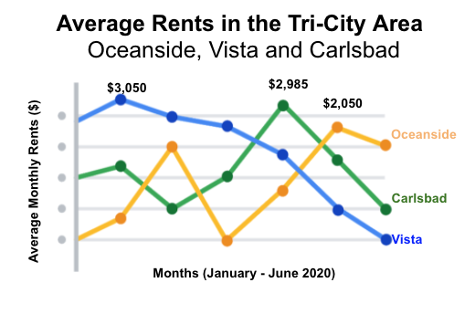

# Pro Tips for Highlighting Key Information

Headlines, subtitles, labels, and annotations help you turn your data visualizations into more meaningful displays. After all, you want to invite your audience into your presentation and keep them engaged. When you present a visualization, they should be able to process and understand the information you are trying to share in the first five seconds. This reading will teach you what you can do to engage your audience immediately.

If you already know what headlines, subtitles, labels, and annotations do, go to the guidelines and style checks at the end of this reading. If you don’t, these next sections are for you.

## Headlines that Pop

A headline is a line of words printed in large letters at the top of a visualization to communicate what data is being presented. It is the attention grabber that makes your audience want to read more. Here are some examples:

- [**Which Generation Controls the Senate?**](https://i.redd.it/rw0vrjakuoc61.png): This headline immediately generates curiosity. Refer to the [subreddit post]([dataisbeautiful-subreddit-link](https://www.reddit.com/r/dataisbeautiful/comments/l1yly6/oc_which_generation_controls_the_senate/)) in the dataisbeautiful community, r/dataisbeautiful, on January 21, 2021.
  
- [**Top 10 coffee producers**](https://ichef.bbci.co.uk/news/976/cpsprodpb/65D8/production/_100827062_chart-globalcoffeeproduction-iskhe-nc.png): This headline immediately informs how many coffee producers are ranked. Read the full article: [bbc.com/news/business-43742686]([bbc-article-link](https://www.bbc.com/news/business-43742686)).

Check out the chart below. Can you identify what type of data is being represented? Without a headline, it can be hard to figure out what data is being presented. A graph like the one below could be anything from average rents in the tri-city area, to sales of competing products, or daily absences at the local elementary, middle, and high schools.

Turns out, this illustration is showing average rents in the tri-city area. So, let’s add a headline to make that clear to the audience. Adding the headline, “**Average Rents in the Tri-City Area**” above the line chart instantly informs the audience what it is comparing.

## Subtitles that Clarify

A subtitle supports the headline by adding more context and description. Adding a subtitle will help the audience better understand the details associated with your chart. Typically, the text for subtitles has a smaller font size than the headline.

In the average rents chart, it is unclear from the headline “Average Rents in the Tri-City Area” which cities are being described. There are tri-cities near San Diego, California (Oceanside, Vista, and Carlsbad), tri-cities in the San Francisco Bay Area (Fremont, Newark, and Union City), tri-cities in North Carolina (Raleigh, Durham, and Chapel Hill), and tri-cities in the United Arab Emirates (Dubai, Ajman, and Sharjah).

We are actually reporting the data for the tri-city area near San Diego. So adding “**Oceanside, Vista, and Carlsbad**” becomes the subtitle in this case. This subtitle enables the audience to quickly identify which cities the data reflects.

## Labels that Identify

A label in a visualization identifies data in relation to other data. Most commonly, labels in a chart identify what the x-axis and y-axis show. Always make sure you label your axes. We can add “Months (January - June 2020)” for the x-axis and “Average Monthly Rents ($)” for the y-axis in the average rents chart.

Data can also be labeled directly in a chart instead of through a chart legend. This makes it easier for the audience to understand data points without having to look up symbols or interpret the color coding in a legend.

We can add direct labels in the average rents chart. The audience can then identify the data for Oceanside in yellow, the data for Carlsbad in green, and the data for Vista in blue.

## Annotations that Focus

An annotation briefly explains data or helps focus the audience on a particular aspect of the data in a visualization.

Suppose in the average rents chart that we want the audience to pay attention to the rents at their highs. Annotating the data points representing the highest average rents will help people focus on those values for each city.

## Guidelines and Pro Tips

Refer to the following table for recommended guidelines and style checks for headlines, subtitles, labels, and annotations in your data visualizations. Think of these guidelines as guardrails. Sometimes data visualizations can become too crowded or busy. When this happens, the audience can get confused or distracted by elements that aren’t really necessary. The guidelines will help keep your data visualizations simple, and the style checks will help make your data visualizations more elegant.

| Visualization Components | Guidelines | Style Checks |
| --- | --- | --- |
| Headlines | - Content: Briefly describe the data  - Length: Usually the width of the data frame  - Position: Above the data | - Use brief language  - Don’t use all caps  - Don’t use italic  - Don’t use acronyms  - Don't use abbreviations  - Don’t use humor or sarcasm |
| Subtitles | - Content: Clarify context for the data  - Length: Same as or shorter than headline  - Position: Directly below the headline | - Use smaller font size than headline  - Don’t use undefined words  - Don’t use all caps, bold, or italic  - Don’t use acronyms  - Don't use abbreviations |
| Labels | - Content: Replace the need for legends  - Length: Usually fewer than 30 characters  - Position: Next to data or below or beside axes | - Use a few words only  - Use thoughtful color-coding  - Use callouts to point to the data  - Don’t use all caps, bold, or italic |
| Annotations | - Content: Draw attention to certain data  - Length: Varies, limited by open space  - Position: Immediately next to data annotated | - Don’t use all caps, bold, or italic  - Don't use rotated text  - Don’t distract viewers from the data |

## Key Takeaways

You want to be informative without getting too detailed. To meaningfully communicate the results of your data analysis, use the right visualization components with the right style. In other words, let simplicity and elegance work together to help your audience process the data you are sharing in five seconds or less.

This section emphasizes the importance of headlines, subtitles, labels, and annotations in enhancing data visualizations. It stresses the need for these components to engage the audience immediately and communicate the key information effectively.

1. **Headlines:** Headlines are crucial attention grabbers at the top of a visualization, communicating the presented data. They should be concise, placed above the data, and avoid the use of all caps, italics, or acronyms.

2. **Subtitles:** Subtitles provide additional context and description, supporting the headline. They should be smaller in font size, clarify details, and avoid all caps, bold, or italic formats.

3. **Labels:** Labels identify data in relation to other data, commonly indicating the x-axis and y-axis. It's important to label axes clearly, use thoughtful color-coding, and keep labels concise.

4. **Annotations:** Annotations briefly explain data or focus the audience on specific aspects of the visualization. They draw attention to key points and should avoid all caps, bold, or italic formats.

**Guidelines and Style Checks:**

- For Headlines, use brief language, avoid all caps, italics, acronyms, and humor.
- Subtitles should clarify context, use a smaller font size, avoid all caps, bold, italic, acronyms, and abbreviations.
- Labels should replace the need for legends, use few words, employ thoughtful color-coding, and avoid all caps, bold, or italic formats.
- Annotations should draw attention to data without using all caps, bold, or italic formats, and without distracting viewers.

Simplicity and elegance are emphasized, encouraging data analysts to effectively communicate results without overwhelming detail. The goal is to ensure that the audience can process the presented data within the first five seconds of viewing the visualization.
