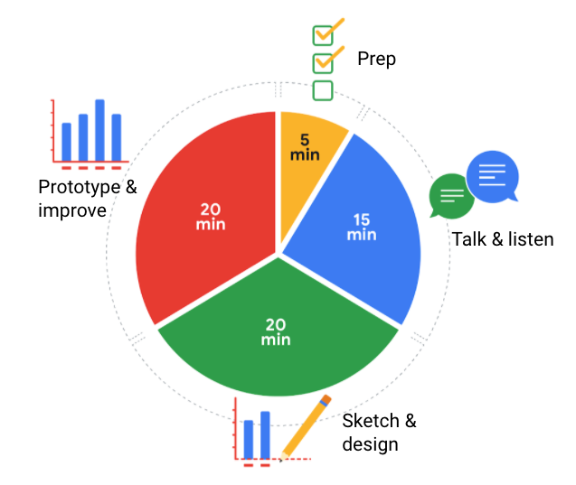

# Reading: Design a Chart in 60 Minutes

By now, you understand the principles of design and how to think like a designer. Among the many options of data visualization is creating a **chart**, which is a graphical representation of data.

Choosing to represent your data via a chart is usually the most simple and efficient method. Let’s go through the entire process of creating any type of chart in 60 minutes. The goal here is to develop a prototype or mock up of your chart that you can quickly present to an audience. This will also enable you to have a sense of whether or not the chart is communicating the information that you want.

Follow this high-level 60-minute chart to guide your thinking whenever you begin working on a data visualization.

**Prep (5 min):** Create the mental and physical space necessary for an environment of comprehensive thinking. This means allowing yourself room to brainstorm how you want your data to appear while considering the amount and type of data that you have.

**Talk and Listen (15 min):** Identify the object of your work by getting to the “ask behind the ask” and establishing expectations. Ask questions and really concentrate on feedback from stakeholders regarding your projects to help you hone how to lay out your data.

**Sketch and Design (20 min):** Draft your approach to the problem. Define the timing and output of your work to get a clear and concise idea of what you are crafting.

**Prototype and Improve (20 min):** Generate a visual solution and gauge its effectiveness at accurately communicating your data. Take your time and repeat the process until a final visual is produced. It is alright if you go through several visuals until you find the perfect fit.

## Key Takeaways

This is a great overview you can use when you need to create a visualization in a short amount of time. As you become more experienced in data visualization, you will find yourself creating your own process. You will get a more detailed description of different visualization options in the next reading, including line charts, bar charts, scatterplots, and more. No matter what you choose, always remember to take the time to prep, identify your objective, take in feedback, design, and create.

**Key Points from "Design a Chart in 60 Minutes" Reading:**

The reading outlines a high-level process for designing a chart in 60 minutes:

1. **Prep (5 min):**
   - Create the mental and physical space for comprehensive thinking.
   - Brainstorm how you want the data to appear, considering the amount and type of data.

2. **Talk and Listen (15 min):**
   - Identify the objective of your work by understanding the "ask behind the ask" and setting expectations.
   - Ask questions and focus on feedback from stakeholders to inform how to present the data.

3. **Sketch and Design (20 min):**
   - Draft your approach to the problem.
   - Define the timing and output of your work to have a clear idea of the crafted visualization.

4. **Prototype and Improve (20 min):**
   - Generate a visual solution and assess its effectiveness in communicating the data.
   - Repeat the process if needed until a final, effective visualization is produced.
