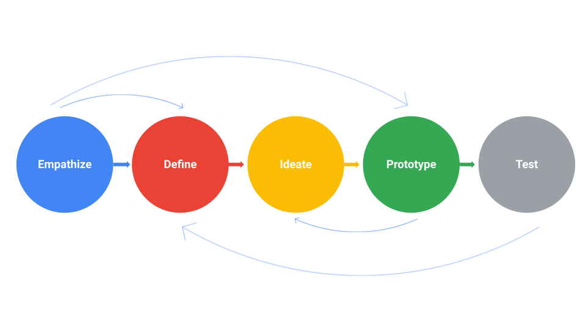
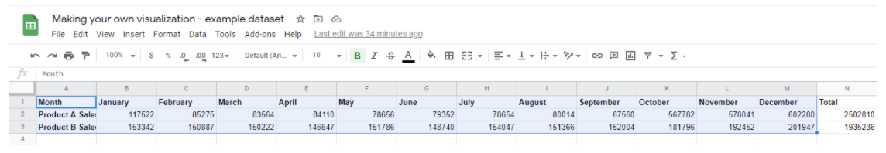
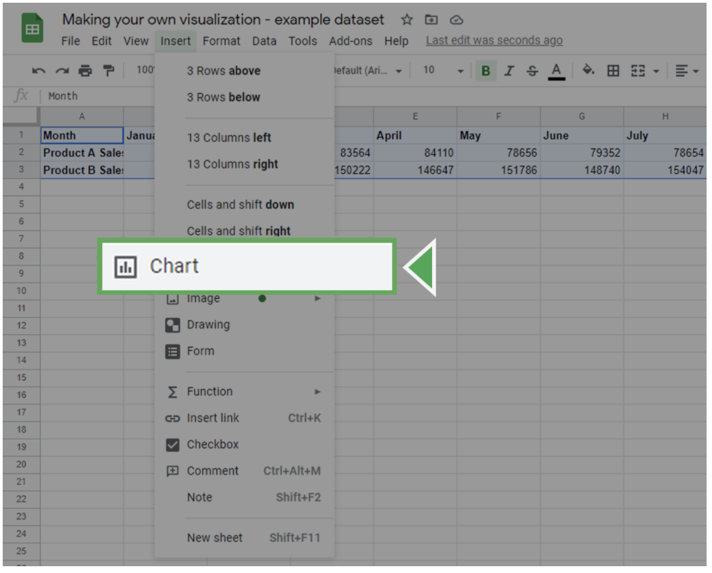
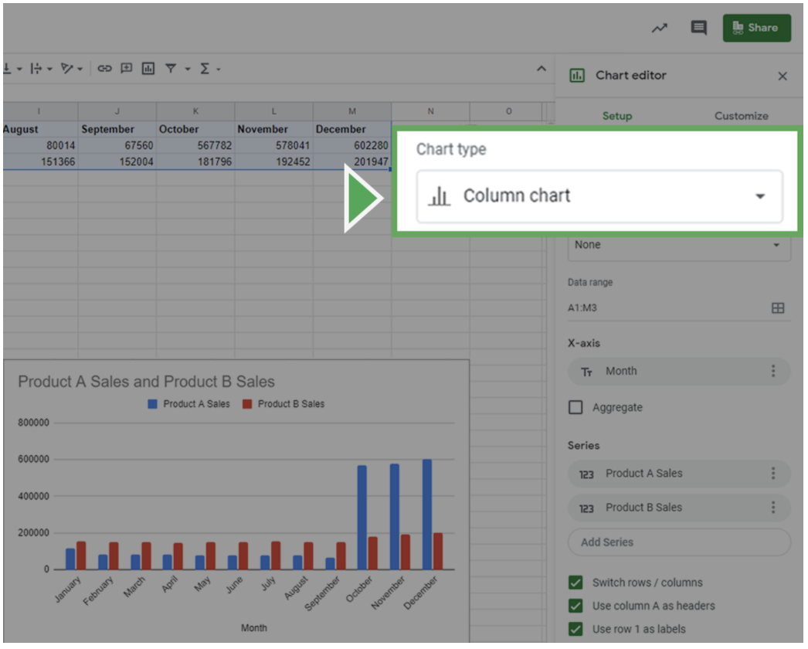

# Practice Quiz: Hands-On Activity: Create your own visualization

## Activity verview

Earlier in this course, you learned the importance of visualizing data with design thinking. In this activity, you will apply this knowledge and create your own visualization from a dataset.

By the time you complete this activity, you will be able to create and customize data visualizations using the Chart Editor in a spreadsheet. This will enable you to answer a business question with a shareable representation of data, which is important for presenting your findings in your career as a data analyst.

## Scenario

You are a junior data analyst at a local company. In your current data analysis project, you’ve been exploring sales data for all of your company’s products, including the top products and sales trends for the last year. You need to present the results of this analysis to the company executives. Your goal for this presentation is to demonstrate how sales of the company’s products have changed over the last 12 months. Your findings about the two top-selling products include:

| Product Name | Units Sold | Time Period with Highest Sales                                      |
|--------------|------------|-------------------------------------------------------------------|
| Product A    | 2.5 million| 70% of total annual sales occur in October, November, and December |
| Product B    | 1.9 million| Mostly consistent sales year-round, with a slight increase in November, December, and January |

Your audience is made up of the chief marketing officer (CMO) and marketing department vice presidents (VPs), not other data analysts or engineers. They will use the information you present to make decisions on how to allocate advertising dollars for each product for the coming year.

## Step by Steps instructions

Follow the instructions to complete each step of the activity. Then answer the questions at the end of the activity before going to the next course item.

### Step 1: Access the dataset

To get started, first access the example dataset.

Click the link to the example dataset to create a copy. If you don’t have a Google account, you may download the example dataset directly from the attachments below.

Link to example dataset: [Making your own visualization](https://docs.google.com/spreadsheets/d/1Zhm9WyrM4dmBav9Vc1VnCU82vLlESEaJGFgNcfTRsZk/template/preview)

OR file [making-your-own-visualization-example-dataset.xlsx](./resources/making-your-own-visualization-example-dataset.xlsx)

### Step 2: Review the design thinking rocess

Now that you are familiar with the scenario, take a moment to review the steps of the design thinking process. Remember, design thinking is about keeping a user-centric focus. By understanding the needs of your audience, you can craft a data visualization that communicates your findings effectively. The steps of the Design Thinking process are:

- **Empathize**: Think about the emotions and needs of the target audience.
- **Define**: Understand the audience’s needs, problems, and insights.
- **Ideate**: Use your findings from the previous phases to begin to create data visualizations.
- **Prototype**: Start putting it all together. In this case, you can put your findings into  a presentation or dashboard.
- **Test**: Check that your prototype is effective. In this case, you can show your visualizations to team members before the presentation.

Take a moment to empathize with your audience’s needs. What takeaways are most important to them? Which data visualization would communicate that takeaway most effectively?

As you consider which kinds of data visualizations would be most useful, review the decision tree from earlier in this course. This will help you figure out what type of story you want to tell with your data.

### Step 3: Create a prototype

Now, use spreadsheet software to try out different visualizations of the data.

1. Highlight all cells by clicking on cell **A1** and dragging to **M3**. This should highlight all the data and headers aside from the **Total** column.

Columns A-M are highlighted. Each column corresponds to a month and each row represents product sales
2. Click on the **Insert** tab and select **Chart**.

This will insert a chart object and bring up the **Chart editor** on the right side of the screen.

1. In the Chart editor, click on the Setup tab.

2. Click on the Chart type dropdown box. This will bring up the different kinds of charts you can create. Select the data visualization you think would be most useful during your design thinking process.

### Step 4: Customize your chart

Now, customize your visualization by editing the titles, labels, and style.

Click on the **Customize** tab in the **Chart Editor**. Click on the **Chart & axis** titles dropdown to add an informative title or label your axes. Click the **Legend** dropdown to create a legend for your chart.

Once you decide on the style and labels, focus on the design elements of the chart. This is your chance to adjust elements such as color and font. For instance, you can change the color scheme of the chart in the **Chart Style** dropdown.

When creating data visualizations, **accessibility** is important. Set up your visualization in a way that is accessible and understandable by including highly contrasting colors.

Once you’re done customizing your chart, review your choices to ensure that your visualization is easy to understand.

- Do you think your audience will fully understand what they are observing within five seconds?
- Will they understand the key takeaway you’re trying to communicate after another five seconds?  
- Did you use the most clear and communicative visualization style for your data?  

If the answer to any of these questions is no, try different visualization styles and design choices. Experiment with colors, shapes, and chart types to find what makes it easier or harder to understand the message you are trying to convey.

### Pro tip: Save the activity dataset

Be sure to save a copy of the dataset you used to complete this activity. You can use it for further practice or to help you work through your thought processes for similar tasks in a future data analyst role.

## Reflection

### Question 1: Which of the following are necessary to consider while making an effective visualization? Select all that apply

- `The type of data you are visualizing`
- `The needs of your audience`
- The brand of visualization software you use
- `The design thinking process`

> In order to make an effective visualization, you must consider the type of data you’re visualizing, the needs of your audience, and the design thinking process. An effective visualization can be made in any visualization software. Going forward, you can use your knowledge of creating data visualizations in the chart editor to explore more types of data visualizations. This will help you better present your data and findings to peers and stakeholders.

### Question 2: In this activity, you used design thinking to create a data visualization and answer a business question. In the text box below, write 2-3 sentences (40-60 words) in response to each of the following questions

- What insights did you gain about the two products you visualized? What trends did you notice?
- How did design thinking (Empathize, Define, Ideate, Prototype, Test) influence the process of making the data visualization?
- How can design thinking help make data visualizations more accessible and easier to understand?

**My response Reflection:**

1. **Insights gained about the two products:**
   - The sales trend of top 2 product are focuses on the last three month of the year
   - The visualization highlighted a clear trend in sales for both products. Product A exhibited a significant peak in sales (2.5 million units) during the last quarter (October, November, December), representing 70% of total annual sales. In contrast, Product B showed mostly consistent sales throughout the year, with a slight increase in November, December, and January.

2. **Influence of design thinking on the process:**
   - **Empathize:** Recognizing the audience (CMO and VPs) and their need for insights into sales trends for effective advertising decision-making.
   - **Define:** Clearly defining the goal of showcasing how sales have changed over the last 12 months for the two top products.
   - **Ideate:** Brainstorming visualization options based on the identified needs and goal.
   - **Prototype:** Using the Chart Editor to create visualizations quickly, experimenting with chart types, and refining until an effective visual is produced.
   - **Test:** Ensuring the visualization is easy to understand and conveys key takeaways within a short time.

3. **Design thinking for accessibility and understanding:**
   - Empathy in design thinking involves understanding the audience's needs, making the visualization user-centric.
   - Well-defined goals ensure the visualization serves a clear purpose and communicates relevant information.
   - Ideation helps explore various ways of presenting data to find the most effective and understandable visualization.
   - Prototyping allows testing different visualization styles and making adjustments based on feedback.
   - Testing ensures that the final visualization is accessible, easy to understand, and aligns with the audience's needs. Design choices, such as color contrast and clarity, contribute to accessibility.

> Correct:
>
> Congratulations on completing this hands-on activity! A good response would include how design thinking should be at the heart of your visualization process because it allows analysts to create user-centric visualizations.
>
> Design thinking helps you stay focused on your audience, message, and goal. This helps you create a data visualization that tells a meaningful story about your data that is useful to your audience. Design thinking also helps you plan for accessibility issues. By improving accessibility, you make data visualizations that communicate more effectively.
