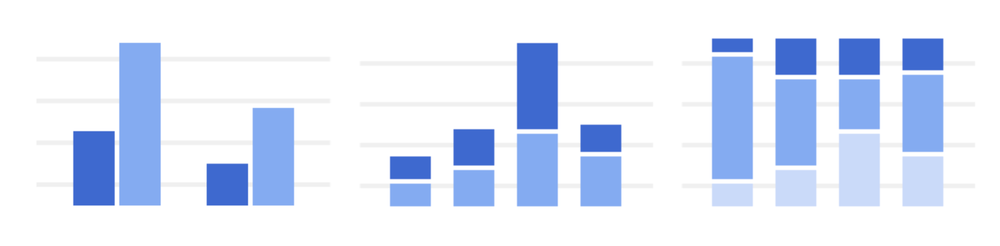
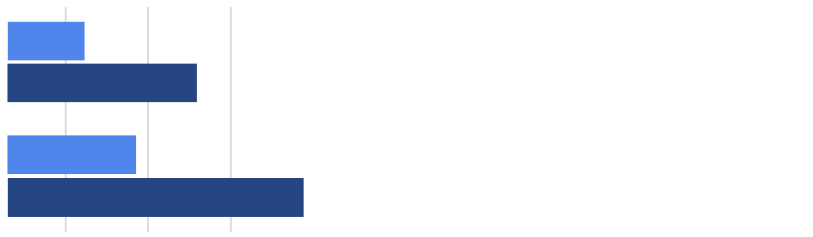
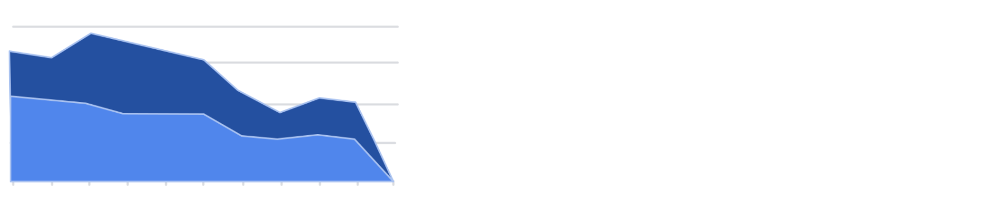
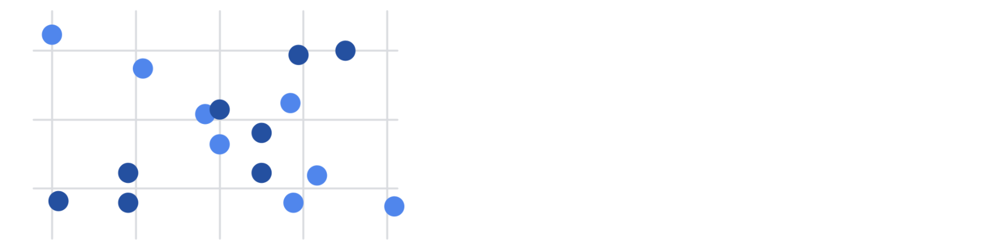

# Reading: Visualizations in Spreadsheets and Tableau

This reading summarizes the seven primary chart types: column, line, pie, horizontal bar, area, scatter, and combo. Then, it describes how visualizations in spreadsheets compare to those in Tableau.

## Primary Chart Types in Spreadsheets

In spreadsheets, **charts** are graphical representations of data from one or more sheets. Although there are many variations to choose from, we will focus on the most broadly applicable charts to give you a sense of what is possible in a spreadsheet. As you review these examples, keep in mind that these are meant to give you an overview of visualizations rather than a detailed tutorial. Another reading in this program will describe the applicable steps and process to create a chart more specifically. When you are in an application, you can always select **Help** from the menu bar for more information.

- To create a chart in Google Sheets, select the data cells, click **Insert** from the main menu, and then select **Chart**. You can set up and customize the chart in the dialog box on the right.
- To create a chart in Microsoft Excel, select the data cells, click **Insert** from the main menu, and then select the chart type. Tip: You can optionally click **Recommended Charts** to view Excel’s recommendations for the data you selected and then select the chart you like from those shown.

These are the primary chart types available:

- **Column (vertical bar):** A column chart allows you to display and compare multiple categories of data by their values.
  

- **Line:** A line chart showcases trends in your data over a period of time. The last line chart example is a combo chart which can include a line chart. Refer to the description for the combo chart type.
  

- **Pie:** A pie chart is an easy way to visualize what proportion of the whole each data point represents.
  

- **Horizontal Bar:** A bar chart functions similarly to a column chart but is flipped horizontally.
  

- **Area:** Area charts allow you to track changes in value across multiple categories of data.
  

- **Scatter:** Scatterplots are typically used to display trends in numeric data.
  

- **Combo:** Combo charts use multiple visual markers like columns and lines to showcase different aspects of the data in one visualization. The example below is a combo chart that has a column and line chart together.
  

You can find more information about other charts here:

- [Types of charts and graphs in Google Sheets]([Google-Sheets-Chart-Examples-Link](https://support.google.com/docs/answer/190718?hl=en))
- [Excel Charts](https://www.tutorialspoint.com/excel_charts/excel_charts_types.htm)

## How Visualizations Differ in Tableau

As you have also learned, Tableau is an analytics platform that helps data analysts display and understand data. Most if not all of the charts that you can create in spreadsheets are available in Tableau. But, Tableau offers some distinct charts that aren’t available in spreadsheets. These are handy guides to help you select chart types in Tableau:

- [Which chart or graph is right for you?]([Tableau-Popular-Charts-Link](http://www.tableau.com/sites/default/files/media/which_chart_v6_final_0.pdf)): This presentation covers 13 of the most popular charts in Tableau.
- [The Ultimate Cheat Sheet on Tableau Charts](https://towardsdatascience.com/the-ultimate-cheat-sheet-on-tableau-charts-642bca94dde5): This blog describes 24 chart variations in Tableau and guidelines for use.

## Types of Visualizations in Tableau

In addition to more traditional charts, Tableau also offers some more specific visualizations that you can use in your dashboard design:

- **Highlight Tables:** Appear like tables with conditional formatting. Review the [steps to build a highlight table](https://help.tableau.com/current/pro/desktop/en-us/buildexamples_highlight.htm).

- **Heat Maps:** Show intensity or concentrations in the data. Review the [steps to build a heat map]([Heat-Map-Steps-Link](https://help.tableau.com/current/pro/desktop/en-us/buildexamples_highlight.htm)).

- **Density Maps:** Illustrate concentrations (such as a population density map). Refer to [instructions to create a heat map for density]([Density-Map-Heat-Map-Instructions-Link](https://help.tableau.com/current/pro/desktop/en-us/maps_howto_heatmap.htm)).

- **Gantt Charts:** Demonstrate the duration of events or activities on a timeline. Review the [steps to build a Gantt chart](https://help.tableau.com/current/pro/desktop/en-us/buildexamples_gantt.htm).

- **Symbol Maps:** Display a mark over a given longitude and latitude. Learn more from this [example of a symbol map](https://interworks.com/blog/ccapitula/2014/08/18/tableau-essentials-chart-types-symbol-map/).

- **Filled Maps:** Are maps with areas colored based on a measurement or dimension. Explore an [example of a filled map](https://interworks.com/blog/ccapitula/2014/09/23/tableau-essentials-chart-types-filled-map/).

- **Circle Views:** Show comparative strength in data. Learn more from this [example of a circle view](https://interworks.com/blog/ccapitula/2014/10/17/tableau-essentials-chart-types-circle-view/).

- **Box Plots:** Also known as box and whisker charts, illustrate the distribution of values along a chart axis. Refer to the [steps to build a box plot]([Box-Plot-Steps-Link](https://help.tableau.com/current/pro/desktop/en-us/buildexamples_boxplot.htm)).

- **Bullet Graphs:** Compare a primary measure with another and can be used instead of dial gauge charts. Review the [steps to build a bullet graph](https://help.tableau.com/current/pro/desktop/en-us/qs_bullet_graphs.htm).

- **Packed Bubble Charts:** Display data in clustered circles. Review the [steps to build a packed bubble chart]([Packed-Bubble-Chart-Steps-Link](https://help.tableau.com/current/pro/desktop/en-us/buildexamples_bubbles.htm)).

## Key Takeaway

This reading described the chart types you can create in spreadsheets and introduced visualizations that are more unique to Tableau.

### Key Points from the Reading

- Primary Chart Types in Spreadsheets

1. **Column (Vertical Bar) Chart:**
   - Displays and compares multiple categories of data by their values.
   - Examples include grouped and stacked column charts.

2. **Line Chart:**
   - Showcases trends in data over a period of time.
   - Combo charts can include both column and line charts.

3. **Pie Chart:**
   - Visualizes the proportion of each data point relative to the whole.

4. **Horizontal Bar Chart:**
   - Similar to a column chart but flipped horizontally.
   - Example includes a grouped horizontal bar chart.

5. **Area Chart:**
   - Allows tracking changes in value across multiple data categories.
   - Example shows a stacked area chart.

6. **Scatter Chart:**
   - Typically used to display trends in numeric data.

7. **Combo Chart:**
   - Uses multiple visual markers like columns and lines to showcase different aspects of the data.
