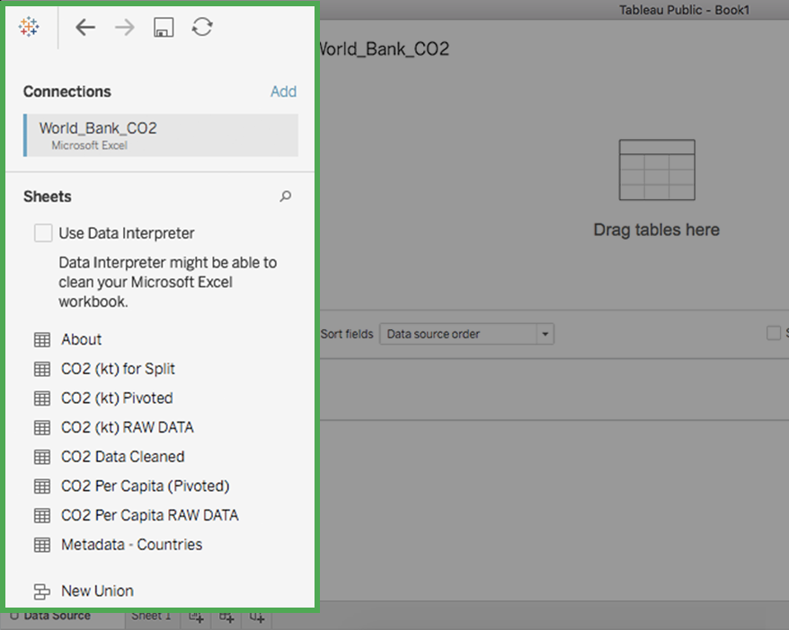
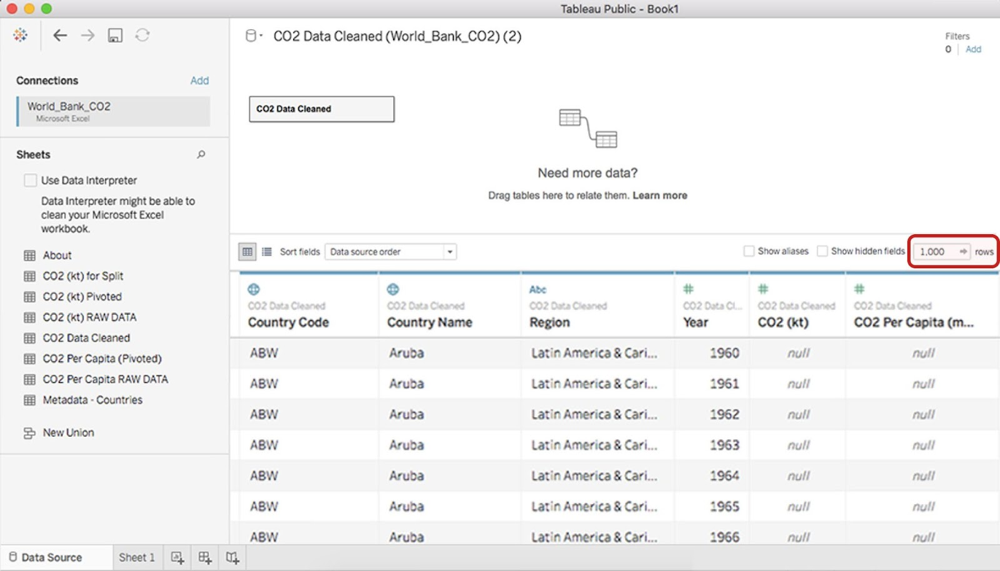
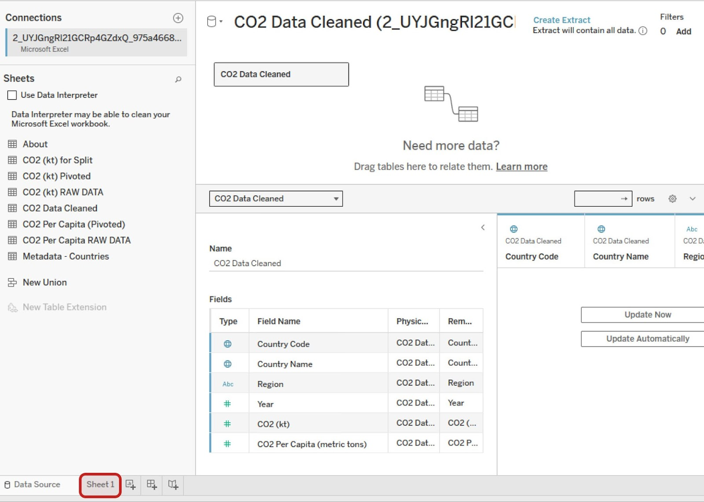
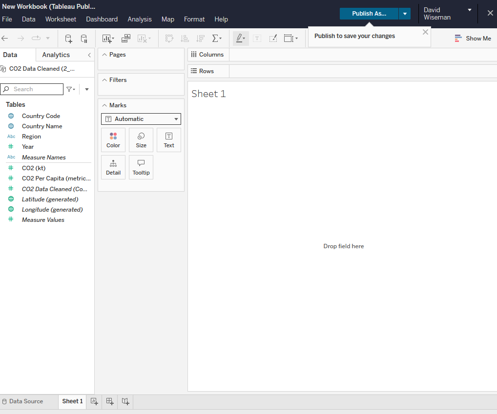
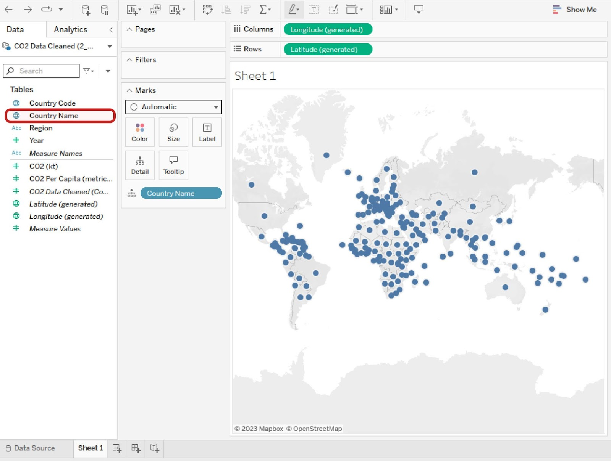
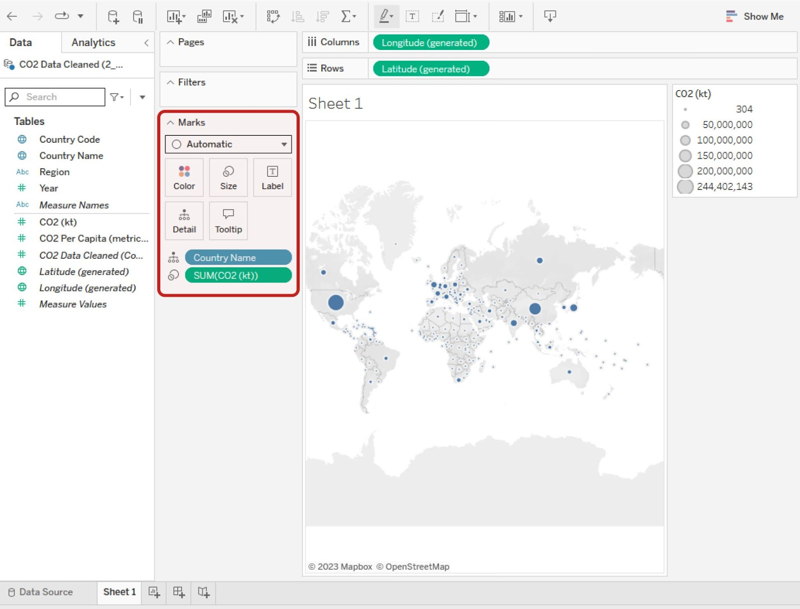
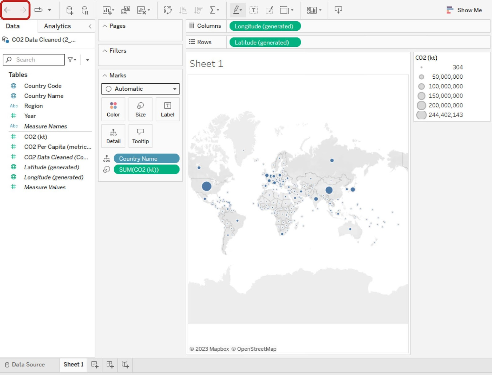
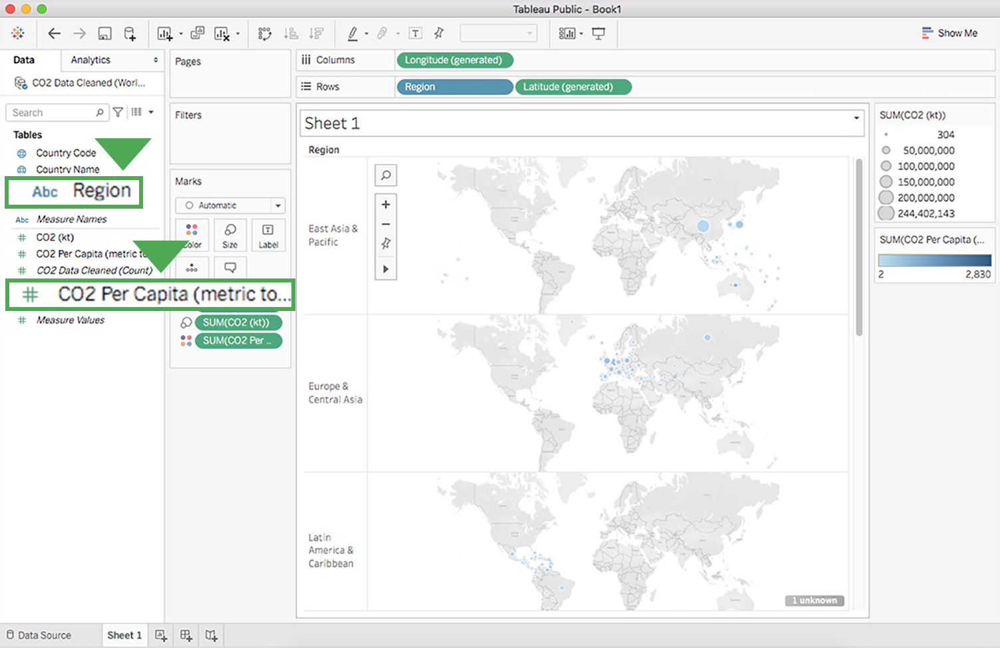
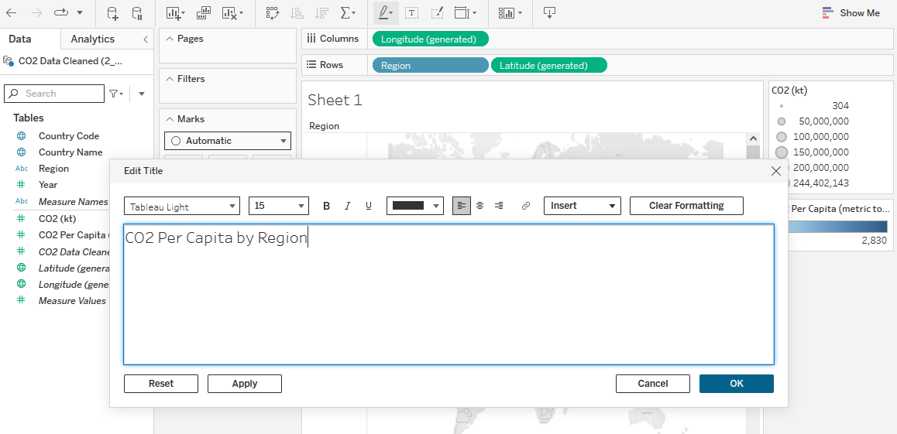
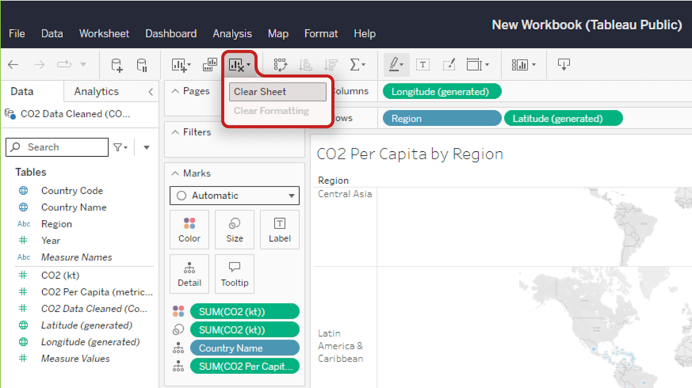

# Practice Quiz: Hands-On Activity: Create a data visualization in Tableau

## Activity Overview

Now that you know how to create a visualization in Tableau, you’ll use the dataset and instructions in this activity to create your own visualization. If you have questions along the way, refer to the previous video, 
[Create a data visualization in Tableau](video_link_here)
.

In this activity, you’ll practice the following skills:

- Connect data to Tableau.
- Create a chart.
- Customize your chart.
- Delete a chart or sheet.

By the time you complete this activity, you’ll be able to create and customize visualizations in Tableau. This will enable you to share your valuable data insights  with others.

## Step by Steps instructions

Follow the instructions to complete each step of the activity. Then answer the questions at the end of the activity before going to the next course item.

### Step 1: Access the dataset

Click the following link and select Use Template to create a copy of the dataset. Download this dataset to your computer by selecting File > Download > Microsoft Excel (.xslx). If you don’t have a Google account, download the dataset directly from the attachment below.

Link to dataset:: [CO2 Dataset](https://docs.google.com/spreadsheets/d/1LwGHDgJkXSm8b0ziSDyC8pQGqjYVGpX9mAEVPs2KQgY/copy)

OR [co2-dataset.xlsx](./resources/co2-dataset.xlsx)

### Step 2: Connect data to Tableau

1. Log in to Tableau Public. If you have not yet created an account, refer to the reading [Begin to use Tableau Public](s3_r_begin-to-use-tableau-public.md).

    Note: Tableau frequently updates its user interface. The latest changes may not be reflected in the screenshots presented in this activity, but the principles remain the same. Adapting to changes in software updates is an essential skill for data analysts, and it’s helpful for you to practice troubleshooting. You can also reach out to your community of learners on the discussion forum for help.

2. Select the user profile icon and choose **My Profile** to display your Tableau profile and any vizzes you’ve created.
3. Select the **Create a Viz button**.
4. When you select **Create a Viz**, Tableau may open the **Connect to Data** dialog box. If so, select the Files tab and upload the CO2 dataset you downloaded earlier.

    If selecting **Create a Viz** does not open the **Connect to Data** dialog box, in the Tableau Public interface, select the **Data** tab and then **New Data Source**. Upload the CO2 dataset.

5. After you upload the data, notice the list of data connections and sheets beside the main **Data-Source Interface**. The data connection is the CO2 dataset you’ve connected. It contains eight sheets, including one labeled CO2 Data Cleaned.

    

6. Double-click on the sheet `CO2 Data Cleaned` to load that sheet's data into the main part (canvas) of the Tableau Public page. Alternatively, drag and drop the sheet onto the canvas where it says **Drag tables here**.

    **Note**: Loading a sheet twice may cause you to inadvertently create a table relationship between the loaded sheets (similar to joining tables in SQL). You’ll explore this later in the course. For now, if you do this accidentally, don’t worry! Just right-click on the second box to remove it from the table listings.

    

7. When the sheet is loaded, Tableau displays the table schema with the field names, data types, etc. Select the **Update Now** button to bring up the first 100 rows in the table; you can increase the number of rows in the settings above the data view. In the following image, the number of rows displayed has been increased to 1,000.

    

    Each row corresponds to a single data point, and each column represents a different feature.

    Tableau automatically interprets the type of data in each column and  displays the following icons above the column names, to indicate how Tableau has interpreted the data in the column:
      - `#`: Numeric data
      - `Abc`: String data
      - `Globe`: Geographic data
      - `Calendar`: Date data
      - `Calendar`: Date and time data

In the previous image, Tableau has interpreted the first two columns as geographic data, the third column as string data, and the last three columns as numeric data.

### Step 3: Access your data in Tableau

Now that you have all of your data loaded into Tableau, you can use it to create a visualization in which the CO2 emissions are displayed per country.

Select the **Sheet 1** tab to open the **New workbook** pane in the display.

### Step 4: Understand dimensions and measures

The **Data** pane in the side bar displays column names in a list. In Tableau and most business intelligence software, you will find two types of data elements: **dimensions** and **measures**. According to the [Tableau documentation](link_here):

- Dimensions contain qualitative values (such as names, dates, or geographical data). You can use dimensions to categorize, segment, and reveal the details in your data. Dimensions affect the level of detail in the view.
- Measures contain numeric, quantitative values that you can measure. Measures can be aggregated. When you drag a measure into the view, Tableau applies an aggregation to that measure (by default).

In the Data pane of the Tableau side bar, you’ll see dimensions listed above the gray line and measures below the gray line (under Measure Names). These allow you to build and customize charts.

### Step 5: Create a visualization chart of C02 emissions

Now, create a chart that displays the CO2 emissions per country. In the **Data** pane of the sidebar, double-click the **Country Name** dimension. The canvas displays a map of the countries with points indicating which countries are represented in the data.

The points are all the same size because, if there is no measure selected, Tableau defaults to scale each country equally. If you want to scale point size by kilotons (kt) of CO2 emissions, you need to include a specific measure.

To do this, double-click (or drag and drop onto the sheet) the `measure CO2 (kt)` in the **Data** pane. This changes the size of the dots to be proportional to the amount of CO2 emitted, as in the example below.

Tableau has a wide selection of options for depicting the measure of a given dimension. Most of these options are contained in the Marks card, Filter shelf, and Page shelf.

### Step 6: Customize your chart's dimensions and measures

If you drag and drop a measure on one of the option classes, such as Color, Size, or Label, you can change that aspect of the measure’s visualization on the chart.

For example, if you want to change the color of the CO2 measure, drag the measure `CO2 (kt)` from the sidebar to the **Marks** card and drop it on the **Color** box. This will change the measure’s configuration to a color breakdown. Then, select the **Color** box in the **Marks** card to pull up a menu for changing the color and its options. To change the color, select the **Edit Colors** button.

Try out the different options available. You can always reverse a change by selecting the Back arrow button in the toolbar or using your computer's default undo keyboard shortcut. Similarly, you can redo changes you make by selecting the Forward arrow button.

#### Change dimensions and measures

Changing either the dimension or the measure on a chart is simple. Suppose that, instead of visualizing the CO2 per country, you want to chart the CO2 per capita per region. To do this, in the sidebar, double-click on the dimension **Region**. Then double-click on  the measure **CO2 Per Capita**. This will result in seven world charts: East Asia & Pacific, Europe & Central Asia, Latin America & Caribbean, Middle East & North Africa, North America, South Asia, and Sub-Saharan Africa.

### Step 7: Customize your chart's title

Currently, the title of this chart is **Sheet 1**. To give the chart a more descriptive title:

1. Point to the title box, select the dropdown list menu, and then select **Edit Title** to open the **Edit Title** dialog box. (You can also double-click **Sheet 1** to open the **Edit Title** dialog box where you can change the title.)

    

2. Enter any title you wish and select **OK**. A descriptive title helps people understand what the chart visual seeks to convey. For example, you could title this chart “CO2 Per Capita by Region.”

    

### Step 8: Delete a chart or sheet

#### **Delete a chart**

To delete a chart from the sheet, select the **Clear Sheet** button in the toolbar.

This will completely delete the chart and bring you back to an empty sheet.

**Note**: This will not remove the sheet title.

If you delete a chart by accident or change your mind, select the **Back** button to undo the deletion.

#### **Delete a sheet**

If you want to delete a sheet in its entirety, right-click on the sheet's tab at the bottom of the screen and select **Delete**. You won’t be able to delete a sheet if it is the only sheet in your file.

**Note**: Unlike clearing a sheet, deleting a sheet altogether cannot be reversed!

The skills you’ve practiced in this hands-on activity will help you get started visualizing your data. This is far from the end of the story, though. As you progress through this course, you’ll continue refining your Tableau skills.

### Pro tip: Save the activity dataset

Be sure to save a copy of the dataset you used to complete this activity. You can use it for further practice or to help you work through your thought processes for similar tasks in a future data analyst role.

## Reflection

In this activity, you used Tableau to create a visualization out of a dataset. In the text box below, write 2-3 sentences (40-60 words) in response to each of the following questions:

- What elements can you change to customize a chart in Tableau?
- What other kinds of visualizations could you create in Tableau?
