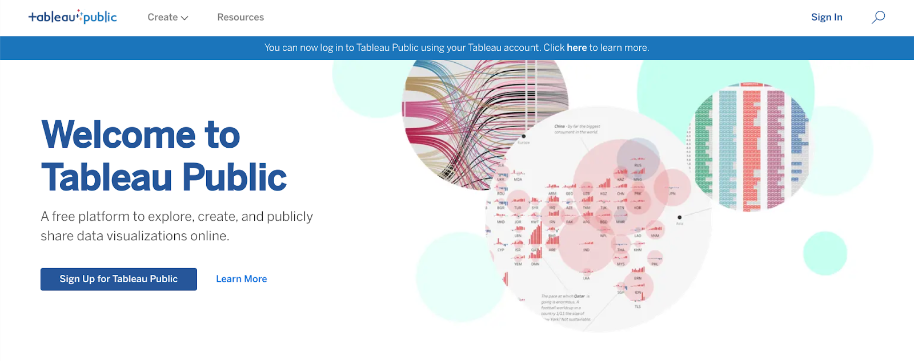
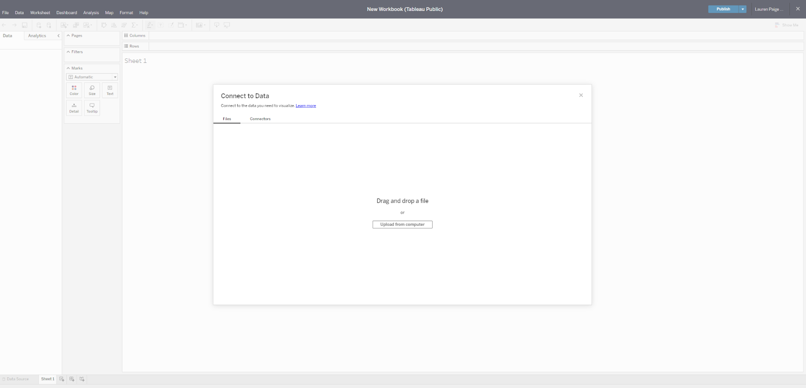
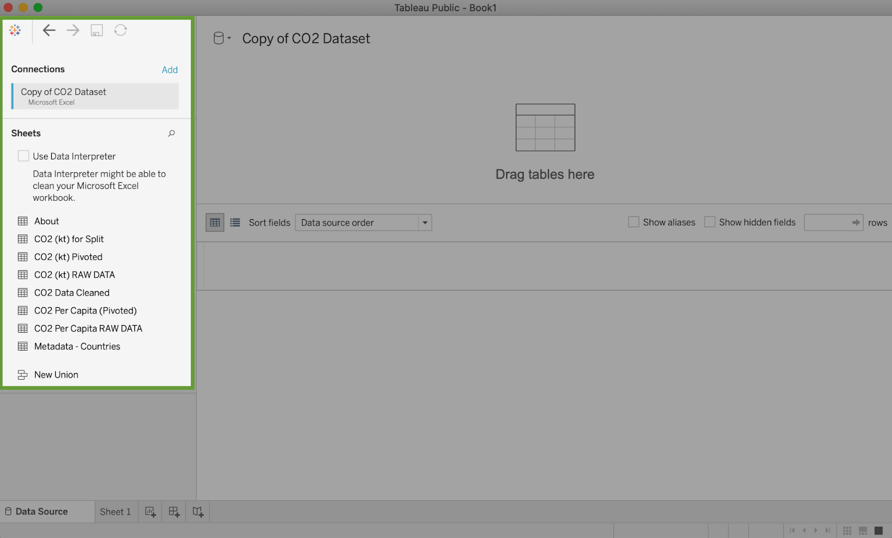
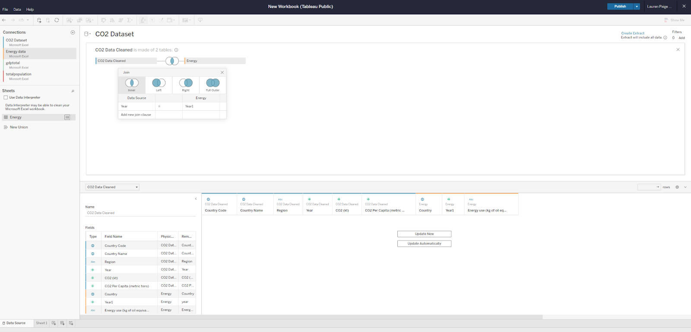
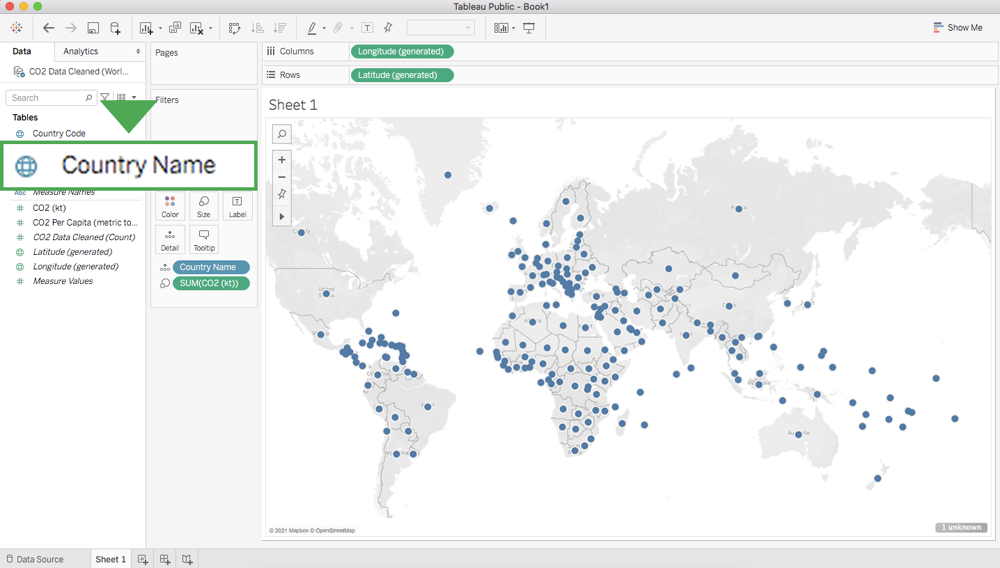
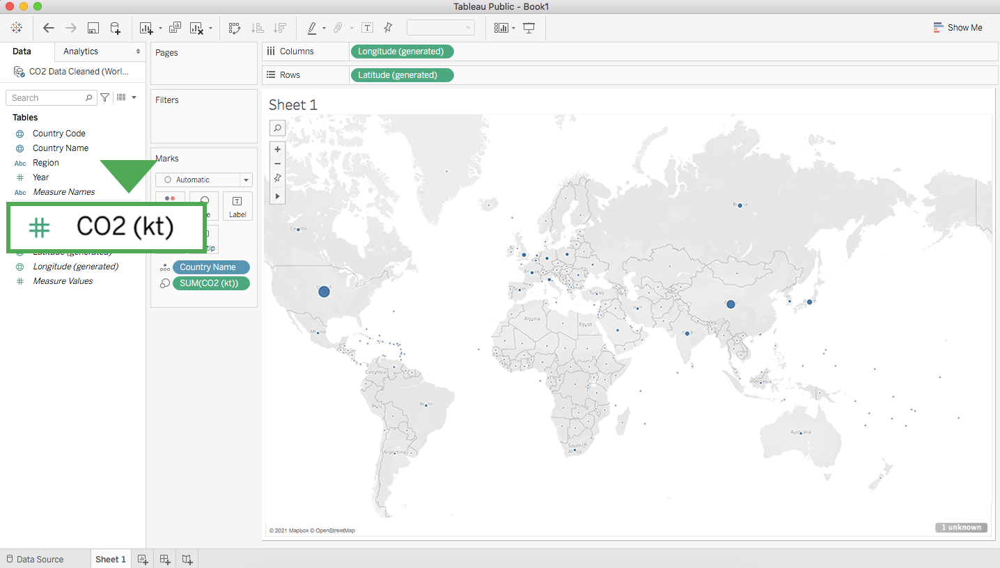
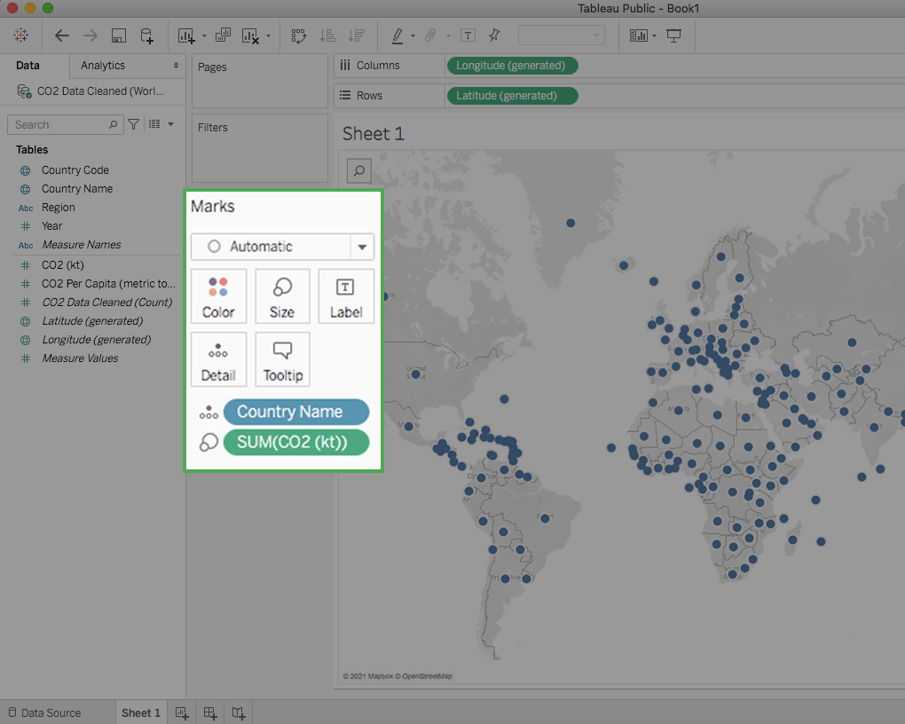

# Optional: Using Tableau Desktop

You have started exploring Tableau as a data visualization tool in business intelligence dashboards to convey insights with stakeholders. Throughout this program, you will continue to use and access Tableau—eventually using it to create your own dashboards. This reading will enable you to familiarize yourself with Tableau's interface and functionality.

## Create a profile on Tableau Public

With Tableau Public, you can create and share visualizations. If you don’t already have an account, make one on the [Tableau Public](https://public.tableau.com/s/) site. Note that trying to make an account from the main page will sign you up for a Tableau Free Trial rather than a Tableau Public account.

The difference between these two options is that a Free Trial lasts for 14 days, whereas Tableau Public gives you long-term access through the web version of the program. It has some limitations compared to the other versions of Tableau, but it is free to use and will enable you to complete the upcoming activities. You can also use your Tableau credentials to access Tableau Public if you already have an account! You are welcome to try the free trial or purchase Tableau, but it is not required for this program.

Complete the information in the signup form. When you click the **Create My Profile** button, you’ll be transferred to your profile page. This is where your Tableau Public visualizations can be made public to share with your peers. In the tabs on this page, you can access lists of visualizations you’ve made, visualizations you’ve favorited, authors you are following, and authors who are following you. By clicking **Edit Profile**, you can add additional information like your bio, title, organization, and links to social media accounts. This is also where you can enable Tableau Public’s **Hire Me** button. The Hire Me button will indicate to potential hiring managers that your Tableau skills are available for hire.

## Optional: Download the desktop version

With the desktop application, you can use features from Tableau Public without connecting to the internet. It is free to use, just like Tableau Public’s online version. Keep in mind that this application cannot be used on the Chromebook operating system and is not required for this course. If you are using Windows or Mac OS, this desktop application will enable you to complete upcoming activities that use Tableau Public. To download [Tableau Public Desktop Edition](https://www.tableau.com/products/public/download), log into your account and review the [system requirements](https://www.tableau.com/products/techspecs#public) for your operating system.

- Download for [MacOS](https://www.tableau.com/en-us/downloads/public/mac)
- Download for [Window](https://www.tableau.com/en-us/downloads/public/pc64)

## Loading and linking data

Tableau enables you to load in your own data and link it to other datasets directly in the platform. When you log in, choose to **Create a Viz**. This will open a new worksheet where you can upload data or connect to online sources, such as your Google Drive.

Once you upload data to your worksheet, it will populate the Connections pane.

You can add more connections to other data sources in order to build visualizations that compare different datasets. Simply drag and drop tables from the Sheets section in order to join tables and generate those connections:

## Dimensions and measures

Tableau uses dimensions and measures to generate customized charts. For example, check out this chart focusing on CO2 emissions per country. The **Country Name** dimension can be used to show a map of the countries on the planet with dots indicating which countries are represented in the data.

The dots are all the same size because—with no measure selected—Tableau defaults to scale each country equally. If you want to scale by CO2 emissions, you need to include a specific measure. Here is the same chart with a measure for CO2 kiloton (kt). This changes the size of the dots to be proportional to the amount of CO2 emitted:

Tableau has a wide variety of options for depicting the measure for a given dimension. Most of these options are contained near the main display and the column with dimensions and measures.

## Key takeaways

Tableau allows you to customize measures with options such as Color, Size, and Label, which change those aspects of the measure’s visualization on the chart. As you customize measures in Tableau, you will want to consider accessibility for your audience. As a refresher, you can check out [this video on accessible visualizations](../../m1_visualize-data/p4_visualization-considerations/s2_v_accessible-visualizations.md) from the Google Data Analytics Certificate program.
