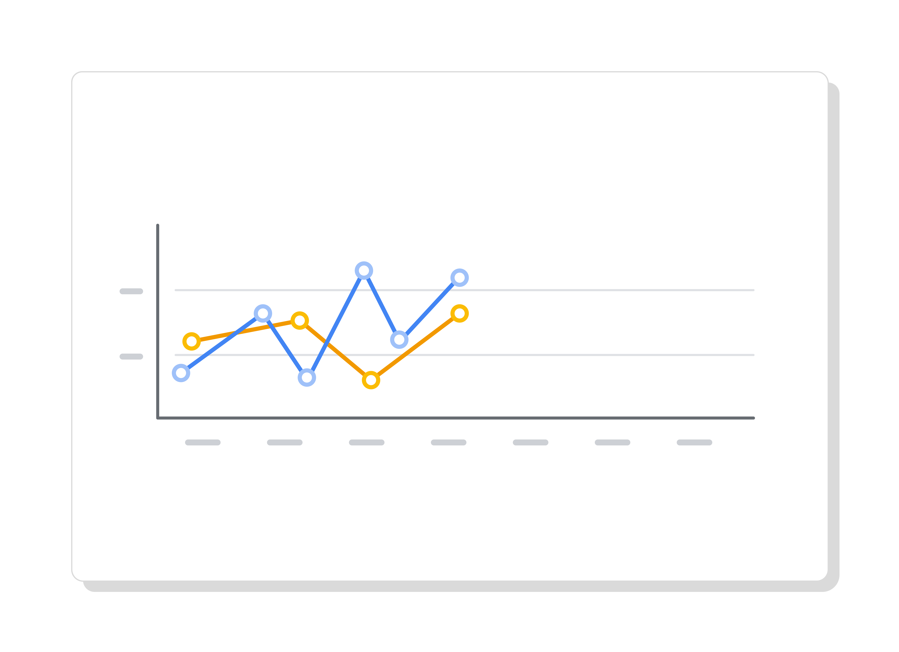
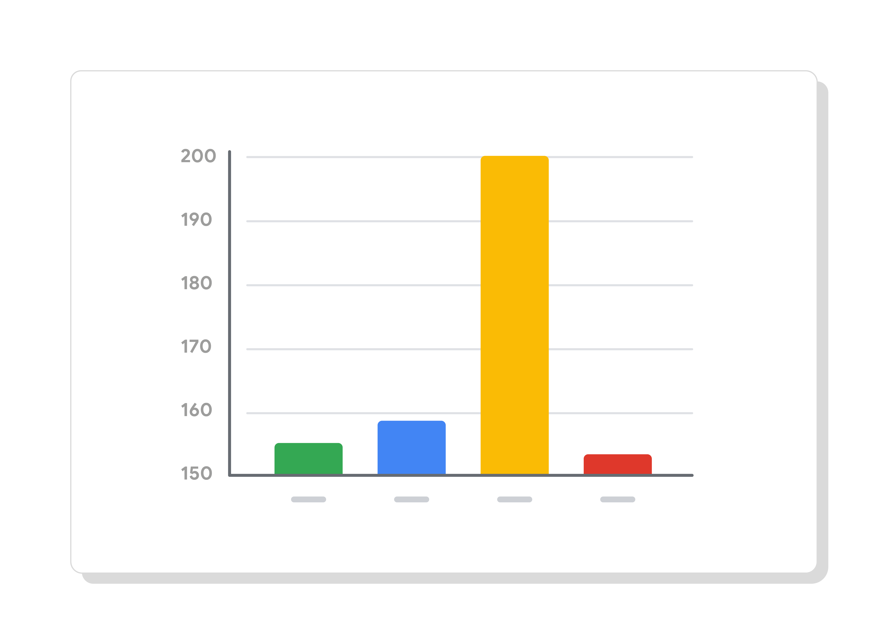
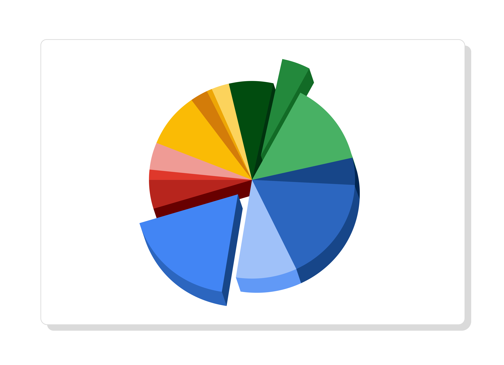

# Essential Design Principles

You recently learned about pre-attentive attributes of data visualization—the building blocks of data visualizations: marks and channels. In this reading, you’ll take this understanding a step further with essential design principles.

As an analyst, your audiences will have a variety of roles, backgrounds, and perspectives. You might present information to other data analysts, to clients, or to executives in your company’s C-suite. You’re responsible for developing data visualizations that convey the information your audience needs in a manner that makes sense to everyone.

## Design Principles

These design principles are important to your work as a data analyst because they help ensure that you’re creating visualizations that communicate your data effectively to your audience. By keeping these rules in mind, you can plan and evaluate your data visualizations to decide if they’re working. And, if they aren’t, you can adjust them!

| Principle | Description |
|-----------|-------------|
| Choose the right visual| One of the first things you have to decide is which visual will be the most effective for your audience. Sometimes, a simple table is the best visualization. Other times, you need a more complex visualization to illustrate your point. |
| Optimize the data-ink ratio | The data-ink entails focusing on the part of the visual that is essential to understanding the point of the chart. Try to minimize non-data ink like boxes around legends or shadows to optimize the data-ink ratio. |
| Use orientation effectively | Make sure the written components of the visual, like the labels on a bar chart, are easy to read. You can change the orientation of your visual to make it easier to read and understand. |
| Color | There are a lot of important considerations when thinking about using color in your visuals. These include using color consciously and meaningfully, staying consistent throughout your visuals, being considerate of what colors mean to different people, and using inclusive color scales that make sense for everyone viewing them. |
| Numbers of elements | Think about how many elements you include in any visual. If your visualization uses lines, try to plot five or fewer. If that isn’t possible, use color or hue to emphasize important lines. Also, when using visuals like pie charts, try to keep the number of segments to less than seven since too many elements can be distracting. |
| Avoiding misleading or deceptive charts | As you are considering what kind of visualization to create and how to design it, you will also want to be sure that you are not creating misleading or deceptive charts. Data analysis provides insights and knowledge that people use to make decisions. So, it’s important that the visualizations you create are communicating data insights accurately and truthfully. |

## Avoiding misleading or deceptive charts

As you are considering what kind of visualization to create and how to design it, you will also want to be sure that you are not creating misleading or deceptive charts. Data analysis provides insights and knowledge that people use to make decisions. So, it’s important that the visualizations you create are communicating data insights accurately and truthfully. 

Here are some common errors to avoid so that your visualizations aren’t accidentally misleading:

| What to avoid | Why |
|----------------|-------|
| Cutting off the y-axis | Changing the scale on the y-axis can make the differences between different groups in your data seem more dramatic, even if the difference is actually quite small. |
| Misleading use of a dual y-axis | Using a dual y-axis without clearly labeling it in your data visualization can create extremely misleading charts. |
| Artificially limiting the scope of the data | If you only consider the part of the data that confirms your analysis, your visualizations will be misleading because they don’t take all of the data into account. |
| Problematic choices in how data is binned or grouped | It is important to make sure that the way you are grouping data isn’t misleading or misrepresenting your data and disguising important trends and insights. |
| Using part-to-whole visuals when the totals do not sum up appropriately | If you are using a part-to-whole visual like a pie chart to explain your data, the individual parts should add up to equal 100%. If they don’t, your data visualization will be misleading. |
| Hiding trends in cumulative charts | Creating a cumulative chart can disguise more insightful trends by making the scale of the visualization too large to track any changes over time. |
| Artificially smoothing trends | Adding smooth trend lines between points in a scatter plot can make it easier to read that plot, but replacing the points with just the line can actually make it appear that the point is more connected over time than it actually was. |

## Key Takeaways

Design principles are important for creating effective data visualizations. When creating visualizations, consider the audience, choose the right visual for the job, and be sure to avoid misleading or deceptive visuals. By following these principles, you’ll be able to design visualizations that are effective, informative, and easy to understand, which will help you communicate findings to a wider audience and make a greater impact on your organization!