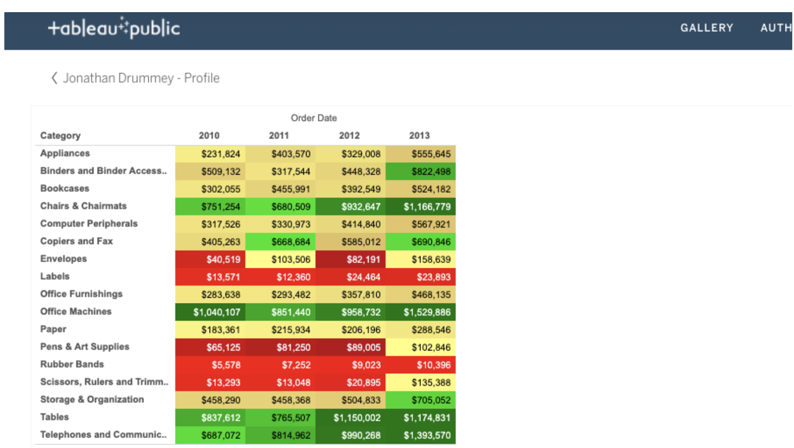

# Discussion Prmopt: Misleading visualizations

You can create data visualizations in Tableau using a wide variety of charts, colors, and styles. And you have tremendous freedom in the tool to decide how these visualizations will look and how they will present your data.

Below is an example of a visualization created in Tableau:

| Category                  | 2010       | 2011       | 2012       | 2013       |
|---------------------------|------------|------------|------------|------------|
| Appliances                | $231,824 (yellow 1)   | $403,570 (yellow 2)  | $329,008 (yellow 1)  | $555,645   (yellow 2)  |
| Binders and Binder Access | $509,132 (yellow 2)   | $317,544 (yellow 1)  | $448,328 (yellow 2)  | $822,498   (green 2)   |
| Bookcases                 | $302,055 (yellow 1)   | $455,991 (yellow 2)  | $392,549 (yellow 1.5)| $524,182   (yellow 2)  |
| Chairs & Chairmats        | $751,254 (green 2)    | $680,509 (green 1)   | $932,647 (green 3)   | $1,166,779 (green 3.5) |
| Computer Peripherals      | $317,526 (yellow 1.5) | $330,973 (yellow 1.5)| $414,840 (yellow 1.5)| $567,921   (yellow 2)  |
| Copiers and Fax           | $405,263 (yellow 2)   | $668,684   (green 1) | $585,012 (yellow 2)  | $690,846   (green 1.5) |
| Envelopes                 | $40,519 (red 3)       | $103,506 (yellow 1)  | $82,191 (red 3.5)    | $158,639   (yellow 1)  |
| Labels                    | $13,571 (red 2)       | $12,360  (red 2)     | $24,464 (red 2)      | $23,893 (red 2)        |
| Office Furnishings        | $283,638  (...)       | $293,482 (...)       | $357,810   (...)     | $468,135   (...)       |
| Office Machines           | $1,040,107(...)       | $851,440 (...)       | $958,732   (...)     | $1,529,886 (...)       |
| Paper                     | $183,361  (...)       | $215,934 (...)       | $206,196   (...)     | $288,546   (...)       |
| Pens & Art Supplies       | $65,125   (...)       | $81,250  (...)       | $89,005    (...)     | $102,846   (...)       |
| Rubber Bands              | $5,578    (...)       | $7,252   (...)       | $9,023     (...)     | $10,396    (...)       |
| Scissors, Rulers and Trimm| $13,293   (...)       | $13,048  (...)       | $20,895    (...)     | $135,388   (...)       |
| Storage & Organization    | $458,290  (...)       | $458,368 (...)       | $504,833   (...)     | $705,052   (...)       |
| Tables                    | $837,612  (...)       | $765,507 (...)       | $1,150,002 (...)     | $1,174,831 (...)       |
| Telephones and Communic   | $687,072  (...)       | $814,962 (...)       | $990,268   (...)     | $1,393,570 (...)       |

Study the visualization and think about these questions:

1. Red normally indicates danger or a warning. Why do you think cells are highlighted in red?
2. Green normally indicates a positive or “go” status. Is it clear why certain cells are highlighted in green?
3. The purpose of the color coding isn’t clear without a legend, but can you guess what might have been the intent?

Post your theory of what the colors mean. In the same post, share in 3-5 sentences (150-200 words) how this table could be misleading and how you would improve it to avoid confusion. Then, visit the [discussion forum](discussion_forum_link) to browse what other learners shared and engage in at least two discussions about the visualization.

> *Participation is optional*

## My response

Color coding isn’t clear without a legend, but we can guess the implication that the selected color is used to represent product category sales, expressed by color intensity; the lower the sales, the higher the color intensity:

- Red indicates low sales.
- Yellow indicates medium sales.
- Green indicates high sales.
