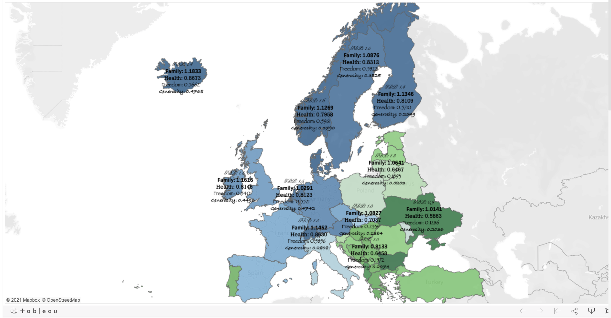

# Practice Quiz: Test your knowledge on creating visualizations in Tableau

## Question 1: What color combination does a diverging color palette use to display characteristics of values?

- `Intensity for the magnitude and hue for the range`
- Value for the range and tint for the margin of error
- Shade for the accuracy and grayscale for the reliability
- Intensity for the range and hue for the magnitude

> A diverging color palette uses intensity for the magnitude and hue for the range to display characteristics of values.

## Question 2: A data analyst creates a Tableau visualization to compare international trade routes. Which color choices could be misleading?

- `Green and red`
- Beige and purple
- Orange and brown
- Blue and gray

> Many people associate green with positive results and red with negative results. They could be misleading in this data visualization because green might falsely represent a trade surplus for the EU and red might falsely represent a trade deficit for Australia. 

## Question 3: In this visualization, what steps could you take to adjust the labels in order to make the visualization more effective? Select all that apply

- Move the labels to white space on the map
- Change the font color for the labels from black to white
- `Use a single font for the labels`
- `Reduce the number of labels`

> To make the visualization more effective, you could reduce the number of labels and use a single font for the labels.

## Question 4: If stakeholders prefer to view data in a spreadsheet-type format, what can be added to a Tableau visualization?

- Companion table
- Headers and footers
- Key
- Legend

> Correct
If stakeholders prefer to view data in a spreadsheet-type format, a companion table can be added to a Tableau visualization. Companion tables show the same data in a different way. 
