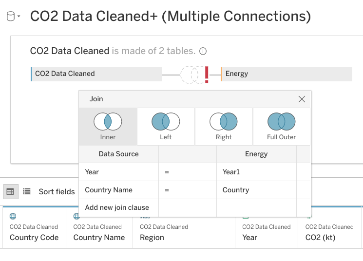

# Practice Quiz: Hands-On Activity: Link multiple datasets in Tableau

## Activity Overview

The video you just watched showed you how to make and visualize `JOINs` in Tableau. Now, you can use the datasets and instructions in this activity to perform the `JOINs` yourself. Feel free to refer back to the previous video if you get stuck.

In earlier activities, you worked in Tableau to create a data visualization. In this activity, you will review a scenario, link different data sources in Tableau, and create visualizations using multiple datasets.

By the time you complete this activity, you will be able to make visualizations out of data from multiple sources. This will enable you to visualize comparisons and combinations of data, which will allow you to share more complex projects in your career as a data analyst.

## Scenario

Review the following scenario. Then complete the step-by-step instructions.

Imagine you are working as a data analyst at a policy research institute. For your current project, you need to create a visualization that shows the CO2 emissions per capita for each country from 2000-2011. You need to provide a visual presentation that not only allows someone to visually compare CO2 emissions between countries from year to year but also provides information about each county’s population, GDP, and **energy** use.

You already have a dataset that includes emissions for each country between the years 1960 - 2011. But, the information that you need on **energy** use, total population, and GDP you had to collect from a government website. Each dataset is in a separate file. Moreover, some of the information is missing for some countries.

Often you will work with datasets that are missing information. Whether or not you need to find this missing information will depend on your project. In this case, you will notice that the missing information is from the 1960s, 1970s, and 1980s.

Luckily, your project is only concerned with the data from 2000-2011. You need an efficient way to utilize some data from one source, and some data from other sources. Taking just the information that you need from each source and creating a new data source takes a lot of time.

Tableau allows you to link data from different sources, as well as import data from different formats. While you won’t be working with one in this assignment, Tableau allows you to use a Web Data Connector. This tool allows you to import the data you need directly from another site. Your visualizations will update when the data sources for your visualization are updated.

## Step by Steps instructions

Follow the instructions to complete each step of the activity. Then answer the questions at the end of the activity before going to the next course item.

### Step 1: Access the dataset

Click the link to create a copy of the datasets and download them. Note that upon opening the CO2 dataset below, you will immediately see the About page load with a single URL code at the top. Navigate to the bottom of the document, and you can access all the raw and cleaned CO2 data by clicking on the different sheets. All of these sheets will be accessed by the Tableau platform once loaded. If you don’t have a Google account, download the datasets directly from the attachments below.

**Links to datasets:**

- [CO2](https://docs.google.com/spreadsheets/d/1NBV7WYvOX-WbB6f7JLm0jaaf5E-L9Me5fKVFgBkNJKo/template/preview)
- [Energy](https://docs.google.com/spreadsheets/d/1OZQu4Sd6TaZMRyvECZNK9rjKPnl41ToS_ZWg3xwRnCE/template/preview)
- [Population](https://docs.google.com/spreadsheets/d/1wNQzkMZQGL9I0j7PYW1qdt9UoBYv94Yswn1ry8YBFC8/template/preview)
- [GDP](https://docs.google.com/spreadsheets/d/17YOeJcActweV5vJc1JjJIyMcy89Qm5AFIP1X26ymMSM/template/preview#gid=1769006840)

**OR if you don't have a Google account, you can download the spreadsheets directly from the attachments below:**

- [CO2-Dataset.xlsx](./resources/CO2-Dataset.xlsx)
- [Energy-Dataset.xlsx](./resources/Energy-Dataset.xlsx)
- [GDP-Dataset.xlsx](./resources/GDP-Dataset.xlsx)
- [Population-Dataset.xlsx](./resources/Population-Dataset.xlsx)

### Step 2: Load the data

1. Log in to Tableau Public.
2. Go to your profile and click **Create a Viz**.
3. From the **Connect to Data** window, go to the **Files** tab and open the **CO2 dataset** you downloaded earlier.
4. From the **Data Source** tab on the bottom of the interface, go to the **Connections** header at the top of the left-side column.
5. Click the `+` icon to add another data source. Start with the **energy** dataset.
6. Repeat step 5 for the other datasets, **`gdptotal`** and **`totalpopulation`**.

Now, you should have all four datasets loaded into Tableau. The datasets will be on the left-hand side of your screen under **Connections**.

**Note**: As you progress through the activity, make sure to save your progress by clicking **File**, then **Publish** or the **Publish** button in the top right corner of the screen. If you are asked to "Create an Extract," do so. It may take some time to create an extract of the data you are using in this activity, but it is essentially the same as saving your progress.

You’ll notice that Tableau has already added one of the data sources into the area **Multiple **Connections****. In the screenshot below, **Energy** is already loaded.

If one of the datasets has already been loaded in, you can remove it by dragging the box to the left-hand side (the grey area) of the screen. Click on the box labeled **Energy** in the center-top of the screen and drag it off to the left to delete it.

Once you remove the data from **Multiple **Connections****, it should appear similar to the image below.

### Step 3: Make connections with JOINS

Now, you’ll set up the connections between the different datasets by creating `JOINs` between them. You learned about `JOINs` in the previous course.

As a refresher: `INNER JOINs` and `OUTER JOINs` are types of relationships that can be used to combine data based on common columns of information.

In Tableau, you’ll notice that the former `JOINs` window has now become a multi-purpose Relationships window. By double-clicking your data tables, you can edit the `JOINs` instead of the relationships.

Follow these instructions to create `JOINs` in Tableau:

1. Click on CO2 under **Connections**.
2. Under **Sheets**, you will notice all the different sheets in the CO2 dataset. Find `CO2 Data Cleaned` and double-click on it to load it.
3. Hover your cursor over the right side of the `CO2 Data Cleaned` box and click on the arrow.
4. Select Open to open the `CO2 Data Cleaned` dataset. Make sure you complete this step. This allows you to

    change the physical table, which will allow you to create `JOINs`. Otherwise, you will only be able to edit Relationships. Usually, you could use either option to accomplish the same goal. But for the purposes of this activity, we specifically want to use `JOINs`.

    Your screen should appear similar to the screenshot below.

    

5. Click on the **energy** dataset under **Connections**.
6. Drag the **energy** sheet across to the `CO2 Data Cleaned` box under Multiple **Connections**. A Join pop-up window will appear.
7. The popup window may automatically populate with `Year` from `CO2 Data Cleaned` and `Year1` from Energy. If not, put `Year` on the left side of the chart and `Year1` on the right side.
8. Click on **Add new join clause** under `Year`. A dropdown menu will appear.
9. Select Country Name on the left side and Country on the right side.
10. Click the X to close the dropdown menu.

    

11. Click **Update now** to examine the dataset. You will notice that **`Year`** and **`Year1`** have a number sign above them. Change the data type to date for each of these columns.
12. In the column, `Year` click on the # (not the arrow next to it) and select Date from the available options.

    After completing the first field, you will notice a red exclamation mark between `CO2 Data Cleaned` and Energy. This indicates that the columns you have joined are no longer of the same data type. One is formatted as a date, and the other numeric.

    You will also notice that after changing `Year` (`CO2 Data Cleaned`) to a Date type, the data preview pane will no longer display properly.

13. To fix this, go to the column list in the lower left of the screen.

    

14. Select the # icon next to the `Year1` (Energy) column. Then, change the data type to Date.

    

You may need to click **Update Now** in the preview pane to display the data properly. Make sure to repeat this step when you change more data types later on in this exercise.

The red exclamation mark will disappear. You might notice that all the years have been put into a month/day/year form with the default month and day as January 1st. This will not create any problems when creating a visualization, as you will filter the data by year.

### Step 4: Connect additional datasets

Before adding any additional joins, the data type for `Year`(Gdptotal) needs to change.

A pop-up window will appear for the join. It might already be populated with `Year1` under Datasource and `Year`(Gdptotal) under `gdptotal`.

1. Click on `gdptotal` under **Connections**.
2. Under Sheets, drag the `gdptotal` sheet into the white space underneath the **energy** box.
3. Go to the column list in the lower left of the screen, scroll until you find the column `Year`(Gdptotal). Click on # above it. A drop-down menu will appear.
4. Select Date from the drop-down menu.

    If the data preview does not display properly, fix the date type in the lower left pane.

5. Click on the Venn diagram between **energy** and `gdptotal`. Click on **Add new join clause** under year. A drop-down menu will appear.
6. Under `CO2 Data Cleaned` click on Country Name.
7. Click on the empty field under `gdptotal` across from Country Name. A dropdown menu will appear.
8. Set the right side of the join statement to Country1.
9. Close the Join pop-up by clicking on its exit button.

    Now you are going to join `totalpopulation`, the last of the four datasets that you downloaded.

10. Click on `totalpopulation` under **Connections**.
11. Under Sheets, drag the `totalpopulation` sheet into the white space to the right of the **energy** and `gdptotal` boxes.

    A pop-up window will appear for the join. It should already be populated with `Year` under Datasource and `Year`(`totalpopulation`) under `totalpopulation`.

12. Go to the column list in the lower left of the screen, scroll until you find the `Year`(`totalpopulation`) column. Click on # above it. A drop-down menu will appear.
13. Select Date from the drop-down menu.

    If the data preview does not display properly, fix the date type in the lower left pane.

14. Click on the Venn diagram to the left of `totalpopulation`. Click on **Add new join clause** under `Year`.
15. Under `CO2 Data Cleaned` click Country Name.
16. Click on the empty field under `totalpopulation` across from Country Name. A dropdown menu will appear.
17. Click Country (`totalpopulation`).
18. Close the Join pop-up by clicking on its exit button.
19. Click the Update button to view your data columns.

    Congratulations! You have successfully joined four different sources of data.

    You should take some time to study your dataset. The only years you should notice in your dataset are between 2000-2011. While your dataset CO2 went from 1960-2011, and your other datasets went from 2000-2015, the intersection (the years they have in common) only includes 2000-2011. This is just the time span that you need.

    If the dataset had gone beyond those dates, you would have filtered out the unneeded years in your visualization.

    Reviewing the dataset, you may have noticed that some of your measurement values need to be changed. The data type for the column **Energy use** is listed as string data. You can tell this because of the **Abc** icon above the name. The column currentGDP is also formatted as type string.

20. Find the **Abc** icon above the **Energy use** column. Change it to Number (decimal).
21. Find the **Abc** icon above the currentGDP column. Change it to Number (whole).

If the data preview does not display properly, fix the date type in the lower left pane.

### Step 5: Create a visualization

At the bottom of your screen, you will notice a tab labeled Sheet 1.

1. Click on the tab Sheet1.
2. Drag Country Name under `CO2 Data Cleaned` into the Detail square.

    

3. Drag CO2 Per Capita to Color.
4. Click on Color, then Edit Colors.
5. Click on the Palette dropdown and change it from Automatic to Red-Green diverging.
6. Check the boxes for Stepped Color and Reversed. (Because green is generally viewed as positive for CO2 emissions, you want the colors to move towards red as emissions go up.)
7. Click the Show Advanced dropdown.
8. Check the Start and End boxes.

    You might have noticed that the legend on the right-hand side of the screen shows Sum(CO2 per capita). You need to change the start and end values in order to notice color contrasts showing red shades.

    The lowest CO2 Per Capita emission for any year is 0.0396 and the largest is 61.9898.

9. Enter 0 into the Start field, and 62 into the End field. Click OK. Click the X button.

    Note: These values are the highest and lowest emissions between 2000-2011. Your screen should now look like this:

    

10. Drag `Year` from under `CO2 Data Cleaned` into the Filters area.
11. Click on Years, Next, All, OK.

    

12. In the Filters box, right-click on YEAR(`Year`)
13. Select Show Filter. The filter will appear on the right side of the screen.

    

14. Click on the arrow to the right of **YEAR(Year)** on the far-right side of the screen.
15. Select **Single Value (dropdown)**. Now the areas are colored only for the values of each year. Use the checkboxes in the list to choose which years you want to include in the visualization. You can select only the years between 2000-2011 to view the emissions relevant to the scenario.

Congratulations! You've linked your data and made a comprehensive data visualization in Tableau.

**Final Note:** It is important to understand that you are not required to submit any exported dashboards or visualizations from the Tableau Public interface to move forward in this course. Your reflection answer is here for personal guidance and growth. Moreover, it is highly suggested that you export any visualizations from your gallery as a PDF or embedding the interactive dashboard for your portfolio.

### **Pro Tip: Save the activity datasets**

Be sure to save a copy of the datasets you used to complete this activity. You can use it for further practice or to help you work through your thought processes for similar tasks in a future data analyst role.

## Reflection

In this activity, you used Tableau to link data together and visualize it. In the text box below, write 2-3 sentences (40-60 words) in response to each of the following questions:

**1. What did linking data from multiple sources allow you to do with your visualization in Tableau?**

Linking data from multiple sources in Tableau allowed me to create a comprehensive visualization that incorporated CO2 emissions, population, GDP, and energy use for each country from 2000-2011. This enriched the analysis by providing a holistic view of the factors influencing CO2 emissions.

**2. What other kinds of datasets could you link to the four you used in this activity? What kinds of comparisons or insights could you make?**

Additional datasets like climate data, renewable energy production, or government policies could be linked to gain deeper insights. Comparisons could include examining the impact of renewable energy on emissions or assessing how policy changes correlate with CO2 trends.

**3. If you couldn’t link data in this way, how would you make complex comparative datasets and visualizations like this?**

Without linking data, I would need to manually merge datasets, ensuring alignment based on common columns. This process is time-consuming and prone to errors. Tableau's linking capabilities streamline this, saving time and ensuring accuracy in creating complex visualizations.

> Correct:
>
> Congratulations on completing this hands-on activity! A good response would include that linking data allows you to combine different features of multiple datasets without having to create a new dataset as you visualize comparisons and combinations of data.
>
> With Tableau and other visualization software, you can simplify the process of combining and visualizing data. Otherwise, you would need to select the information you need and create a new data source, which takes a lot of time. This simplified process will allow you to share more insights with your peers and stakeholders throughout your career as a data analyst.
