# Mapping New York’s Noisiest Neighborhoods

By Ben Wellington

*January 17, 2015*

In New York, there are two kinds of noise: the sounds of the city (car horns, loud neighbors, construction equipment, barking dogs) and the sound of New Yorkers complaining about it. In 2007, the city modernized its noise code for the first time in thirty years, in an effort to get a better handle on the first category. Despite the changes, however, 311 logged more than a hundred and forty thousand noise-related complaints between the winter of 2013 and the fall of 2014. That works out to one complaint every four minutes, day in and day out, all year.

The City Council has taken notice. In November, Margaret Chin, a councilmember from lower Manhattan, introduced a bill that would require the Department of Environmental Protection to start sampling noise across the city. The bill notes that “noise pollution is widely prevalent in urban areas” and that “transportation systems are the main source”—though it adds that bulldozers, air compressors, loaders, dump trucks, jackhammers, pavement breakers, loudspeakers, plumbing, boilers, air-conditioners, fans, and vacuum cleaners also bear considerable blame. As a data scientist, I will be delighted to have data, one day, on decibel levels across the city. In the meantime, the information from those hundred and forty thousand 311 calls, which is available on the city’s OpenData portal, provides an immensely rich view of New York’s soundscape. I decided to dig in, to gain a more quantitative understanding of where our noise is coming from.

A glance at the data reveals the most common types of noise complaint.

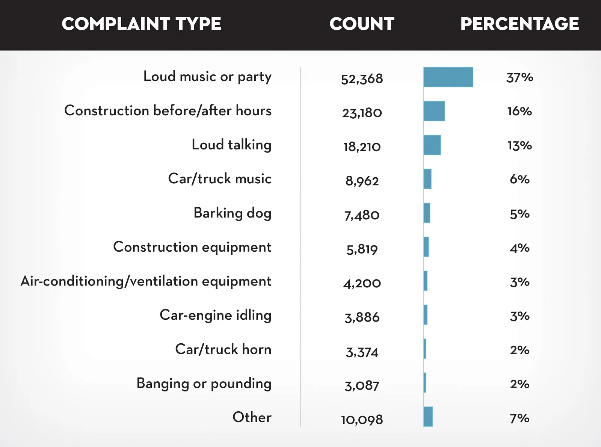

The top ten complaint types account for ninety-three per cent of the total, so I’ll focus on those. The most common complaints, about loud music and parties, prompt more than a third of all calls. The second-most common involve after-hours construction; the third-most involve loud talking. Curiously, loud partyers and loud talkers, who together elicit half of all noise complaints in New York, aren’t mentioned in the new City Council bill, perhaps because it’s more politically expedient to place the blame on inanimate objects.

Since partying and talking attract so many complaints, I took a closer look at when those complaints tend to occur. In the chart below, I’ve plotted the total number of complaints throughout the day, with each day of the week represented as a separate line.

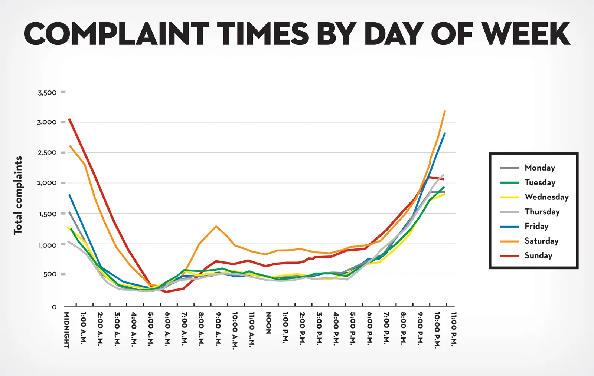

The plot shows a similar pattern on weekday nights as on early mornings: the number of noise complaints rises dramatically after about 8 p.m., peaks between 11 p.m. and midnight, and then falls. This is not so surprising; loud partying and social noise peak at night, when potential sleepers are most likely to complain. Naturally, late-night complaints are more numerous on weekends. One curious anomaly, however, is the large spike of complaints on Saturday mornings (the orange line), between about eight and ten o’clock. Perhaps people are more attached to their sleep on Saturday, and are more likely to complain, than on Sunday. Or perhaps people sleep more soundly by the time Sunday rolls around. Or perhaps they’re in church in the morning and not at home to complain.

Not all complaints peak overnight, of course. In the chart below, I examined the distribution of various complaint types throughout the day.

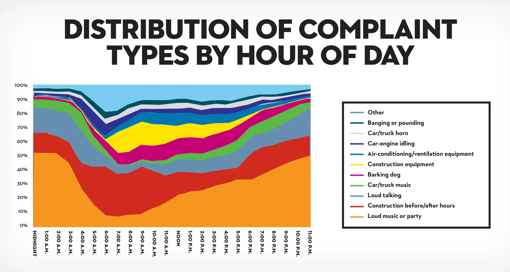

The portion of complaints related to partying largely subsides by 6 a.m., at which point people start complaining about noise from air-conditioning units and construction equipment. Notably, car horns seem to annoy people more during daylight hours than at night, no doubt because city streets are most congested, and loudest, at those times.

Next, I charted each of the 311 complaints against the city’s neighborhood tabulation areas, census-derived geographic blocks that designate neighborhoods more finely than even the community boards do. (Tabulation-area boundaries and population data can be found [here](link) and [here](link).) The results reveal the noisiest and the quietest neighborhoods in New York City.

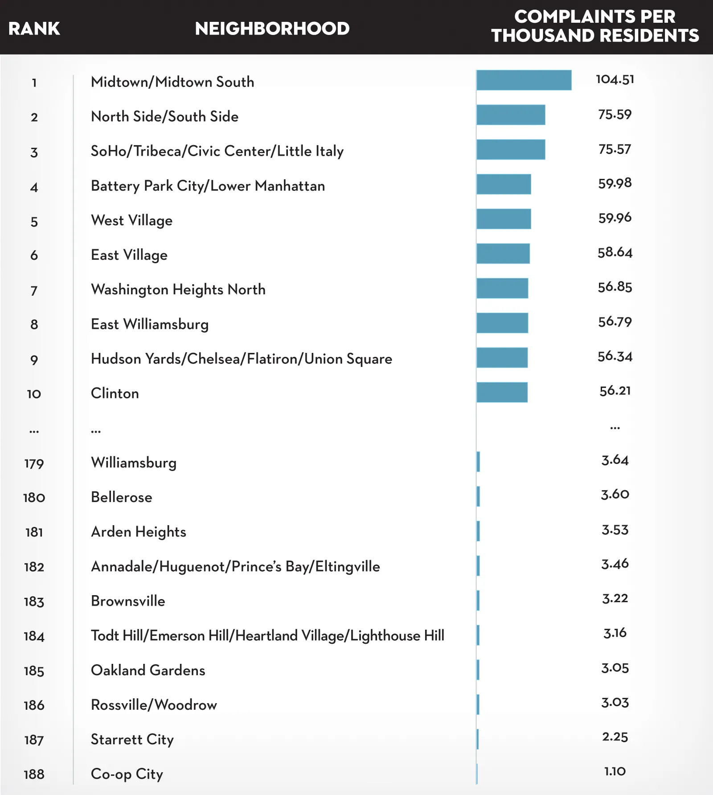

The noisiest area of the city, when measured by the number of complaints per thousand residents, is midtown Manhattan. (This metric may be skewed by the large number of people who work in midtown, and who may call in complaints even if they don’t live there.) Other loud neighborhoods include the East Village, the West Village, Battery Park, lower Manhattan, and northern Washington Heights. The quietest neighborhoods—Co-op City, in the Bronx, followed by Starrett City, in Brooklyn—are that way by design. Both are high-density planned developments, built in the nineteen-seventies as middle-class housing under the Mitchell-Lama program. They are more uniformly residential than the louder neighborhoods, which are mixed-use, combining residential, commercial, industrial, and other buildings.

Plotting the number of calls per resident per neighborhood provides the following map, which shows that, as a general rule, noise complaints decline as one gets farther from Manhattan. (Darker areas represent higher densities of complaints.)

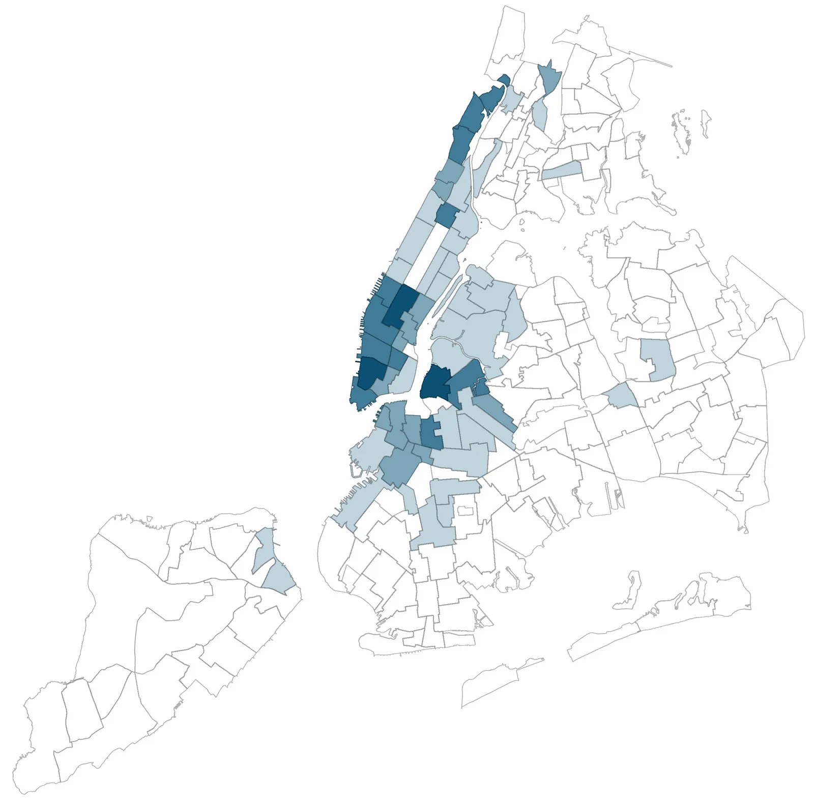

A closer look reveals that one of the top ten noisiest parts of the city is adjacent to one of the quietest. Both are within what most New Yorkers refer to as Williamsburg, in Brooklyn, which the tabulation system subdivides into several smaller areas: Williamsburg, East Williamsburg, and North Side/South Side.

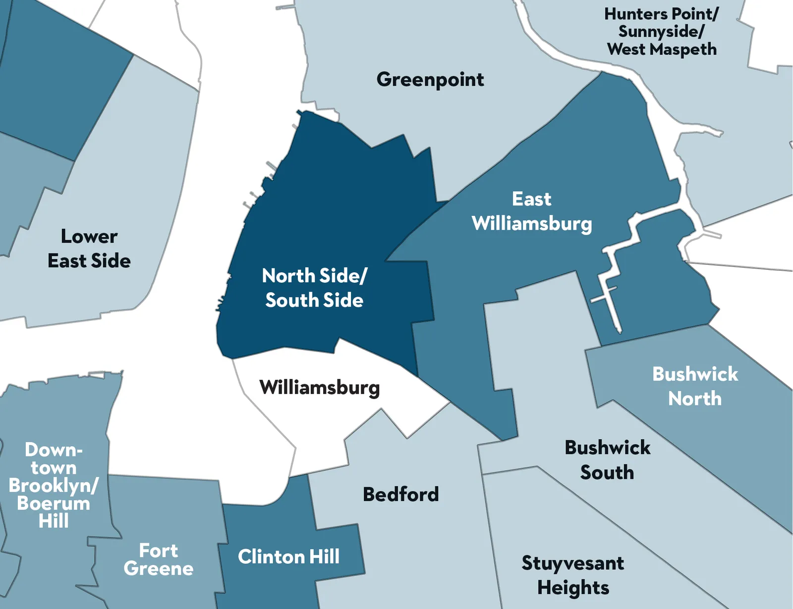

Williamsburg, the lighter area in the map above, is inhabited by many Hasidic Jews, who often abstain from using electrical appliances on the Sabbath—sundown Friday to sundown Saturday, a prime time for noise-complaint phone calls to 311. (This illustrates one of the limitations of 311 data; residents of different communities use the hotline at differing rates.)

Neighborhoods also vary in the types of noise complaints that they tend to produce. I’ve built a table that allows you to see how your neighborhood ranks (from No. 1 to No. 188) in each of the top ten complaint categories. For instance, although Battery Park City has the fourth-highest noise-complaint score overall, it is ranked a hundred and fifty-ninth for car-music complaints. Midtown has the highest complaint score overall, but it ranks a hundred and twenty-sixth for barking-dog complaints. The New Brighton-Silver Lake area, in Staten Island, scores second for dog-barking complaints but only eighty-fifth overall. Clearly, there is no single recipe for understanding noise.

Mapping out individual complaint types shows that construction-related complaints are centered in midtown, lower Manhattan, and North Brooklyn.

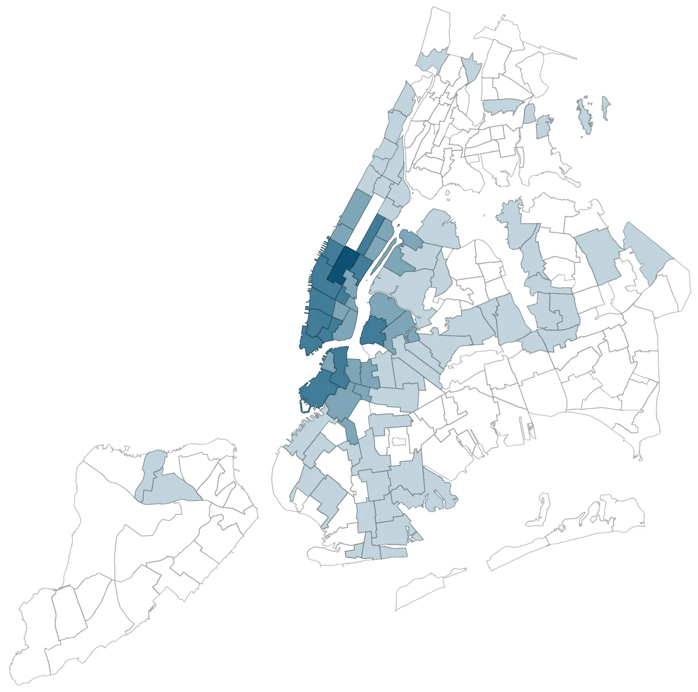

*Complaints about construction equipment.*

The number-one neighborhood for loud-party complaints is Inwood/Marble Hill. For loud talking: Norwood, in the Bronx. As one might expect, loud talking correlates with loud music and partying.

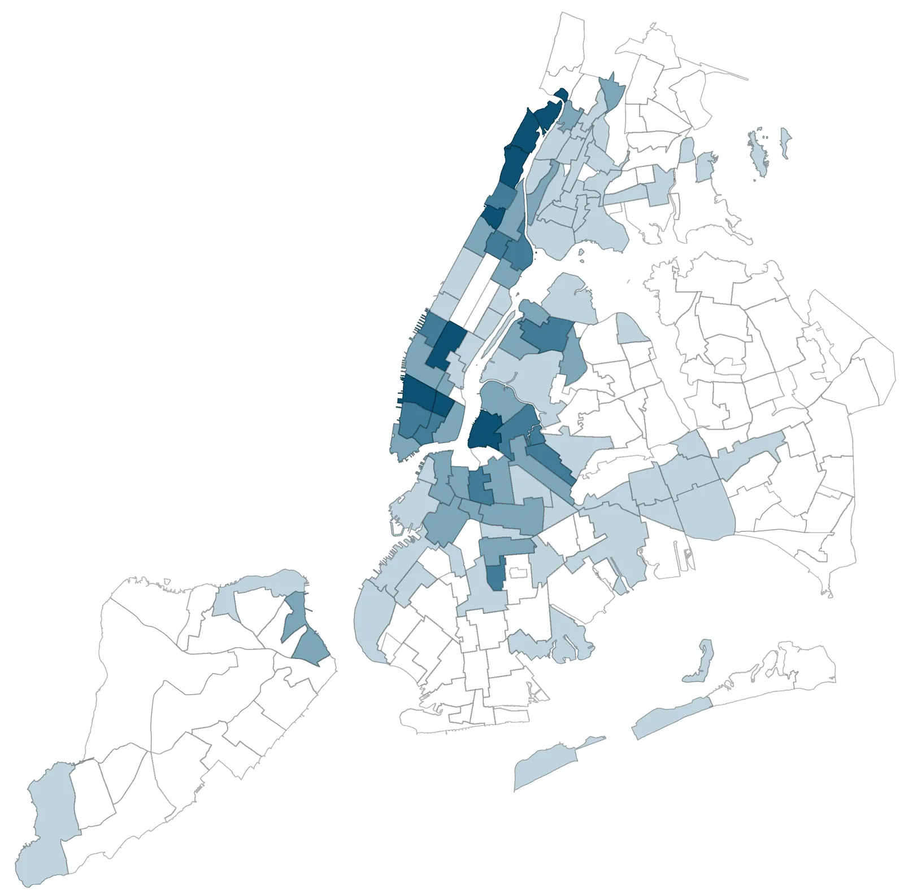

*Complaints about loud parties.*

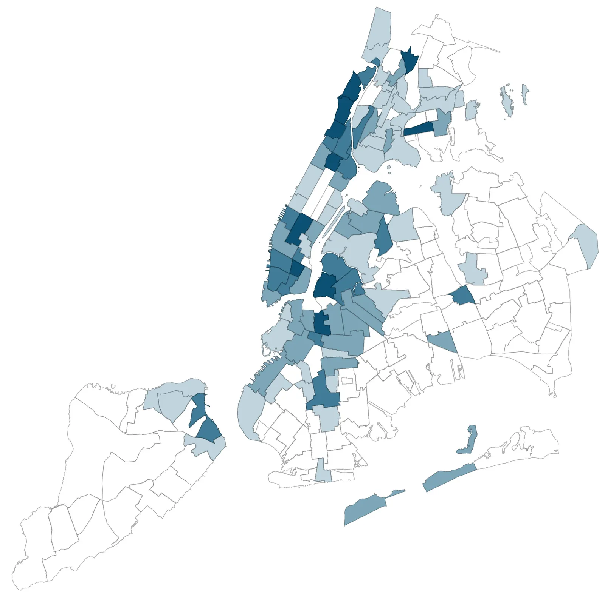

*Complaints about loud talking.*

Air-conditioning and fan complaints seem to arise in the more densely populated neighborhoods, while complaints about barking dogs are common throughout the city.

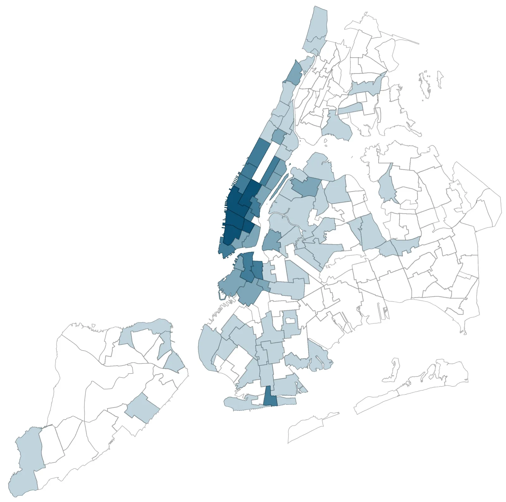

*Complaints about air conditioner noise.*

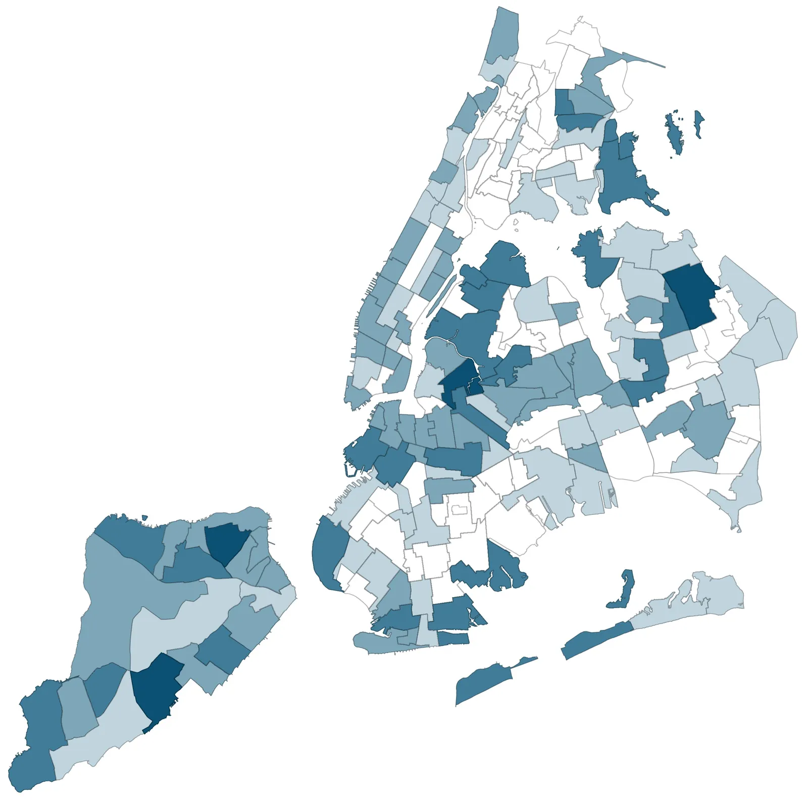

*Complaints about barking dogs.*

Finally, we come to the ice-cream trucks. Although they rank thirteenth overall in the data, making up only 1.3 per cent of 311 calls in our time window, they are the media darling of noise complaints. Leading neighborhoods for the jingle haters are Norwood, northern Washington Heights, and Inwood.

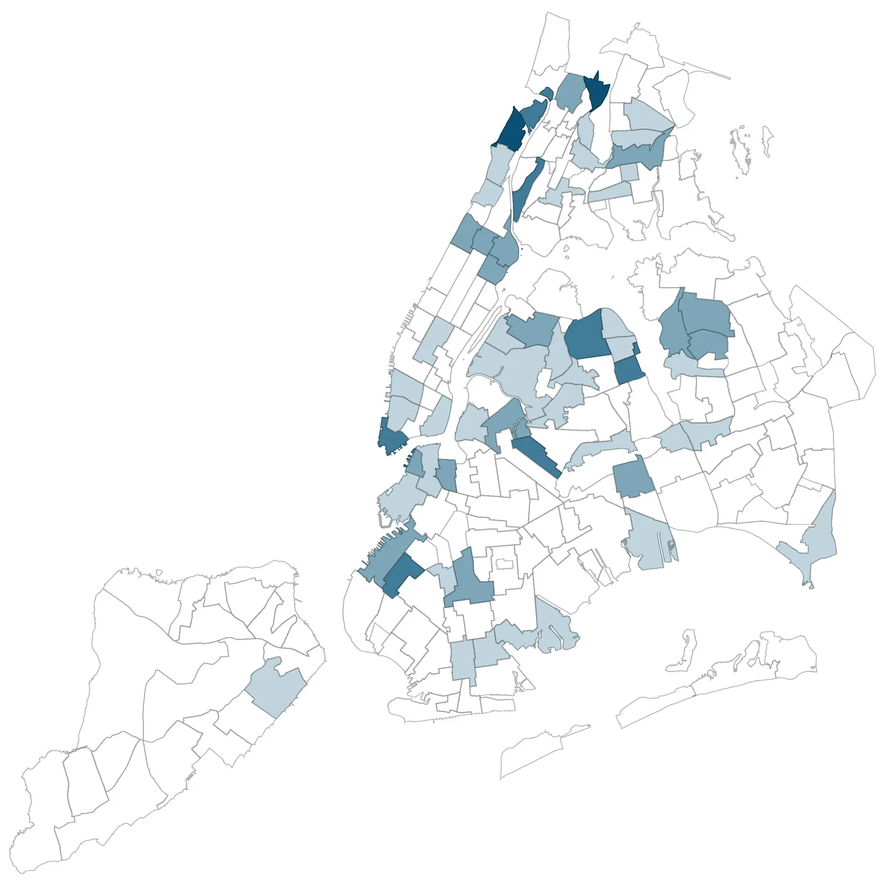

*Complaints about ice cream trucks.*

It’s clear that, as the city starts to think about how to address noise, it will need a diverse set of solutions. With a data-driven analysis, the New York Police Department and the Department of Environmental Protection, the two agencies charged with regulating noise, ought to be able to develop customized solutions for the different parts of the city—whether the problem is idling engines in Park Slope or loud talking in the East Village.
