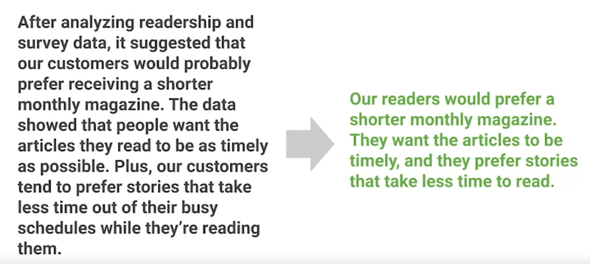

# Video: Speak to your audience

Video transcrit

- Welcome back.
- When you want to communicate something to others, a great story can help you reach people's hearts and minds and make them more open to what you have to say.
- In other words, stories make people care.
- As you learned before, the first of the three data storytelling steps teach us that for a story to be successful, you need to focus on who's listening.
- Data analysts do this by making sure that they're engaging their audience.
- That's what we'll explore together now.
- First, you need to know your audience.
- Think back to the example of telling someone a joke they've heard many times before and expecting them to laugh at the punchline.
- Not likely.
- To get the response you're seeking, you've got to understand your audience's point of view.
- That means thinking about how your data project might affect them.
- It helps to ask yourself a few questions.
- What role does this audience play? What is their stake in the project? What do they hope to get from the data insights I deliver? Let's say you're analyzing readership data from customers to help a magazine publisher decide if they should switch from quarterly to monthly issues.
- If your stakeholder audience includes people from the printing company, they're going to care because the change means they have to order paper and ink more frequently.
- They also might need to assign more staff members to the project.
- Or if your stakeholders include the magazine authors and editors, you'll want to keep in mind that your recommendations might change the way they work.
- For instance, they might need to write and edit stories at a faster pace than they're used to.
- Once you've considered the answers to those questions, it's time to choose your primary message.
- Every single part of your story flows from this one key point, so it's got to be clear and direct.
- With that in mind, let's think about the key message for the data project about our pretend magazine.
- Maybe the readership data from customers shows that print magazine subscriptions have been going down recently.
- You discover in survey data that this is mainly because readers feel the information is outdated, so this finding suggests that readers would probably appreciate a publication cycle that gets the information into their hands more often.
- But that's not all.
- Your reader survey data also shows that readers prefer shorter articles with quick takeaways.
- The data is generating a lot of possible decision points.
- The volume and variety of information in front of you may feel challenging.
- To get the key message, you'll need to take a few steps back and pinpoint only the most useful pieces.
- Not every piece of data is relevant to the questions you're trying to answer.
- A big part of being a data analyst is knowing how to eliminate the less important details.
- One way to do this is with something called spotlighting.
- Spotlighting is scanning through the data to quickly identify the most important insights.
- There are many ways to spotlight, but lots of data analysts like to use sticky notes on a whiteboard, like how archaeologists make sense of the artifacts they discover in a dig.
- To do this, you write each insight from your analysis on a piece of paper, spread them out, and display them on a whiteboard.
- Then you examine it.
- It's important not to get bogged down in every tiny detail.
- Instead, look for broad universal ideas and messages.
- Try to find ideas or concepts that keep popping up again and again or numbers and words that are repeated often.
- Maybe you're finding things that look like they're connecting or forming patterns.
- Highlight these items or group them together on your whiteboard.
- Next, explore your discoveries.
- Find the meaning behind the numbers.
- The idea is to identify which insights are most likely to help solve your business problem or give you the answers you've been seeking.
- This is how spotlighting can lead you to your key message.
- Remember to keep your key message clear and concise, as an overly-long message like this one shown on screen has less chance of conveying the most important conclusion.
- Here's a clear, concise message that's likely to engage your audience because it's short and to the point.
- Of course, no matter how much time and effort you put into studying your audience, you can't predict exactly how they'll react to your recommendations.
- But if you follow the steps we're discussing, you'll be much more likely to have good results.
- In an upcoming video, you'll learn how to deal with situations that don't go quite according to plan.
- That's okay.
- It happens to all of us.

## Question and Notes

- Engage your audience:
  - What roles does this audience play?
  - What is the stake in the project
  - What do they hope to get from the data insights I deliver
- Spotlight: scanning through data to quickly identify the most important insights
- Concise a message example:
    

### Questions 1: Fill in the blank: A data analyst wants to pinpoint the most relevant data derived from their analysis and eliminate the less important details. They use _____ to scan the data and quickly identify the most important insights

- annotating
- spotlighting
- engaging
- messaging

> Correct: A data analyst uses spotlighting to pinpoint the most relevant data derived from their analysis and eliminate the less important details. Spotlighting involves scanning the data to quickly identify the most important insights.

## **Key Points:**

1. **Importance of Stories in Communication:**
   - Stories can reach people's hearts and minds, making them more open to the message.
   - Stories make people care about the information being presented.
2. **Focus on the Audience in Data Storytelling:**
   - Engaging the audience is a crucial step in data storytelling.
   - Knowing the audience's point of view is essential for effective communication.
   - Understanding how the data project might affect the audience is important.
3. **Understanding the Audience:**
   - Consider the role of the audience, their stake in the project, and what they hope to gain from the data insights.
   - Example: Analyzing readership data for a magazine publisher considering a switch from quarterly to monthly issues.
4. **Choosing a Primary Message:**
   - Every part of the story flows from one clear and direct key message.
   - Identify the key message for the data project by analyzing the most useful insights.
5. **Spotlighting Technique:**
   - Spotlighting involves scanning through data to quickly identify the most important insights.
   - Use methods like sticky notes on a whiteboard to highlight and group key insights.
   - Look for broad, universal ideas and messages, focusing on patterns and connections.
6. **Exploring Discoveries:**
   - Find the meaning behind the numbers to identify insights that help solve business problems.
   - The goal is to lead to a clear and concise key message.
   - Avoid overly long messages to increase the chance of conveying the most important conclusion.
7. **Dealing with Audience Reactions:**
   - Despite studying the audience, reactions can't be predicted exactly.
   - Following the discussed steps increases the likelihood of good results.
