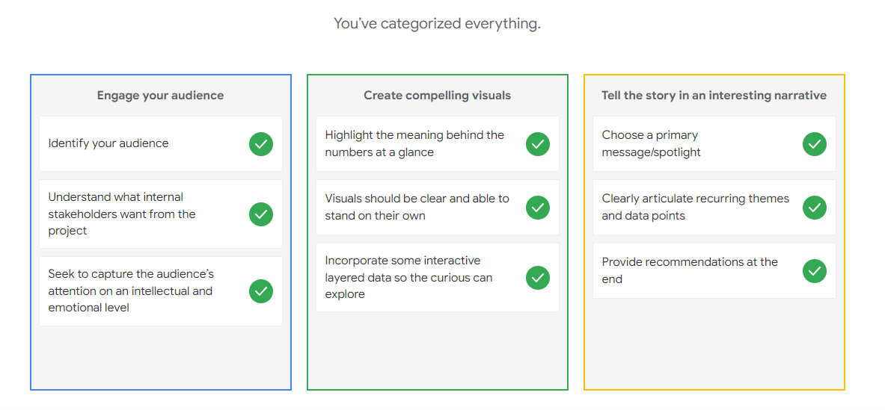

# Ungraded Plugin: Understanding data storytelling

## Categorization exercise

Identify the three steps of data storytelling

In this categorization exercise, you’ll assign parts of data storytelling to their correct step.

Organize your scope of work

Categorize each element by dragging it to the appropriate part of your scope of work. Or, use the plus sign to choose the appropriate answer.

