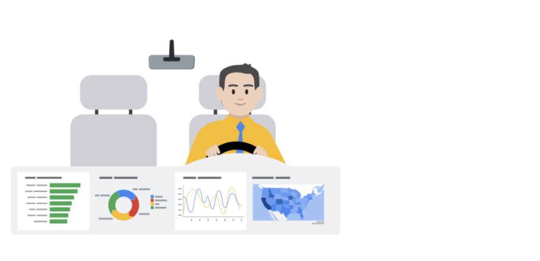

# Reading: Live and static insights

Previously, you learned about data storytelling and interpreting your dataset through a narrative. In this reading, you will explore the difference between live and static insights to make your data even clearer.

## Live versus static

Identifying whether data is live or static depends on certain factors:

- How old is the data?
- How long until the insights are stale or no longer valid to make decisions?
- Does this data or analysis need updating on a regular basis to remain valuable?

**Static data** involves providing screenshots or snapshots in presentations or building dashboards using snapshots of data. There are pros and cons to static data.

### PROS of Static data

- Can tightly control a point-in-time narrative of the data and insight
- Allows for complex analysis to be explained in-depth to a larger audience

### CONS of Static data

- Insight immediately begins to lose value and continues to do so the longer the data remains in a static state
- Snapshots can't keep up with the pace of data change

**Live data** means that you can build dashboards, reports, and views connected to automatically updated data.

### PROS of Live data

- Dashboards can be built to be more dynamic and scalable
- Gives the most up-to-date data to the people who need it at the time when they need it
- Allows for up-to-date curated views into data with the ability to build a scalable “single source of truth” for various use cases
- Allows for immediate action to be taken on data that changes frequently
- Alleviates time/resources spent on processes for every analysis

### CONS of Live data

- Can take engineering resources to keep pipelines live and scalable, which may be outside the scope of some companies' data resource allocation
- Without the ability to interpret data, you can lose control of the narrative, which can cause data chaos (i.e. teams coming to conflicting conclusions based on the same data)
- Can potentially cause a lack of trust if the data isn’t handled properly

## Key takeaways

Analysts need to familiarize themselves with the business and data so they can recommend when an updated static analysis is needed or should be refreshed. Also, this data insight will help you make the case for what sorts of analyses, visualizations, and additional data are recommended for the types of decisions that the business needs to make.

Keep this [customer survey spreadsheet](https://docs.google.com/spreadsheets/d/1DWIKPvtci3Gq6Qbz15SjjY6l4wbc_4I-CpVaFDPneDA/template/preview?resourcekey=0-OOpDEJqur_5qsHXNIt2Bqg) - [customer-service-survey-responses.xlsx](./resources/c6-m3-p2-s2-s3_customer-service-survey-responses.xlsx) on hand as it will be useful for the next video.
