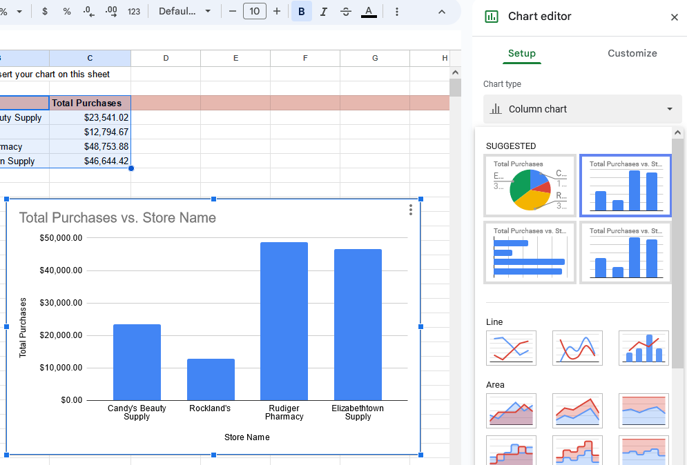
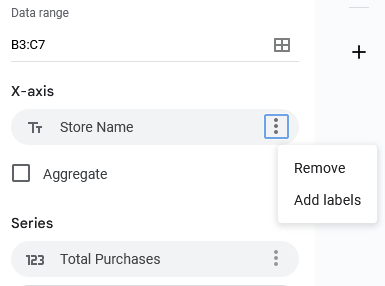
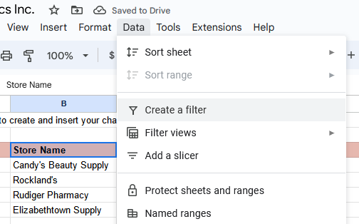
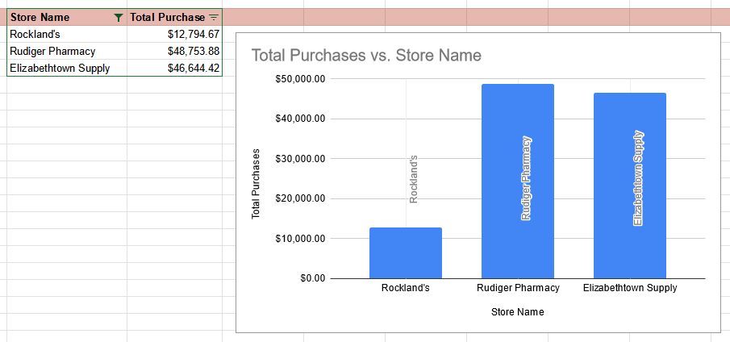
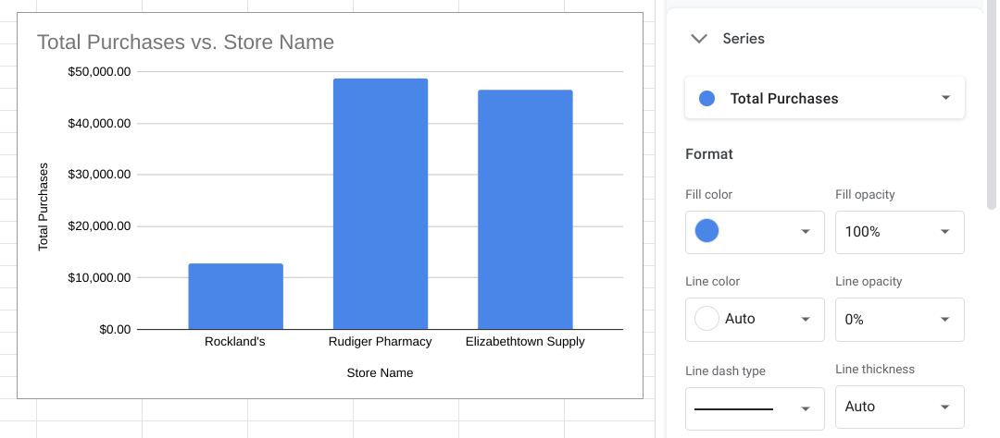
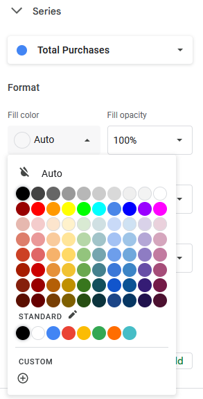
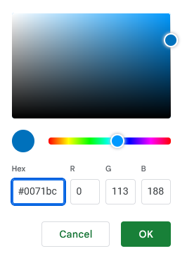

# Practice Quiz: Hands-On Activity: Create, filter, and customize charts

You‘ve learned that you can create charts in spreadsheets and in Tableau and that information can be customized using filters. Before working in Tableau, you will work with a spreadsheet chart editor. This will allow you to create visualizations to draw insights from immediately—and will help you start thinking about how to make design choices in more complex tools.

By the time you complete this activity, you will be able to create a chart in a spreadsheet and customize it by using filters and applying different styles. This will enable you to use spreadsheets in another helpful way, which is important for using all the tools at your disposal in your career as a data analyst.

## Step-By-Step Instructions

Follow the instructions to complete each step of the activity. Then answer the questions at the end of the activity before going to the next course item.

### Step 1: Access the template

To use the template for this course item, click the following link and select Use Template.

Link to template: [Cosmetics, Inc](https://docs.google.com/spreadsheets/d/1qaSKSyfvXz3Zsu_RU7abK-eNScSyGSe2oXT1KgiaMXI/template/preview)

OR [cosmetics-inc.xlsx](./resources/c6-m3-p2-s4_cosmetics-inc.xlsx)

If you don’t have a Google account, download the template directly from the following attachment.

### Step 2: Create a chart in a spreadsheet

**Important note:** The following steps are for Google Sheets, but they can help guide you to similar features in Excel. Refer to the Additional resources section if you need more specific instructions for creating charts in Excel.

1. In the spreadsheet that you copied or downloaded, practice creating a chart by selecting the second tab named Create your chart here. This tab contains the total purchases calculated for each store from the first tab. All of the original data is preserved in the first tab so you can explore chart creation in the second tab without changing or deleting any of the original data.

2. Select to highlight cells **B4 through C7** as the data for your chart.

3. From the main menu, select **Insert**, and select **Chart**.

   - The **Insert** menu is opened, showing Chart as the fifth option on the list.

4. A chart is created automatically, and the **Chart editor** pane opens on the right so you can change the chart type. If a pie chart is displayed, select the **Chart type** dropdown list and then select a **Column chart** so your chart matches the one below. Based on the data selected, you should also get a title like the one shown.

    

5. In the Setup section of the Chart editor, below X-axis, select the three dots menu and then select **Add labels**. Make sure the range B4:B7 is indicated to the left of the three dots, and after you select the **Add labels** option, verify that the data columns display a vertical label on each column.

    

6. To filter the data shown in the column chart, select the pink header row (row 3) and then select the **filter** icon in the toolbar. This adds a filter icon on each column of your data.

   - Alternatively, you can use the Data menu and select **Create a filter** after selecting cells B3:C3.

    

7. Select the filter icon for the Store Name column and uncheck Candy's Beauty Supply.

    

8. Select OK and your chart will automatically update to exclude the data for Candy's Beauty Supply, as shown below.

    

   **Note:** To include the data for Candy's Beauty Supply again, simply select the filter icon for Store Name and then select the Candy's Beauty Supply checkbox to add it back to the chart.

### Step 3: Apply styles

You can also apply different styles to the chart. For example, the default blue in the chart isn't the most appropriate for accessibility when the background is white.

1. Double-click the chart to open the **Chart editor** pane.

2. If necessary, in the **Chart editor** pane, select **Series** to expand the options.

    

3. Below Format, from the Fill color dropdown list, select Custom.

    

4. Change the Hex value for the color to one of the blue hues recommended for use on white backgrounds for accessibility. Carnegie Museums of Pittsburgh's [Web accessibility guidelines](http://web-accessibility.carnegiemuseums.org/design/color/) are an example of web accessibility guidelines.

   - `#0071bc`
   - `#046b99`
   - `#205493`
   - 

   - A palette of a single blue hue shows variations of that blue from nearly white through blue to nearly black. Fields below allow you to enter a Hex value, in this case 0071bc. There are also three fields that allow you to enter values for red, blue, and green to specify a color.

5. Select OK, and the chart will automatically update with the newly assigned color.

### Step 4: Review resources

Here are a few more resources you can reference as you learn more about charts in spreadsheets:

- [Graphs in Google Sheets](https://www.datacamp.com/community/tutorials/graphs-in-spreadsheets) : This resource contains a detailed example of chart creation in spreadsheets and provides downloadable sample data you can use to practice. As you have learned throughout this course, practicing these skills helps you learn more about the tools you are using. This example data is a great way to start!

- [Add and edit a chart or graph in Google Sheets](https://support.google.com/docs/answer/63824) : This article includes steps for creating, editing, and changing charts in Google Sheets with how-to videos. It also has a more in-depth guide to editing and customizing your chart after you have created it.

- [Create a Microsoft Excel chart from start to finish](https://support.microsoft.com/en-us/office/create-a-chart-from-start-to-finish-0baf399e-dd61-4e18-8a73-b3fd5d5680c2) : This how-to guide from Microsoft’s support site includes instructions and a video tutorial for adding charts to Excel spreadsheets. This is a useful resource if you are working specifically with Excel spreadsheets. It also links to other useful articles about creating charts in Excel.

- [Microsoft Excel: Creating and modifying charts](https://guides.lib.umich.edu/c.php?g=283162&p=1886446) : This is an explanation of Excel charts with downloadable handouts. This resource is especially useful because it has downloadable content that you can save to reference later when you start creating charts in your own spreadsheets.

**Pro-tips:** Save the blank activity template

Be sure to save a blank copy of the template you used to complete this activity. You can use it for further practice or to help you work through your thought processes for similar tasks in a future data analyst role.

## Reflection

### Question 1

Which changes can you make to customize a chart in a spreadsheet? Select all that apply.

- [x] Change the chart colors by using the Series drop-down
- [x] Change the chart's data by updating relevant cells
- [ ] Animate the chart by using the Multimedia drop-down
- [x] Change the chart type by using the Chart type drop-down

> To customize a chart in a spreadsheet, you can change the colors, data, and type of chart. Going forward, you can apply your knowledge of charts to future lessons about data visualization. This will help you prepare for future lessons about data visualization.

### Question 2

**During this activity, you created a chart within a spreadsheet. In the text box below, write a 2-3 sentence (40-60 words) response to each of the following questions:**

**What are some advantages and disadvantages of creating a chart directly in a spreadsheet?**

Creating a chart directly in a spreadsheet provides immediate visualization and easy data manipulation. However, it may lack advanced customization features found in dedicated visualization tools.

**How did this activity build your knowledge of spreadsheets and data visualization?**

This activity enhanced my skills in creating charts, applying filters, and styling in spreadsheets, laying a foundation for more advanced data visualization techniques.

> Correct:
> Congratulations on completing this hands-on activity! A thoughtful response would include how the spreadsheet chart editor is a simple and convenient way to visualize data. Beyond that, consider the following:
>
> Data analysts use spreadsheets for a variety of data analysis tasks, including creating charts. What you’ve learned about visualizations in spreadsheets you can apply to dashboard visualizations. In upcoming activities, you will use this knowledge in Tableau, another data visualization platform. This will help you practice more data visualizations—an essential tool in every data analyst’s toolkit.