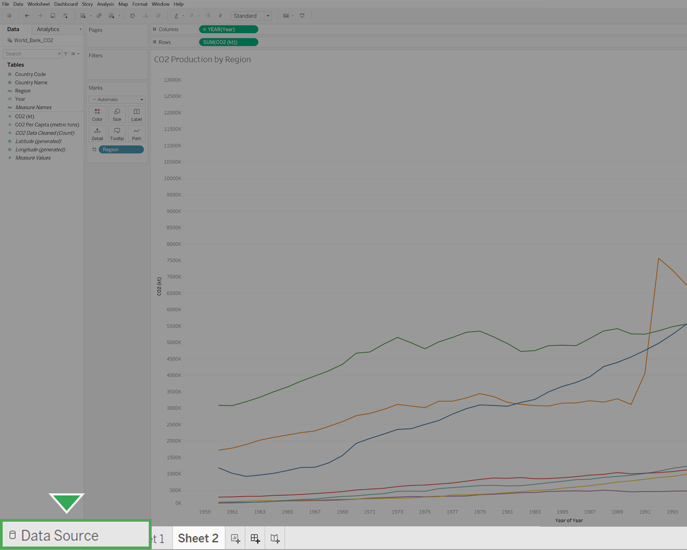
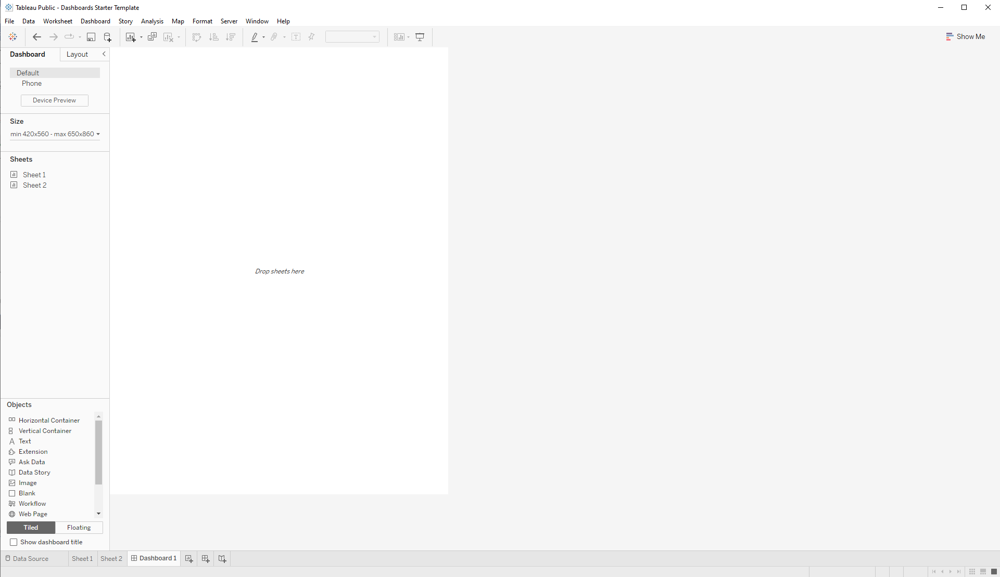
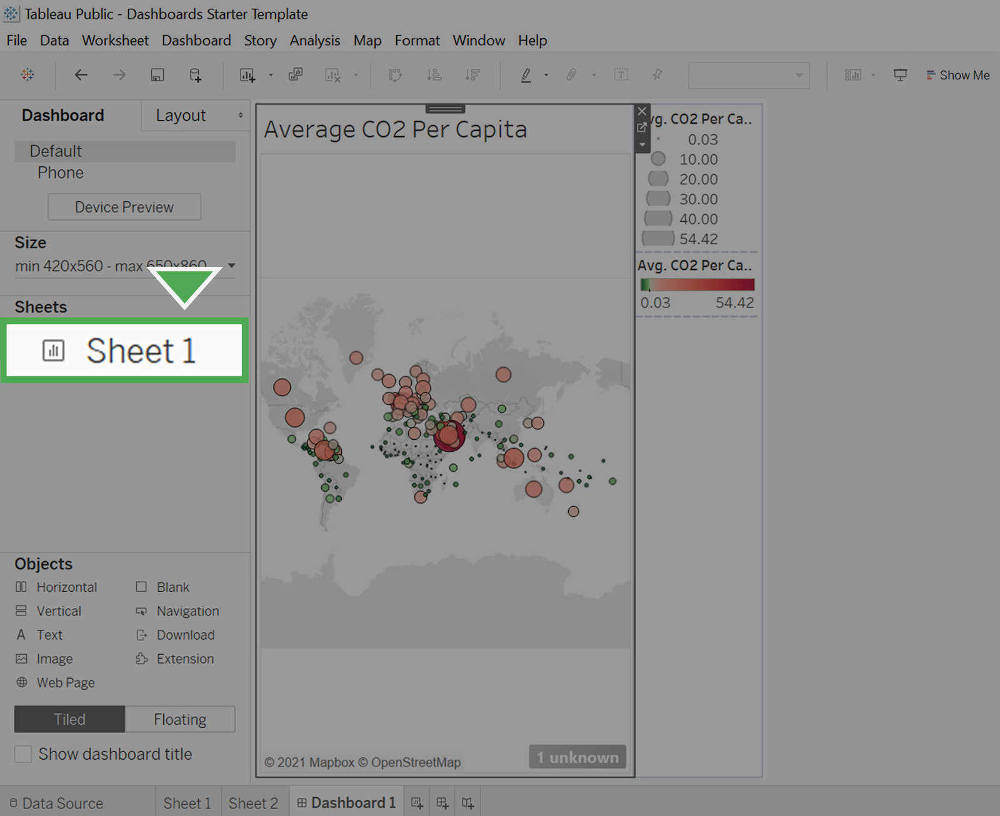
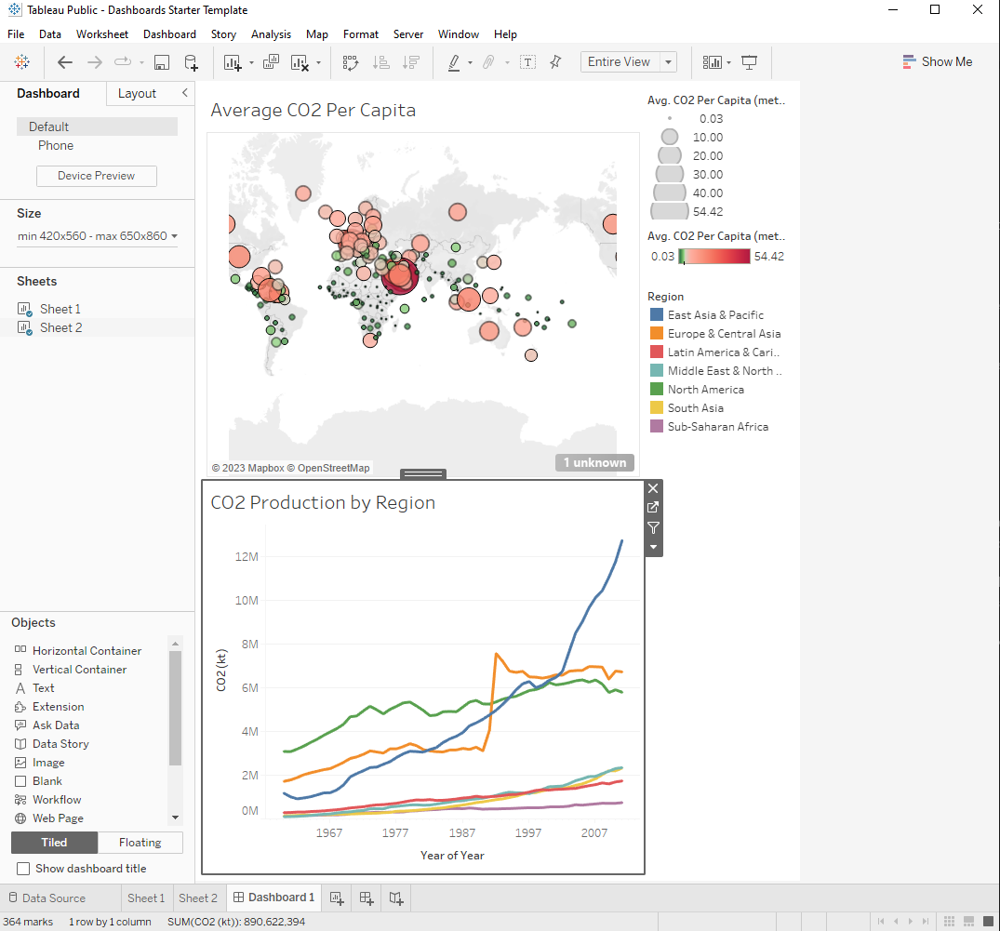
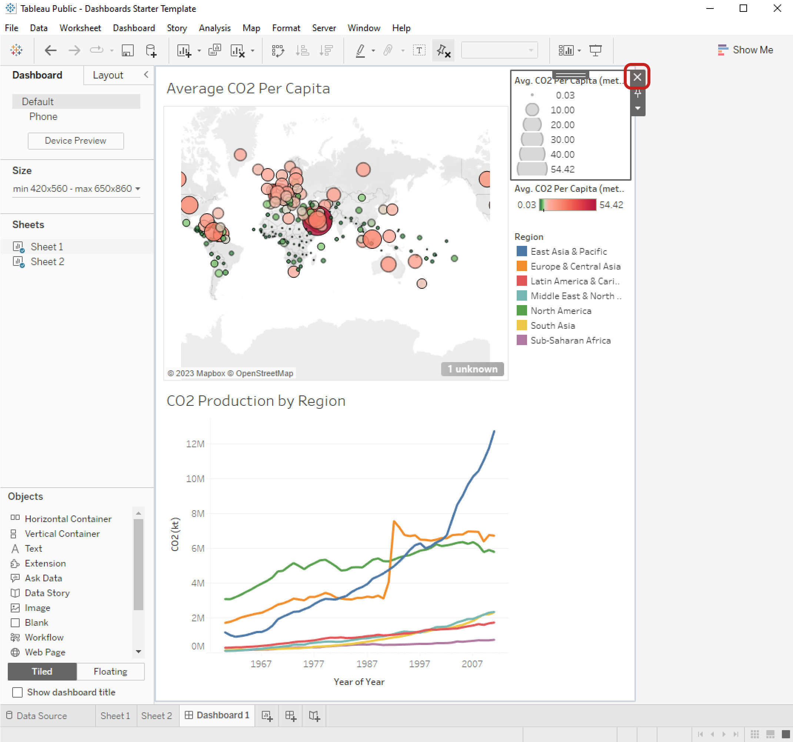
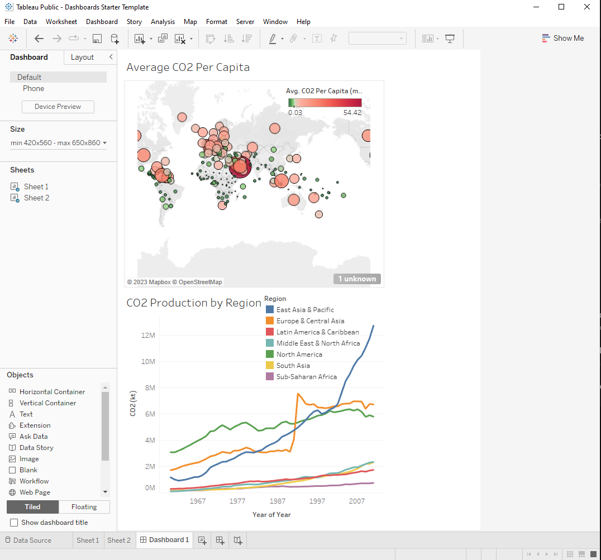

# Practice Quiz: Hands-On Activity: Build a dashboard in Tableau

## Activity Overview

In previous lessons, you connected to data sources and created data visualizations. Now, you’ll cap off the process of data visualization by adding these visualizations to a dashboard. In a business context, data visualizations are most useful when they are presented in a dashboard-style format to stakeholders. Dashboards put all the pertinent information in the same place, making it easier to understand the important takeaways. Many dashboards are also constantly updating to reflect new data, and some are even interactive! No matter what style you choose, dashboards deliver essential insights to others.

By the time you complete this activity, you will be able to create and use a dashboard to present data in an accessible and interactive way. This will enable you to communicate your work and display dynamic data in professional settings.

### IMPORTANT

You will need the Tableau Public Desktop app to import the Dashboards Starter Template in this activity. For more information on downloading the Tableau Public app, check out the [Reading: Optional: Using Tableau Desktop](../../m2_create-data-visualizations-with-tableau/p1_get-started-with-tableau/s8_r_optional_using-tableau-desktop.md).

If you are unable to download the app to your device (e.g., Chromebook users), use the two visualizations you created in the last Tableau activities as Sheet 1 and Sheet 2 of this activity.

## Step by step instructions

Follow the instructions to complete each step of the activity. Then answer the question at the end of the activity before going to the next course item.

### Step 1: Access the dataset and template

A dataset and starter project with a few existing data sources and visualizations are provided. 

Click the link to create a copy of the dataset. If you don’t have a Google account, download the datasets directly from the attachments below.

Then, download the starter project.

Link to dataset: [CO2](https://docs.google.com/spreadsheets/d/1LwGHDgJkXSm8b0ziSDyC8pQGqjYVGpX9mAEVPs2KQgY/template/preview#gid=947031298) (Note: Click "Use Template", then refer to the various tabs at the bottom of the preadsheet.)

OR

Download the dataset:

- [CO2-Dataset.xlsx](./resources/c6-m3-p2-s7_CO2-Dataset.xlsx)
- [Dashboards-Starter-Template.twbx](./resources/Dashboards-Starter-Template.twbx)

### Step 2: Open the template

Dashboards put all the pertinent information in the same place, making it easier to understand the important takeaways. Many dashboards are also constantly updating to reflect new data, and some are even interactive. No matter what style of dashboard you choose, they can help you deliver the work you’ve done when creating visualizations.

After you download the **Dashboards Starter Template**, find the file in your storage and open it in Tableau Public Desktop.

Upon opening the Tableau project template, your screen should showcase the C02 Production by Region sheet.

The Workbook panel is open on the display.A line chart of CO2 emissions in KT by year shows six trendlines. Some lines rise more dramatically than others. All trend upwards.
The Dashboards Starter Template workbook allows you to explore and manipulate the visualizations found in two sheets: **Sheet 1** and **Sheet 2**. However, the Tableau workbook does not contain the actual dataset.

### Step 3: Load the data

Next, you will load the dataset.

1. Select the **Data Source** tab in the sidebar. This will open the **Data Sources** folder Tableau Public has created on your computer by default.  

    

2. Navigate to the location on your computer where you downloaded the **CO2** dataset (filename = “`CO2 Dataset.xlsx`”) and open it.

3. Locate the **My Tableau Repository** folder on your computer. This is usually placed in the Documents folder of your local files. If you cannot find the folder, use the search bar in your computer’s file explorer.

4. Open the folder **My Tableau Repository**, then open the folder **Datasources**.

5. Drag your datasets for Tableau from where you downloaded them into the **Datasources** folder. This will help you keep track of your datasets for various projects and stay organized.

Note: As a best practice, you should always move your datasets for Tableau into the **Datasources** folder.

### Step 4: Create a dashboard

The example project contains the CO2 dataset which has  two separate visualizations. Select **Sheet 1**. This visualization shows the average CO2 per capita of each country. Now, select **Sheet 2**. This visualization is a line chart of the CO2 production of each global region over time.

You will use these visualizations to create a dashboard. Select the **Add Dashboard** button, which is the middle button on the bottom row with a symbol that appears like a spreadsheet with a plus sign.

    

This will open a new dashboard. Your screen should appear like this:

    

A new dashboard window is open. You can drop sheets into the main panel of the display.

### Step 5: Add visualizations

To add visualizations, drag the appropriate sheets onto the dashboard in the layout that you prefer. In this case, you’ll add the map visualization from **Sheet 1** on top of the line graph from **Sheet 2**.

1. Start by finding **Sheet 1** in the Sheets section in the sidebar. Select and drag **Sheet 1** onto the area that says **Drop sheets here**. Sheet 1 should appear under the Sheets tab:

    

2. Select and drag **Sheet 2** onto the visualization. You’ll notice that the visualization adjusts to show the layout depending on where you drag the sheet. Place **Sheet 2** so that it takes up the bottom half.

    

### Step 6: Clean the dashboard

The dashboard currently contains three legends, but only two of them are needed. The legend of grayscale values represents the CO2 Per Capita by size.  

CO2 per capita is represented by size and color. As such, Tableau creates two legends. To simplify the visualization, your best choice is to delete the topmost legend that corresponds to size.

The relationship between small and large emissions can be interpreted by the relative sizes of the circles. However, the color representing the number of emissions per capita is not interpretable without the legend.

1. Delete the topmost legend. To do this, select it and then select the close button (X) to remove it from the dashboard.

    

    Now that it’s been removed, you’ll set the remaining legends to float. This will allow you to drag the legends where you want to place them.  

2. Select a legend.

3. Select the dropdown list for More Options. From there, select Floating.

    

4. Drag the legend onto the top-right corner of the map visualization.

5. Repeat steps 2-4 and float the remaining legend onto the top-right corner of the bottom graph. When you’re finished, your dashboard should appear like this:

    

You’ve now created a basic dashboard. Tableau contains tons of other functionality that allows for dashboards that update automatically or interactive dashboards and visualizations.

### Pro tips: Save the activity datasets and template

Be sure to save a copy of the dataset and template you used to complete this activity. You can use it for further practice or to help you work through your thought processes for similar tasks in a future data analyst role.

## Reflection

In this activity, you created a dashboard that can help you share your findings. In the text box below, write 2-3 sentences (40-60 words) in response to each of the following questions:

- How did you arrange the sheets onto the dashboard to effectively present the data?
- What are some other ways in which you might use dashboards?
- Is there a dashboard that you would like to create? If so, what kinds of data might it feature?

1. I arranged the sheets onto the dashboard by placing the geospatial visualization at the top and the line chart below it. This layout allows viewers to first grasp the global distribution of CO2 emissions and then dive into the specific production trends over time by region.

2. Some other ways to use dashboards include monitoring key performance indicators (KPIs) for business metrics, tracking social media engagement and website analytics, visualizing project progress and deadlines, and presenting survey results or customer feedback in real-time.

3. Yes, I would like to create a dashboard that features financial data for a company, including revenue trends, expenses breakdown, profit margins, and cash flow analysis. This dashboard would provide insights into the financial health of the organization and help guide strategic decision-making.
