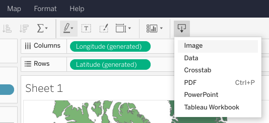

# Practice Quiz: Hands-On Activity: Practice presenting

## Activity verview

Earlier in this course, you learned about what makes an effective presentation. In this activity, you will create screenshots of visualizations in the dashboard from your previous activity. Then, you'll add these jpegs to a new presentation, record yourself presenting, and evaluate your delivery and slides.

By the time you complete this activity, you will understand the steps involved in creating an effective presentation and reflect on how well you do when delivering a presentation yourself. This will enable you to successfully deliver presentations in the future, which is essential to your career as a data analyst.

## Step by step instructions

Follow the instructions to complete each step of the activity. Then answer the questions at the end of the activity before going to the next course item.

### Step 1: Create a screenshots of your dashboard

Before you create your presentation, you need to capture screenshots from the Tableau dashboard you created in the previous activity, [Hands-On Activity: Create your first Tableau dashboard.](../p2_tableau-dashboards/s7_pq_activity_build-a-dashboard-in-tableau.md)

1. Go to Tableau Online and log in to your account. Retrieve the dashboard you created from the **Recents** page.

    The way you capture screenshots will differ based on the operating system you are using. Here are some pointers on how to save your visualizations:

2. Click the **download** icon in the toolbar, then **Image** from the dropdown menu. This will save the visualization you created as a .png file, which you can insert into a slide presentation.

    

    OR

3. Take a screenshot of each visualization using the command that corresponds to your operating system:

   - Chromebook: Press **Ctrl + Show windows** icon (For non-Chrome OS keyboards, press **Ctrl + F5**).
   - Mac: Press **Shift + Command + 4**.
   - Windows: Use the snipping tool—refer to this [Microsoft Support](https://support.microsoft.com/en-us/windows/use-snipping-tool-to-capture-screenshots-00246869-1843-655f-f220-97299b865f6b#take-screen-capture-print-screen=windows-7) page.

**Note**: If you do not find your computer or laptop listed above, please refer to your manufacturer’s reference guide or search online for a quick tutorial.

### Step 2: Prepare a presentation

Now that you have your dashboard screenshots, it’s time to create your presentation.

To prepare your presentation, you should first consider your audience. In this activity, you will build a presentation for an audience of stakeholders. They aren’t closely involved in the project, but are curious about the analysis you have completed, the dashboard you have produced, and your key findings. Next, you can create your slides.

The first slide in your presentation should be a title slide, including the title of your presentation, your name, and the date of your presentation. Each of the next slides should have one or two of your dashboard screenshots. They should also include bullet points describing the context of your screenshots. Finally, you should include a closing slide with your final take-aways.

For this simple presentation, you only need a few simple slides. In future presentations, you will include more specific information and therefore need more slides.

Next, you can create your slides in presentation software.

#### Create your slides

To create your slides, use whichever presentation software you feel comfortable with. If you’re unsure of which one to use or don’t own presentation software, use one of these free options:

- [Google Slides](https://www.google.com/slides/about/) (Google account required)

- [Microsoft 365](https://www.microsoft.com/en-us/microsoft-365/free-office-online-for-the-web) (Microsoft account required)

- [Prezi](https://prezi.com/) (login required)

#### Record yourself

Use a smartphone, digital camera, or computer webcam to record a video of yourself presenting the visualizations you created. You can use [Screencastify](https://www.screencastify.com/) or a free trial of [Camtasia](https://www.techsmith.com/download/camtasia/)  to record the slides of your presentation. Deliver your presentation in 2 to 3 minutes. Check that your lighting is bright enough and the focus of your lens captures a clear image. Then upload your file to your computer.

### Step 3: Evaluate your presentation

#### Watch the video of your presentation

As you watch it, go through the following checklist. Each point is related to a best practice for presentations.

- Do you:

  - Use an attention-grabbing opening?
  - Start with broad ideas and later talk about specific details?
  - Speak in short sentences?
  - Pause for five seconds after showing a data visualization?
  - Pause intentionally at certain points?
  - Keep the pitch of your voice level?
  - Stand still and move with purpose?
  - Maintain good posture?
  - Look at your audience (or camera) while speaking?
  - Keep your message concise?
  - End by explaining why the data analysis matters?

#### Evaluate your slide deck

Next, it’s time to evaluate your slide deck. Watch your video again. As you watch it, consider the following questions. Each question is related to a best practice for slide decks.

- Do you:

  - Include a good title and subtitle that describe what you’re about to present?
  - Include the date of your presentation or the date when your slideshow was last updated?
  - Use a font size that lets the audience easily read your slides?
  - Showcase what business metrics you used?
  - Include effective visuals (like charts and graphs)?

After you complete this checklist, save it for later. If your presentation did not check off every best practice, don’t worry. Later in this course, you will learn more presentation skills so you can rerecord and reevaluate this presentation.

## Reflection

In this activity, you recorded and evaluated a presentation on the dashboard you created in an earlier activity. In the text box below, write 2-3 sentences (40-60 words) in response to each of the following questions:

What did you learn about your presentation delivery? Was anything more or less difficult than you expected?

What worked well in your slide deck? What could you improve?

- **What did you learn about your presentation delivery? Was anything more or less difficult than you expected?**  
  I learned the importance of intentional pauses after showing data visualizations and maintaining a level voice pitch. Managing the pacing was more challenging than expected, requiring practice for smoother delivery.
  Recording the presentation helped me realize the importance of pacing and clarity in delivery. I found it challenging to maintain a consistent pace and ensure pauses after displaying visualizations. However, I also discovered that speaking in short sentences helped keep the message concise and easy to understand.

- **What worked well in your slide deck? What could you improve?**  
  The title and subtitle effectively described the presentation content, and visuals like charts were impactful. To improve, I could enhance the clarity of context bullet points and ensure consistency in font size across slides.
  The title and subtitle effectively introduced the presentation, providing a clear overview of the content. However, I could improve by ensuring consistent font sizes throughout the slides to enhance readability. Additionally, while the visuals were informative, I realized the importance of simplifying complex charts and graphs to make them more accessible to the audience.

> Congratulations on completing this hands-on activity! A good response would include what you learned from your experience of recording and evaluating your presentation.
>
> Presentations are an essential part of being a data analyst. The ability to share your findings is crucial to communicating with stakeholders, co-workers, or any kind of audience. In upcoming lessons and activities, you will learn more about what makes a strong presentation. This will help you recreate this presentation with more skills and context—which will support your effort to develop and refine your presentation skills.

## **Key Points:**

- The activity involves creating screenshots of visualizations from a Tableau dashboard, adding them to a presentation, recording a presentation video, and evaluating both the video and slide deck.
- Screenshots can be captured using Tableau's download option or operating system-specific commands (Chromebook, Mac, Windows).
- The presentation should consider the audience as stakeholders curious about the analysis, dashboard, and key findings.
- Slides should include a title slide, dashboard screenshots with context bullet points, and a closing slide with takeaways.
- Presentation software options include Google Slides, Microsoft 365, or Prezi.
- Recording tools like Screencastify or Camtasia can be used to record a 2-3 minute presentation.
- The checklist for video evaluation includes attention-grabbing opening, structure, clear speech, intentional pauses, level voice pitch, purposeful movement, good posture, eye contact, concise message, and an explanation of the data analysis's significance.
- The slide deck evaluation checklist includes a good title and subtitle, presentation date, readable font size, business metric showcase, and effective visuals like charts and graphs.
- Reflection prompts participants to consider what they learned about their presentation delivery, identify challenges, and evaluate what worked well and what could be improved in their slide deck.
