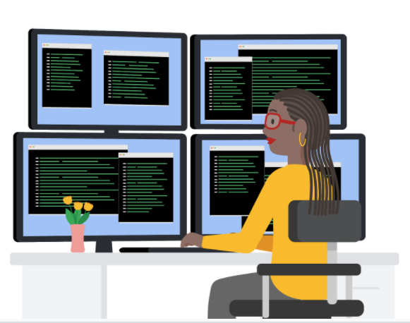

# Ways to Learn About Programming

Writing programming language code can be an exciting and rewarding experience. The programming field has a long history of people helping each other improve their skills and develop best practices. You will focus on the R programming language in this course, but in the future you might choose to pursue additional programming languages based on your interests and professional goals. This reading is a general guide to help you decide which programming languages are best suited for you.

## Popular Programming Languages by Profession

Let’s go through some potential job titles you might encounter and the most popular programming languages used in those professions. Also included is a list of additional resources for you to explore and learn more about each of the programming languages introduced.

### Data Analyst

A data analyst collects, transforms, and organizes data to draw conclusions, make predictions, and drive informed decision-making. The most popular programming languages used by data analysts are R and Python.

**R** offers convenient statistical features for data analysis and is useful for creating advanced data visualizations. Check out these resources to learn more about R:

- [The R Project for Statistical Computing](https://www.r-project.org/): a website for downloading R, documentation, and help
- [R Manuals](https://cran.r-project.org/manuals.html): links to manuals from the R core team, including introduction, administration, and help
- [Coding Club R Tutorials](https://ourcodingclub.github.io/tutorials.html): a collection of coding tutorials for R
- [R for Beginners](https://cran.r-project.org/doc/contrib/Paradis-rdebuts_en.pdf): a starting guide to help you work with data, graphics, and statistics in R

**Python** is a general-purpose language that you can use to create what you need for data analysis. Here are a few resources to begin learning Python:

- [The Python Software Foundation (PSF)](https://www.python.org/about/gettingstarted/): a website with guides to help you get started as a beginner
- [Python Tutorial](https://docs.python.org/3/tutorial/): a Python 3 tutorial from the PSF site
- [Coding Club Python Tutorials](https://ourcodingclub.github.io/tutorials.html): a collection of coding tutorials for Python

**Kaggle** is an online repository of various datasets that can be used in both R and Python. It's a robust platform that regularly hosts solution-based competitions using data sets in high-interest industries. Learners may also explore a vast trove of data modeling discussions, trending plug-in models, and useful code snippets. Here are some great resources to get started in Kaggle:

- [Datasets](https://www.kaggle.com/datasets): explore and download a vast collection of data sets while up-voting your favorite collection.
- [Competitions](https://www.kaggle.com/competitions):: commit individually or collaborate in a team towards data competitions for the possibility of financial rewards. Even without winning the competitions, this is a great way to network with other analysts.
- [Learn](https://www.kaggle.com/learn): use this resource for an additional perspective on data visualization, linear regression techniques, or time series charting code.

A web designer is responsible for the styling and layout of web pages using HTML5 and CSS.

- **HTML5:** Provides structure for web pages. Resources to learn HTML5:
  - [HTML Tutorial](https://www.tutorialrepublic.com/html-tutorial/): Introduction to HTML.
  - [HTML5 Cheat Sheet](https://www.wpkube.com/html5-cheat-sheet/): Summary of HTML5 tags.
  - [HTML5 and CSS Fundamentals course](https://www.edx.org/course/html5-and-css-fundamentals): Free course on edX.

- **CSS:** Controls graphic elements and page presentation. CSS cheat sheets:
  - [Interactive CSS Cheat Sheet](https://htmlcheatsheet.com/css/): Common CSS snippets.
  - [50 Best HTML & CSS Cheat Sheets](https://sharethis.com/best-practices/2020/02/best-html-and-css-cheat-sheets/): List of useful cheat sheets.

### Mobile Application Developer

A mobile application developer creates applications for laptops, mobile phones, and tablets using Swift, Java, and C#.

- **Swift:** For Apple platforms. Resources for Swift:
  - [Swift.org](https://swift.org/): Community resources.
  - [Swift developer site](https://developer.apple.com/swift/): Apple developer website.
  - [Swift development resources](https://developer.apple.com/swift/resources/): Documentation, sample code, and videos.

- **Java:** is the official language for Android development. The article [I want to develop Android apps - which languages should I learn?](https://www.androidauthority.com/develop-android-apps-languages-learn-391008/) explores some other languages used for Android development. Check out these resources for Java:
  - [Android Studio](https://developer.android.com/studio): Integrated development environment (IDE) for building Android apps.
  - [Build your first Android app in Java](https://developer.android.com/codelabs/build-your-first-android-app#1): Instructions for creating your first app.
  - [Java tutorial for beginners](https://www.androidauthority.com/java-tutorial-for-beginners-write-a-simple-app-with-no-previous-experience-1121975/): Overview of learning Java.

- **C#:** Object-oriented language for creating mobile apps in .NET. Resources for C#:
  - [Microsoft .NET learning materials](https://dotnet.microsoft.com/learn): Free courses and tutorials.
  - [Microsoft Xamarin learning materials](https://dotnet.microsoft.com/learn/xamarin): Courses and tutorials for mobile development with Xamarin.
  - [Xamarin Tutorial](https://dotnet.microsoft.com/learn/xamarin/hello-world-tutorial/intro): Build your first iOS or Android app in C#.
  - [Learn C# from Codecademy](https://www.codecademy.com/learn/learn-c-sharp):a website with free basic interactive lessons, and additional activities that can be accessed with a monthly subscription

### Web Application Developer

A web application developer designs and develops network applications used across the web. Java, Python, Ruby, and PHP are popular programming languages.

- **Java:** For enterprise web applications. Resources for Java:
  - [Oracle Java Tutorials](https://docs.oracle.com/javase/tutorial/): From Oracle documentation.
  - [Java for Beginners](https://www.homeandlearn.co.uk/java/java.html): Free Java course.

- **Python:** General-purpose language. Refer to Python resources mentioned in the data analyst section.

- **Ruby:** Object-oriented language for web development. Resources for Ruby:
  - [Ruby news](http://ruby-doc.org/): Latest Ruby releases and resources.
  - [Ruby documentation](https://www.ruby-lang.org/en/documentation/): Guides, tutorials, and reference material.
  - [Ruby programmer’s guide](http://ruby-doc.com/docs/ProgrammingRuby/): Tutorial and reference guide.
  - [Learn Ruby from Codecademy](https://www.codecademy.com/learn/learn-ruby): Interactive lessons.

- **PHP:** Scripting language for web development. Resources for PHP:
  - [PHP downloads and documentation](https://www.php.net/): Latest PHP releases and documentation.
  - [PHP the Right Way](https://phptherightway.com/): Coding standards reference.
  - [Interactive PHP tutorial](https://www.learn-php.org/): Free tutorial with exercises.

### Game Developer

A game developer specializes in video game creation using C# and C++.

- **C#:** Object-oriented language for creating games. Refer to C# resources mentioned in the mobile application developer section.

- **C++:** Extension of the C programming language for creating console games. Resources for C++:
  - [Microsoft resources for C++](https://docs.microsoft.com/en-us/cpp/): Visual Studio IDE and C++ code.
  - [Microsoft C++ and C# code samples for gaming](https://github.com/microsoft/Windows-universal-samples): Over 40 code samples.

## Tips for Learning Programming Languages

Here are some tips for learning a new programming language:

1. **Define a Practice Project:** Use the language to complete a project for practical learning.
2. **Keep Previous Concepts in Mind:** Many principles are transferable between languages.
3. **Create Good Notes and Cheat Sheets:** Maintain organized notes for quick reference.
4. **Online Filing System:** Establish a system to easily access information while working in different programming environments.
