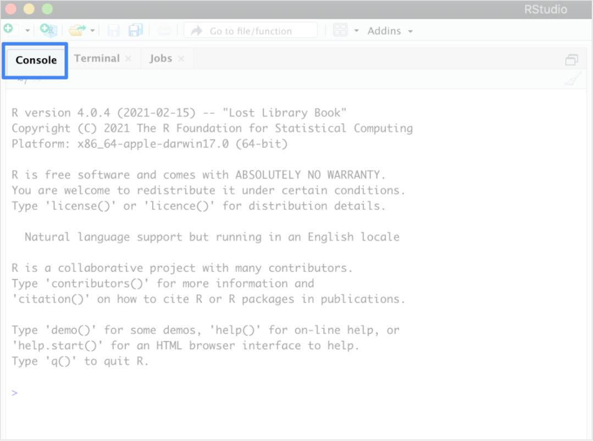
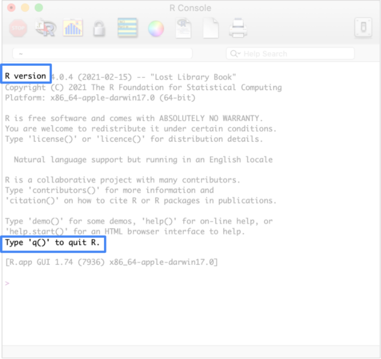
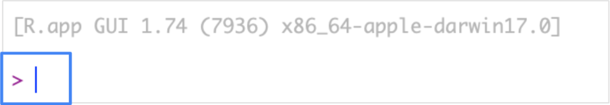

# Practice Quiz: Optional Hands-On Activity: R Console

## **Activity overview**

In the last activity, you downloaded and installed R. You can use the R environment and programming language to conduct data analysis and create visualizations. In this activity, you'll review the basics of working with the R Console and learn how to write and execute a basic command.

This will enable you to better understand the standard R interface. While you will use RStudio for most of the activities in this course, it is useful to know the basics of a programming interface as this will likely come up in your day-to-day work as a data analyst.

## **What is the R Console?**

Note: This is an optional activity. RStudio Cloud is the primary tool you will use for this course, but you can also install R to your computer for offline use. Please keep in mind that Chrome OS does not support the installation of R. If you are completing this course on a Chromebook, you should skip this activity or refer to the Linux workaround linked below.

The **R Console** is the program window in R where you make use of the R programming language. It is an interface that lets you view, write, edit, and execute your R code.

Programs like **RStudio**, an interactive development environment (IDE) for programming in R, use the R Console and other tools to make it easier to write and execute R code. In RStudio, the R Console is often referred to as the console pane (pictured below). It lets you perform any tasks you’d do in the R Console.



However, as you start coding in R, it’s helpful to begin with the simplicity of just the R Console. During this hands-on activity, you’ll use the R Console to perform simple mathematical operations.

## **Use the R Console**

1. Open the R program to use the R Console on your computer. You will find that the console populates a default message. The message starts with R version and your version number, and ends with Type ‘q()’ to quit R. Above the message, you will find a menu with icons that represent the functions of the console and graphical user interface (known in the program as RGui).

    

2. Click in the blank space to the right of the > symbol at the bottom of the console.

    This is the prompt, and anything you type after it will be read as executable R code when you press Enter (Windows) or Return (Mac). Keep in mind that everything you write in the R Console disappears after you end your session (or close the console). If you want to save the code you execute, it is better to save it in a text file or an .rmd file (which you will learn more about in upcoming lessons).

    

3. Type citation() after the prompt and press Enter (Windows) or Return (Mac). This returns instructions for how to cite R in a publication. You don’t need to worry about this now, but it will be helpful if you ever use R in a research paper or article.

    After you execute the line, the > prompt will generate again and you will be able to write a new line of R code. Now, write a mathematical operation. Start with simple addition by using the plus operator (+).

4. Type `4`, then a `+`, then the number `5`. The text you type should look like: 4+5. Press **Enter** (Windows) or **Return** (Mac). The R Console will return the answer to this question, which is 9.

5. On a new line, type `5-4` to use the subtraction operator (-). Press **Enter** (Windows) or **Return** (Mac) to execute the code and return the answer, which is 1.

6. On a new line, use the multiplication operator (`*`) to multiply two numbers. Type `10*2` and then press **Enter** (Windows) or **Return** (Mac). This will execute the code and return the answer, which is 20.

7. On a new line, use the division (`/`) operator to divide two numbers. Type `10/2` and then press **Enter** (Windows) or **Return** (Mac). This will execute the code and return the answer, which is 5.

Your R code and results should look like this:

```R
> citation()
> 4+5
[1] 9
> 5-4
[1] 1
> 10*2
[1] 20
> 10/2
[1] 5
```

Congratulations, you’ve written code in R! You can use R to complete mathematical operations, among many other useful data analysis tasks. This is just the beginning of your journey with writing in R.

## **Reflection**

In this activity, you used the R console to write some basic functions. In the text box below, write 2-3 sentences (40-60 words) in response to each of the following questions:

**What does the R console teach you about programming in the R interface?**

The R console provides a direct interface to interact with the R programming language, allowing users to write, execute, and experiment with R code in real-time. It helps users understand the fundamentals of R syntax and how commands are interpreted and executed.

**What is the difference between using the R console versus writing R code in a text file?**

Using the R console provides immediate feedback and allows for quick experimentation with small snippets

 of code. On the other hand, writing R code in a text file allows for the creation of reusable scripts, documentation, and the organization of code into logical units for larger projects. Additionally, text files can be saved and shared for collaboration or future reference.

### My reflection

**Reflection 1:**

1. **What does the R console teach you about programming in the R interface?**
   The R console serves as a fundamental interface for interacting directly with the R programming language, offering a platform to write, execute, and experiment with R code in real-time. It provides insight into R syntax and how commands are interpreted and executed, facilitating learning and exploration.

2. **What is the difference between using the R console versus writing R code in a text file?**
   Using the R console allows for immediate feedback and rapid experimentation with small code snippets. Conversely, writing R code in a text file enables the creation of reusable scripts, documentation, and organization of code into logical units for larger projects. Text files can be saved, shared, and collaborated on, providing a structured approach to programming in R.

**Reflection 2:**

1. **What does the R console teach you about programming in the R interface?**

   The R console serves as a direct interface for interacting with the R programming language, enabling users to write, execute, and experiment with R code in real-time. It facilitates understanding of R syntax fundamentals and how commands are interpreted and executed.

2. **What is the difference between using the R console versus writing R code in a text file?**

   Using the R console offers immediate feedback and allows for quick experimentation with small code snippets. Conversely, writing R code in a text file enables the creation of reusable scripts, documentation, and organization of code into logical units for larger projects. Text files can be saved and shared for collaboration or future reference.

> Correct:
>
> Congratulations on completing this hands-on activity! A good response would include that learning how to use the R Console and other R programming environments is fundamental to performing data analysis.
>
> The R console is a simple environment in which you can write single lines of R code. It won’t save your code beyond a single session, but it is very valuable for running simple functions. In upcoming activities, you will use RStudio, an interactive development environment that builds on the simplicity of the R console.
