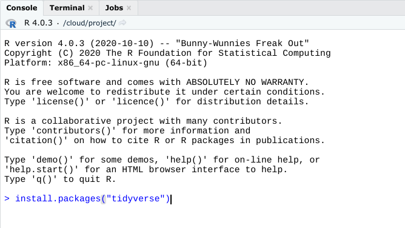
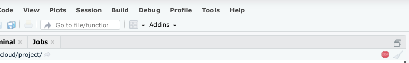
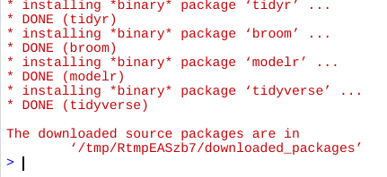

# Pratice Quiz: Hands-On Activity: Cloud access to RStudio

## Activity Overview

By now, you’ve learned about RStudio, an integrated development environment that allows you to more efficiently create and manage projects using R. In this activity, you will learn how to access the cloud version of RStudio.

Upon completing this activity, you will be more familiar with the RStudio interface and comfortable using its basic tools. This is a foundational step that will prepare you for upcoming RStudio activities during this course. This hands-on activity, and the future RStudio activities you will complete, are essential to developing job-ready R programming skills.

## Access RStudio Cloud

RStudio Cloud (now called Posit Cloud) is the primary tool you will use for this course. In order to use RStudio Cloud, you need stable internet access. It won’t matter what operating system you have because it works in your browser.

You can also install a desktop version, which you can download based on instructions provided in the next (optional) activity. This is a good alternative if you want to be able to work with R offline.

In order to access RStudio Cloud, follow these steps:

1. Sign up for an account at the [RStudio Cloud sign-up page](https://rstudio.cloud/plans/free).

    Here, you will find more information about RStudio Cloud, including the pricing plans. You will use the free version throughout this course, but it does have a few limitations. You can only have up to 15 projects on your free account, and can only use 15 project hours per month. You might consider upgrading later on if you find yourself using RStudio a lot.

2. For now, click the Sign Up button on the bottom-right to start with the free version.

3. Input your email, a password, as well as your first and last name.

4. Once you have signed up, open RStudio Cloud for the first time.

5. Click New Project to create a new project workspace and open the RStudio Cloud console.

## Install and Load Packages

Once you have opened a new project in your console, you can install packages to RStudio Cloud.

**Packages** are units of reproducible R code. Members of the R community create packages to keep track of the R functions that they write and reuse. Packages offer a helpful combination of code, reusable R functions, descriptive documentation, tests for checking your code, and sample data sets.

The lubridate package that you are about to install is part of the `tidyverse`. The tidyverse is a collection of packages in R with a common design philosophy for data manipulation, exploration, and visualization. For a lot of data analysts, the tidyverse is an essential tool. You will learn more about the tidyverse later on in this course.

To install the core tidyverse packages and load them, follow these steps:

1. In the bottom of the console, type `install.packages("tidyverse")` and press Enter (Windows) or Return (Mac).

    

    This may take a while. You can tell if the process is still running by checking the red Stop icon in the upper right of the console. You can click this icon to interrupt the running code and cancel the command.

    

    You can tell that the process is complete when the cursor reappears in the bottom of the console.

    

2. Load the tidyverse library with the `library()` function. To load the core tidyverse, type `library(tidyverse)` and press Enter (Windows) or Return (Mac).

    You only need to install a package once, but you need to reload it every time you start a new session.

3. Load the lubridate package. Since this is already part of the tidyverse package, there is no need to re-install. However, the library will need to be loaded. Type `library(lubridate)` into the console pane and press Enter (Windows) or Return (Mac).

    After you complete these steps, you can exit RStudio. Feel free to explore RStudio Cloud on your own to get more familiar with the tools and practice what you are learning in this course.

## Reflection

In this activity, you accessed RStudio, an IDE for programming in R. In the text box below, write 2-3 sentences (40-60 words) in response to each of the following questions:

- **How does the experience of using RStudio differ from other environments like the standard R program? (If you did not install R to your device, how do the features compare?)**
- **What is an advantage of using the RStudio in the cloud?**

### **My Responses:**

1. **Experience with RStudio vs. Standard R Program:**
   RStudio offers a more integrated and user-friendly environment compared to the standard R program. It consolidates all necessary tools for R programming in one interface, making it more convenient for users to write, execute, and manage code. Additionally, RStudio provides features like project management, version control, and package management, which are not available in the standard R program.

2. **Advantage of Using RStudio in the Cloud:**
   I think one advantage of using RStudio in the cloud is accessibility. With RStudio Cloud, we can access their projects and workspaces from any device with an internet connection, without the need for local installation or setup. This flexibility allows users to seamlessly switch between devices and environments, making collaborative work easier and enabling remote access to projects.

> Correct
>
> Congratulations on completing this hands-on activity! A good response would include that RStudio’s more detailed interface allows you to code with ease.
>
> RStudio Cloud is one of the primary tools you will use in this course, so being able to access it on your own will be important as you learn and practice more R skills. Since the program is accessible through the cloud, you have the flexibility of using RStudio from any computer, regardless of OS.
